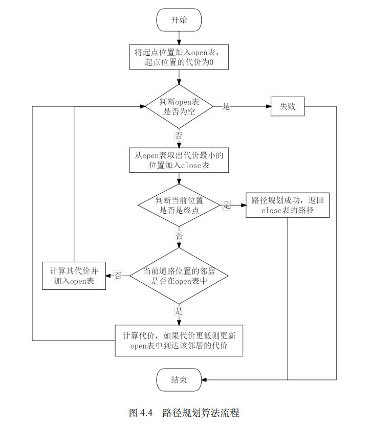

## 毕设的思路细化 - 调度系统路径规划算法的改进部分

---

### 00 本模块的具体思路

> 希望做成多乘客+多车辆的效果，让当前路况会影响后续路况的计算，在车辆进行计算路况的时候，就能根据现有的路况进行新的更新。

&emsp;&emsp;对于一个路段而言，在该道路上移动的车辆分别具有初速度 $V_1,V_2...V_n$，将这些速度根据评估函数 $V(n)$ 进行计算后，得到当前路段的加权速度 $V_{path}$。通过对 $V_{path}$ 的分析，来判断当前道路是拥挤还是通畅。

> 设计两个内容：路况评判的阈值$V_{judge}$、评估函数$V(n)$

&emsp;&emsp;根据路段的通畅 or 拥挤状态，来修改当前道路的状态 - 如给路段的 pathState 置为 1 和 0。在后续道路规划的时候，就能根据路段的 pathState 来对当前道路进行处理，看是否选择它作为最终的路径。

> 阅读合约中的：道路存储相关文件
> 
> 添加一个变量：在相关部分加入道路状态的判断变量 pathState

&emsp;&emsp;这个道路计算是一个实时迭代的过程，算法的示意图如图2。其以成佳壮学长的A*算法流程图（图1）为基础，进行了一些修改。

图1 - 成佳壮学长论文里给出的 A* 算法流程图
 

图2 - 结合实时路况计算的 A* 算法流程图
 

#### 希望达到的效果

1. 实现 “在控制台/浏览器中对选择出来的路径” 的**可视化**、“路段的拥挤程度” 的**可视化**
    * 如果时间允许的话，可以尝试和旧的系统的静态路径规划出的效果进行对比
2. 在浏览器控制台中去掉多余的代码输出，显示需要的信息
3. **能完成 “实时路况计算” 的要求**

---

### 01 对现有系统的工作的整理分析

1. **系统应能显示出：地图、乘客的出发地、目的地、和已经规划好的路径**
    * 出发地、目的地能显示，但不能被直接在 leaflet 里被选定？
    * 路径存疑，需要去向万琦玲学姐确认。

2. **系统目前没有 “车辆移动” 的模拟环节，它完成的步骤为：给乘客匹配上车辆以后，规划路径，给出规划时间，然后 “瞬移” 到目的地**。
    * **对此，需要**：每隔一段时间上传一次车辆位置，从而完成实时路况计算。

3. **当前系统上传的是真实的地图**
    * 为了便于我的代码撰写，需要将它修改为小范围地图。

4. **路径规划时间之所以跨度很大，是区块链机制所导致的**。
    * 具体的原因可以看成佳壮的论文，应该有提到（正在阅读中）

5. **现有的系统是使用单车辆单乘客的脚本来进行测试的，这显然不满足 “路径动态规划” 的思路**。

6. **信誉值部分的显示**
    * 去问万琦玲学姐。

#### 需要询问的内容（周末去问）

询问万琦玲学姐：

* 去年跑此系统的时候，能不能跑出来路径的样子？
    * 在真实地图中，还是在测试的九宫格地图中？
* 信誉值模块是如何展示的？
* 多设备测试的方法？

---

### 02 对我即将要完成的内容的整理分析

1. **阅读浏览器页面的相关代码，学习智能合约和JavaScript脚本的交互过程**
    * 预期效果：要能知道浏览器控制台里的输出是什么，能通过浏览器控制台中的内容对系统完成测试

2. **地图的转换**：把上传的地图修改成一个九宫格，在九宫格的基础上进行测试
    * 掌握地图的划分方法，比如究竟哪块对应着哪个区域，能有一个具体的思考理解

3. **新的测试方法** - 把自动化测试的脚本修改成多乘客多车辆，在地图九宫格的基础上进行测试

4. 实现**每隔一段时间，车辆上传一次位置**的功能

5. **添加实时路况计算代码，改动A*算法代码**
    * 按照《00 本模块的具体思路》撰写代码，进行测试
