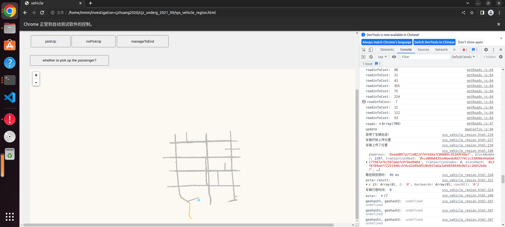
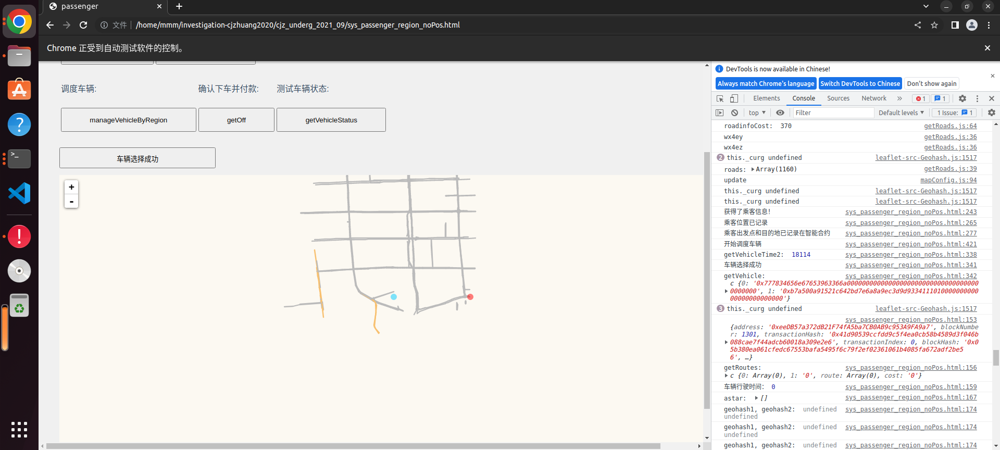
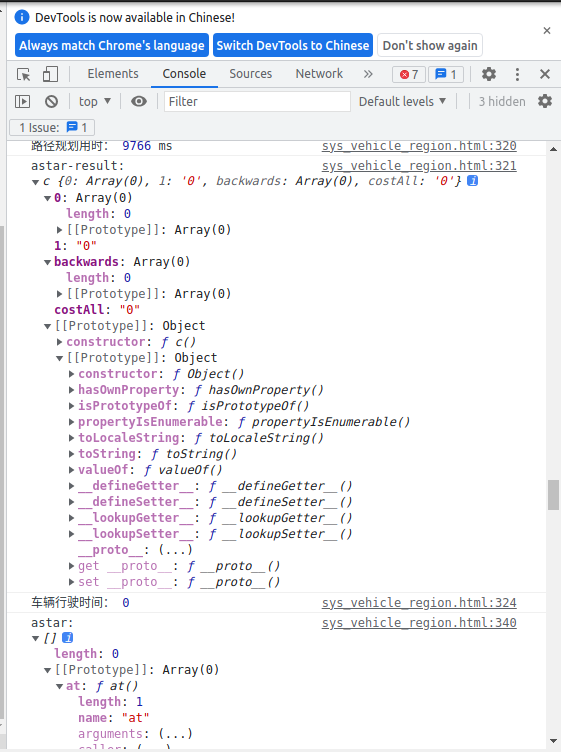
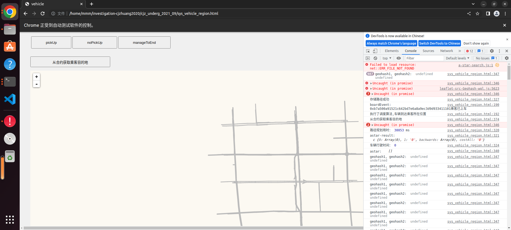
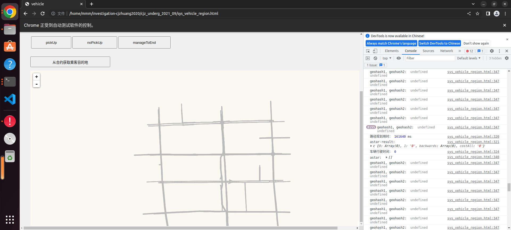
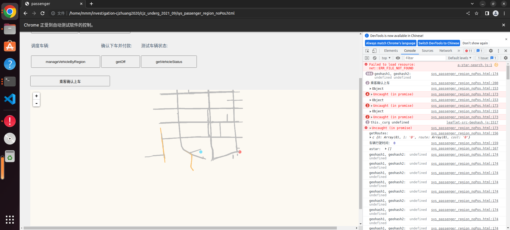
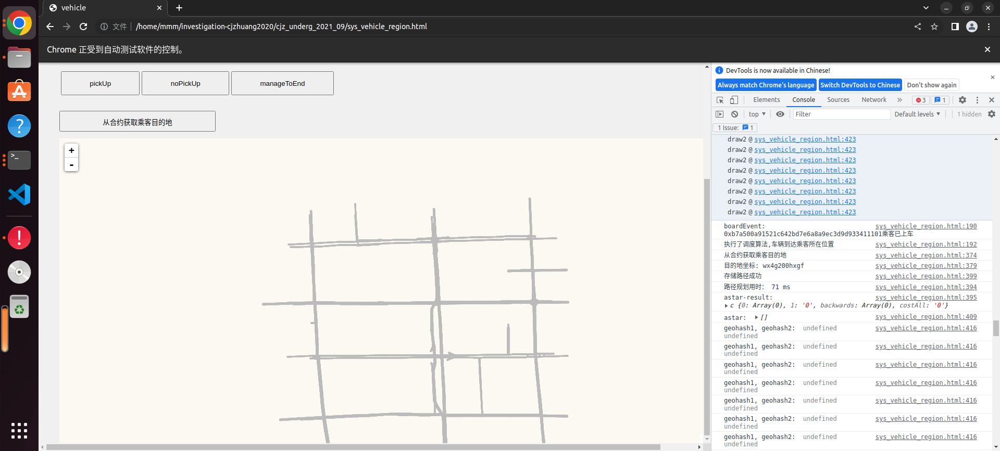

### 运行系统

1. 系统目前能不能动态看到选出的路径？
    * 目前在我的浏览器里，只能看到部分地图（但好像就传了这么一点），其上会显示乘客的出发地和目的地，但不能显示调度好的路径。 
        * 我怎么判断算法选的路径对不对？

2. 已有的自动测试，测试过程？
    > 使用指令`python3 vehicle_test.py`和`python3 passenger_test.py`各一次后，弹出两个浏览器，它自动测试。
    * 表现为：
        * 车辆：上传位置...都正常，到达目的地接到乘客后，在浏览器的console中输出路径规划用时，但车辆行驶时间为0；过一会以后，会再次输出路径规划用时，但车辆行驶时间始终为0？
        
        
        
        
        * 路径规划用时究竟是规划什么的用时？为什么从70ms到161000ms不等？跨度很大。
        
            * 应该是每走过一个geohash块规划一次？
                * 那么我如何判断它现在走到哪了？
                    * 即地图动态显示的问题
    * 始终是同样的顾客、同样的目的地，那是不是可以理解为这是单车单乘客的测试？

3. 如果想要完成某个时段内，多车多乘客路况的计算，怎么对系统进行多车多乘客自动化测试？

### 代码 and 论文阅读

[相关图示](https://www.jianguoyun.com/p/DYtqk-8Ql9uiCRj0kfsEIAA)

* 代码部分：主要阅读了 StoreMap.sol 和 StoreTraffic.sol
* 论文部分：主要阅读了 成佳壮学长、邱皓月学长的论文
    * 成佳壮学长论文阅读：配合合约代码着重看了Astar算法的实现过程，自动化测试部分；
        * A*算法：核心-评估函数，f(n)=g(n)+h(n)，
            * g(n)：耗散函数，从起始点到第 n 个中间位置节点的实际距离。
            * h(n)：启发函数，算法过程查询到的中间节点到目的地节点的距离估计值，曼哈顿距离。
    * 邱皓月学长论文阅读：理清了他的项目思路
        * 我的毕设：
            * 想借鉴“实时路况”的迭代部分，做一个简化版
                * 由系统给出从“出发点”-“目的地”的拥堵状态，让某条路径（path1）处于不可达状态；在代码中寻路阶段，不寻找此条路径（path1），转而去重新规划路径，找到新的可达路径（path2）
                * 多车辆多乘客的测试？