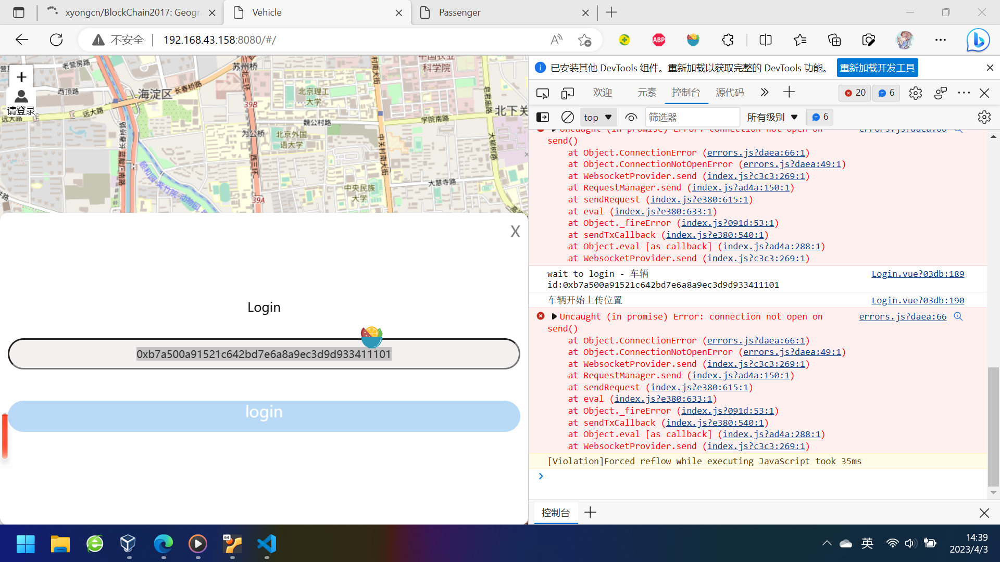
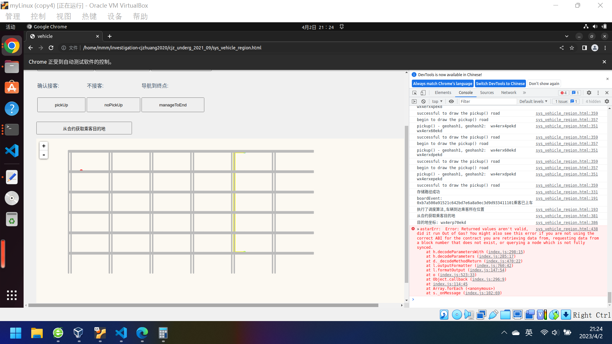
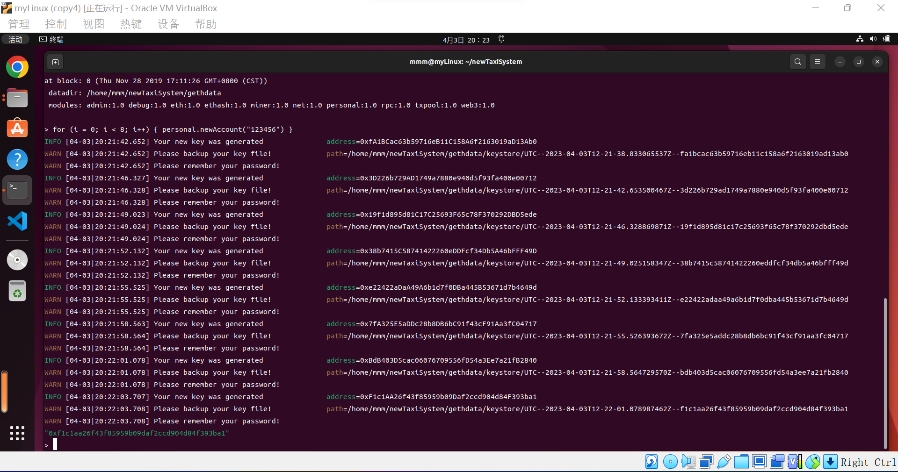

# 0403_交流

## 出租车部分的实验讨论

讨论结果：完成周畅学姐实验需求里的2.1部分，进行地图数据选取。
需要从周畅学姐处获取：geohash和具体区域对应的网页网址

## 1.connection not open on send() 问题的尝试


.png)
在手册里，把 `rpcaddr` 从`127.0.0.1` 修改为 `0.0.0.0`，但是只修改了启动区块链的指令，依然无法和区块链进行交互

* 有可能需要在`初始化区块链`的时候就进行修改？
  * reply：也许是，晚上尝试它

## 2.调试过程中出现的问题 **out of gas**

换了好几种地图，都出现了这个问题。

.png)
.png)
.png)
按照代码部分来看，报在第155行第51列，应该是指这个trafficContract的部分，就是和区块链交互的部分，不知道为什么gas出问题。
在之前vehicle、passenger初始化位置不对的时候，是不报这个错的。
现在把vehicle、passenger初始化的位置放到路上之后，报了这个错。

* 不知道怎么回事，可能还需要再调试？
  * reply：可能是truffle编译的问题，换成remix编译试试

## 0403_测试反馈

### 多设备访问问题

重开 `newTaxiSystem` 文件夹，重新配置区块链，在这一部分主要完成的操作为，将 `rpcaddr` 从`127.0.0.1` 修改为 `0.0.0.0`。（在初始化区块链的时候就进行修改）
> 在这里保存了原有的 `TaxiSystem` 文件夹，为了进行一些小对照，把它当成一个简单的备份。

初始化区块链：

```shell
geth1 --identity "MyEth" --rpc --rpcaddr 0.0.0.0  --rpcport "8545" --rpccorsdomain "*" --datadir gethdata --port "30303" --nodiscover --rpcapi "eth,net,personal,web3" --networkid 91036 init genesis.json
```

启动区块链：

```shell
geth1 --datadir ./gethdata --networkid 91036 --port 30303 --rpc --rpcaddr 0.0.0.0 --rpcport 8545 --rpcapi 'personal,net,eth,web3,admin' --rpccorsdomain='*' --ws --wsaddr='localhost' --wsport 8546 --wsorigins='*' --wsapi 'personal,net,eth,web3,admin' --nodiscover --allow-insecure-unlock --dev.period 1 --syncmode='full' console
```

* 有没有可能是wsaddr的错？
  * 尝试把它也改成 0.0.0.0

```shell
geth1 --datadir ./gethdata --networkid 91036 --port 30303 --rpc --rpcaddr 0.0.0.0 --rpcport 8545 --rpcapi 'personal,net,eth,web3,admin' --rpccorsdomain='*' --ws --wsaddr 0.0.0.0 --wsport 8546 --wsorigins='*' --wsapi 'personal,net,eth,web3,admin' --nodiscover --allow-insecure-unlock --dev.period 1 --syncmode='full' console
```

存一下初始化启动后的信息：

账户信息：

```js
> eth.accounts
["0xfa1bcac63b59716eb11c158a6f2163019ad13ab0", "0x3d226b729ad1749a7880e940d5f93fa400e00712", "0x19f1d895d81c17c25693f65c78f370292dbd5ede", "0x38b7415c58741422260eddfcf34db5a46bfff49d", "0xe22422adaa49a6b1d7f0dba445b53671d7b4649d", "0x7fa325e5addc28b8db6bc91f43cf91aa3fc04717", "0xbdb403d5cac06076709556fd54a3ee7a21fb2840", "0xf1c1aa26f43f85959b09daf2ccd904d84f393ba1"]
```

解锁账户：

```javascript
for (i = 0; i < eth.accounts.length; i++) { personal.unlockAccount(eth.accounts[i],"123456",0) }
```

查看余额：

```javascript
for (i = 0; i < eth.accounts.length; i++) { console.log(eth.getBalance(eth.accounts[i])) }
```

> 需要整理进vue手册里，进行测试。

aaa！！de出来了！！！
是需要在以下地方进行修改：

1. 初始化区块链时，用 rpcaddr 0.0.0.0 进行初始化
2. 启动区块链时，用 rpcaddr 0.0.0.0 和 wsaddr 0.0.0.0
3. vue代码里进行一些修改，修改Global.vue里的全局配置，把所有如下的语句都注释掉本地访问的 ws，修改接入当前局域网

    ```javascript
    this.web3Map = new Web3(
      //new Web3.providers.WebsocketProvider("ws://127.0.0.1:8546")
      new Web3.providers.WebsocketProvider("ws://192.168.43.158:8546")
    );
    ```

1和2的目的在我的考虑中，应该是为了把区块链设置成一个公有的区块链，让所有设备都能访问。但是究竟需不需要，其实不能确定，因为在只进行1和2，未进行3的更改时，依然报 old error，理论上如果修改1、2就能起一部分作用的话，应该会有不一样的报错？但这个事情无所谓，已经能跑了，就按照能跑的做就行，至于是否要考虑1和2的修改的充分性，可以延后再议。
3的目的在我的考虑中，应该是为了把vue的ws端口打开，它对应的是之前一直忽略的报`ws://localhost:8546`连接不上的错，修改成局域网中的8546端口后，就没问题了。
