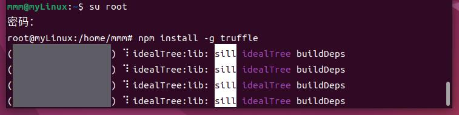
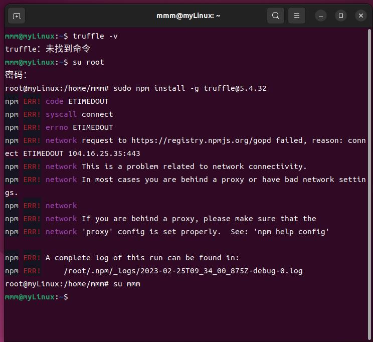
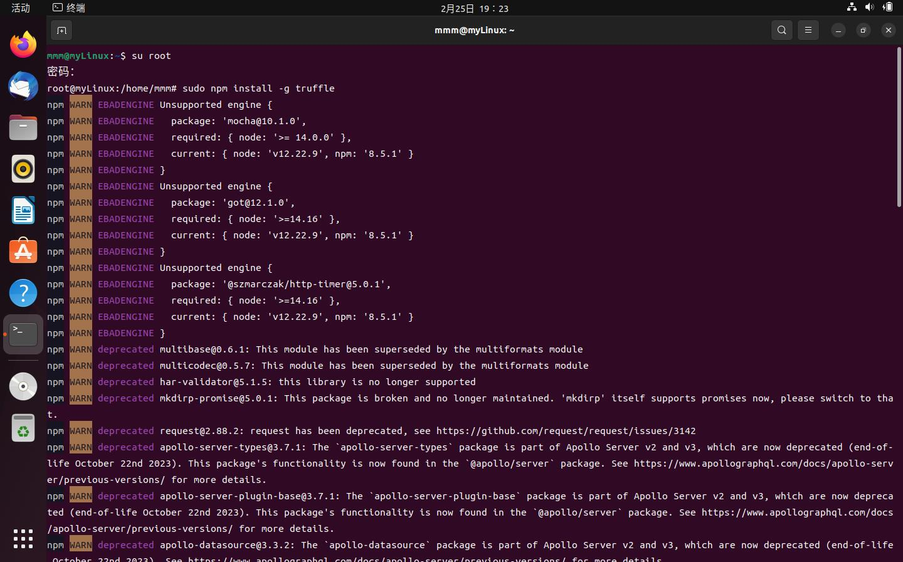
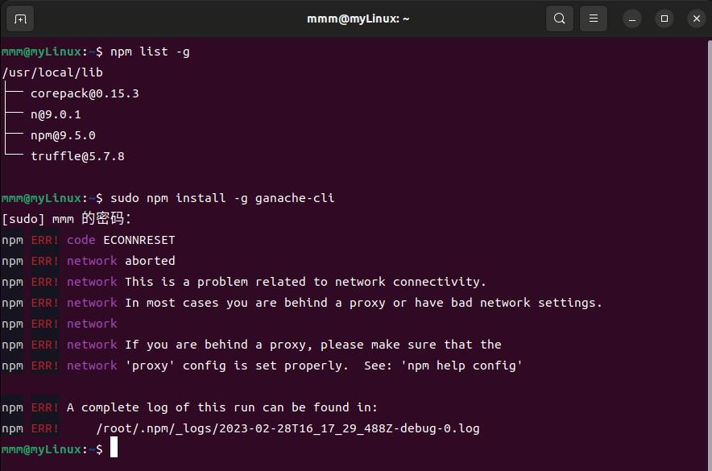
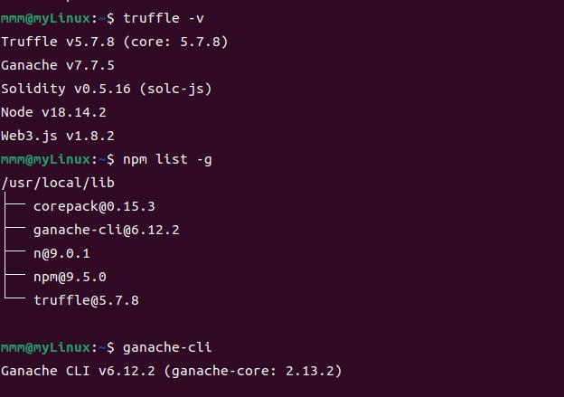
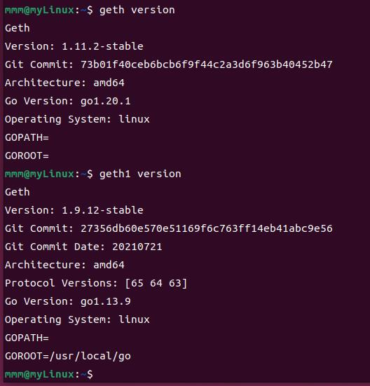

# 00 安装虚拟机

在 *VirtualBox* 中安装 *Ubuntu 22.04* 注意预留足够的磁盘空间

## 具体设置
1. `virtual box` 版本：**7.0.6版本**
2. `ubuntu` 版本：**22.04版本**
    * 虚拟机设置：
        * 内存大小：2048MB
        * 处理器：4
        * 磁盘空间：20.00G

进入系统后，在 *显示应用程序* 界面中，找到 *软件和更新* 选项，将其中的 *下载自* 更改为阿里云的镜像源，避免网络不稳定导致环境配置失败。


# 01 安装依赖

使用如下命令，安装所需的依赖。

```shell
sudo apt-get install npm
sudo npm install -g truffle
sudo apt install nodejs

sudo apt-get install software-properties-common
sudo add-apt-repository -y ppa:ethereum/ethereum
sudo apt-get update
sudo apt-get install ethereum

sudo npm install web3
sudo apt-get install solc
```

## 遇到问题：

* 下载`truffle`，需要node 12.0.0以上，更新node版本
* 使用代理registry：在网上查阅了一些资料后，决定使用代理的方式，方法也很简单，就是
    ```bash
    npm config set registry https://registry.npm.taobao.org
    ```
   然后后续的install等命令还是通过npm运作，而不是cnpm。

### truffle

#### 失败过程

* 出现卡死情况（进度条完全不动）：

* 解决方式：重新配置淘宝源，然后再次输入指令 `sudo npm install -g truffle`，还是卡死，于是考虑以下俩可能性：
    * 试图通过安装指定版本（`v5.4.32`）来解决卡死的问题（但装到一半又卡了，然后报错如下，所以失败了）
    
    感觉好像是网络不好...
    * 又安装了一次（未指定版本号，直接让它默认安装），装到一半显示`node`的版本太低了
    
    * 于是升级`node`版本，升到`v18.14.2`，并再次输入`sudo npm install -g truffle`指令，此次成功安装
* 终于安完了...
    * 版本号：v5.7.8
        ```shell
        mmm@myLinux:~$ truffle version
        Truffle v5.7.8(core:5.7.8)
        Ganache v7.7.5
        Solidity v0.5.16(solc-js)
        Node v18.14.2
        Web3.js v1.8.2
        ```

#### 总结
`truffle`的安装可能跟网络关系比较大...如果不小心卡死了，很大概率可能是网络的原因...多试几次，如果它明显报错是某个模块的版本太低的话，对应修正更新即可。

### ganache-cli

>《实验：1 传统区块链初始化和启动》会用它进行测试，其余实验不使用它

#### 失败过程

* 指令：sudo npm install -g ganache-cli 
* 报错了，好像是网络原因，超时了？
    
    * 好像是网络导致的超时问题，再次安装就解决了
* 安装完查询版本：v6.12.2版本
    
* 使用 ganache-cli 指令，能正常运行，模拟部署私有区块链，为运行合约打基础

#### 总结

`ganache-cli`的安装可能跟网络关系比较大...如果不小心卡死了，很大概率可能是网络的原因...多试几次即可。

# 02 npm镜像

> 我没用到这个

可以参考[NPM镜像站](https://npmmirror.com/)。

# 03 安装软件

## vscode

> 我配置vscode的目的：用于后续运行truffle以编译合约。

* 直接下载即可
* [一些使用技巧](https://blog.csdn.net/weixin_44062177/article/details/125302270?ops_request_misc=&request_id=&biz_id=102&utm_term=vscode%20truffle&utm_medium=distribute.pc_search_result.none-task-blog-2~all~sobaiduweb~default-9-125302270.nonecase&spm=1018.2226.3001.4187)
* 1.75.1版本

# 04 版本检查

## gcc

* 11.3.0版本

## vim

* 8.2.4919版本

## npm

* 8.5.1版本

## nodejs

* nodejs:v12.22.9版本
* node:v18.14.2版本

## geth

* 1.11.2-stable版本

### geth1

> 此部分主要遇到的问题在于我想把Windows系统里的geth1导入虚拟机。

* 本实验后续的内容要借助此基础（geth1）完成
* 1.9.12版本的geth，二进制文件在仓库里
* [Linux和Windows之间共享文件夹设置方法](https://blog.csdn.net/weixin_46952849/article/details/124061252?ops_request_misc=&request_id=&biz_id=102&utm_term=virtualbox%E5%85%B1%E4%BA%AB%E6%96%87%E4%BB%B6%E5%A4%B9&utm_medium=distribute.pc_search_result.none-task-blog-2~all~sobaiduweb~default-4-124061252.142^v73^insert_down3,201^v4^add_ask,239^v2^insert_chatgpt)
    * 设置共享文件夹之后，首先要从共享文件夹里把geth1移动出来，我先移到了文档里，[访问共享文件夹的权限设置](https://blog.csdn.net/a772304419/article/details/123048330)
    * 然后要从文档文件夹里把geth1放进/usr/bin里，直接剪切+粘贴会报问题“无向/usr/bin写入的权限”，则说明需要[借助root权限进入/usr/bin](https://blog.csdn.net/m0_59133441/article/details/122081288?ops_request_misc=%257B%2522request%255Fid%2522%253A%2522167739817216800192264491%2522%252C%2522scm%2522%253A%252220140713.130102334..%2522%257D&request_id=167739817216800192264491&biz_id=0&utm_medium=distribute.pc_search_result.none-task-blog-2~all~sobaiduend~default-1-122081288-null-null.142^v73^insert_down3,201^v4^add_ask,239^v2^insert_chatgpt&utm_term=linux%20%E7%A7%BB%E5%8A%A8%E6%96%87%E4%BB%B6%E6%9D%83%E9%99%90%E4%B8%8D%E5%A4%9F)。采用第一条解决方法即可完成移动。
* 检查版本无误。

* [关于geth的基础使用手册](https://www.cnblogs.com/ddcoder/p/7837910.html)