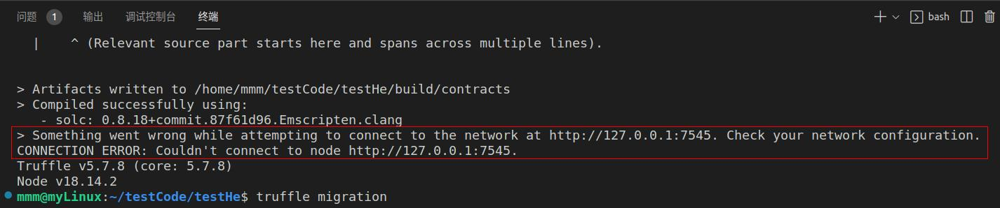
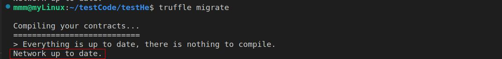
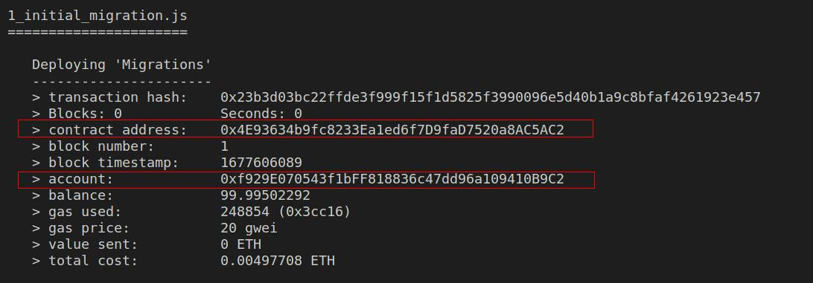

# 00 本地私有链

## 建立本地私有链

* 建立测试文件夹
  
  ```bash
    $ mkdir test_truffle_geth
    $ cd test_truffle_geth/
  ```  

* 建立创世块（genesis.json即配置文件）
  
  ```bash
    sudo vim genesis.json
  ```  
  ```json
    {
    "config": {
        "chainId": 666,
        "homesteadBlock": 0,
        "eip150Block": 0,
        "eip150Hash": "0x0000000000000000000000000000000000000000000000000000000000000000",
        "eip155Block": 0,
        "eip158Block": 0,
        "byzantiumBlock": 0,
        "constantinopleBlock": 0,
        "petersburgBlock": 0,
        "istanbulBlock": 0,
        "ethash": {}
    },
    "nonce": "0x0",
    "timestamp": "0x5ddf8f3e",
    "extraData": "0x0000000000000000000000000000000000000000000000000000000000000000",
    "gasLimit": "0x47b760",
    "difficulty": "0x00002",
    "mixHash": "0x0000000000000000000000000000000000000000000000000000000000000000",
    "coinbase": "0x0000000000000000000000000000000000000000",
    "alloc": { },
    "number": "0x0",
    "gasUsed": "0x0",
    "parentHash": "0x0000000000000000000000000000000000000000000000000000000000000000"
    }
  ```
  在树状区块链中用的也是这个文件

* 初始化文件夹
  ```bash
    $ geth1 init ./genesis.json --datadir "./chain"
  ```  
* 启动私有链
  ```bash
    geth1 --identity "mshk.top etherum" --rpcaddr 127.0.0.1 --rpc --rpcport "8545" --rpccorsdomain "*"  --maxpeers 2 --rpcapi "personal,eth,net,web3,debug" --networkid 100 --datadir "./chain" --nodiscover --allow-insecure-unlock --dev.period 1 console
  ```  
* 创建账户开始挖矿
  ```bash
    # 创建帐号
    > personal.newAccount("123456")
    # 解锁
    > personal.unlockAccount(eth.accounts[0],"123456",15000)
    # 开始挖矿
    > miner.start(1)
  ```

## 测试本地私有链
还是拿之前测试的合约来运行

* 首先需要更改truffle-config.js文件：
```json
    module.exports = {
        networks: {
            development: {
            host: "127.0.0.1",
            port: 8545,
            network_id: "*", // Match any network id
            }
        }
    };
```

然后执行`truffle migrate`即可部署合约

打开`index.html`

测试通过

### 我的bug

通过`测试的合约`链接跳转，会跳转到一个根据 ganache-cli 来完成网页交互的方法。在这个方法中，会跟自己部署的区块链没太大关系，其区块链是用ganache-cli模拟的，账户也通过ganache-cli给出。

#### 使用ganache-cli部署的私有区块链进行测试

* 使用 ganache-cli 完成区块链模拟，在 “truffle migration”，应该是“发布合约”的环节报错，显示的是网络连接出错了，如下图：

* 因此去 truffle-config.js 里修改连接的网络地址：
    ```json
    development: {
     host: "127.0.0.1",     // Localhost (default: none)
     port: 8545,            // Standard Ethereum port (default: none)
     network_id: "*",       // Any network (default: none)
    }
    ```
    * 把这几部分的注释消掉，之所以使用 127.0.0.1:8545 的原因是，ganache-cli 的区块链模拟情况下，其显示的监听端口为 127.0.0.1:8545
    * 修改完 truffle-config.js 以后，再次 “truffle migration”
        * truffle migration 和 truffle migrate 的效果一致
* 但实际上此时还是出问题：
    
    * 按行去查找，发现问题出在红框里：“network up to date”，像个报错，然后在网上搜到[可能的解决方法](https://blog.csdn.net/jamesdodo/article/details/108445967?ops_request_misc=&request_id=&biz_id=102&utm_term=truffle%20migrate%20Network%20up%20to%20&utm_medium=distribute.pc_search_result.none-task-blog-2~all~sobaiduweb~default-3-108445967.142^v73^insert_down3,201^v4^add_ask,239^v2^insert_chatgpt)
        * 为了强制合约再次发布，采用 “truffle migrate --reset” 指令
* 然后发现在部署后，他不按照正常的情况出结果，因此对拍源代码，发现我缺失了 “1_initial_migration.js” 和 “Migrations.sol” 文件（因为在原有的测试手册里没有提及要做这些工作，完全跟着测试手册走就会忽略这些内容），添加后，正常出结果
 

* 正常，按要求寻找合约地址和合约账户，在 index.html 里修改
* 改完以后，在 index.html 页面里，直接借助 “open in default browser” 打开默认浏览器，如下图：
    
    如果访问 localhost:8545/index.html 则出现下图的400号报错。
    
    * 新目标：解决无法访问动态网页的问题
    * 分析可能是因为没有正确连接 web3？不清楚，但是没有给 firebox 浏览器安装 MetaMask 扩展，可能是失败第一步...
* 在csdn上搜索，发现好像是因为没有安装MetaMask？所以在走流程以后， ganache-cli 中给出的私钥也没啥用...就按流程安装它
  
* [配置 MetaMask 网络](https://blog.csdn.net/weixin_46353030/article/details/121494906)
* 还是不显示（test 11 year old），查看页面元素，发现是web3的调用部分出错了↓

  * 感觉它是不是想说，无法访问 web3.min.js，就去查看了一下 node_modules 文件夹的权限，发现其只允许 root 访问，感觉可能是这里的问题，修改 node_modules 文件夹的权限。
    * 把 node_modules 文件夹的权限从仅限 root 访问，变成了允许 mmm 访问，完全更改体如下图，原本的样子如红色标示。
    
    * 以及修改了 web3 文件夹、web3.min.js 文件的权限以后，测试的网页能正常出现，完成测试，接下来的目的是返回复现实验，测试在 test_truffle_geth 文件夹内部署的区块链是否正确

#### 使用自己部署的私有区块链进行测试

报错中，暂未解决