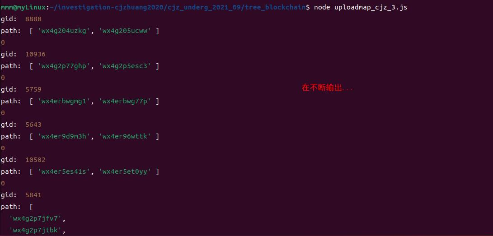
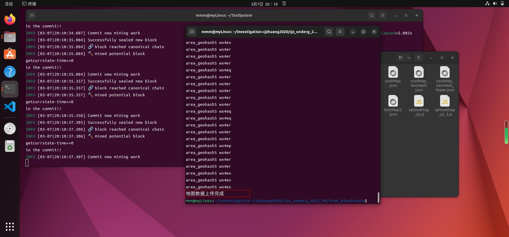
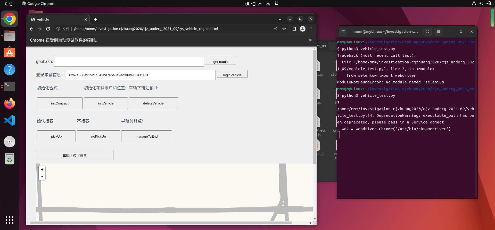
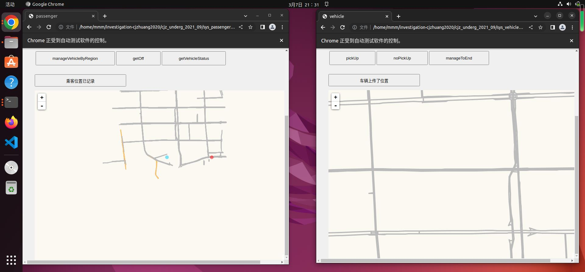
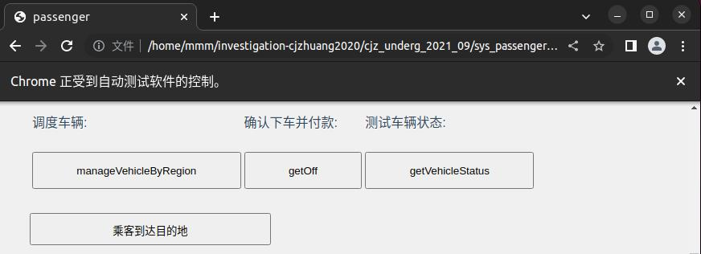

# 00 环境准备
在本实验中，需要用到`python`的`selenium`模块，在调用代码中使用`google chorme`来运行测试程序，因此需要预先安装好它们。

* selenium 下载：

    ```shell
    pip install selenium
    ```

  * 如果控制台显示没有pip的话，就正常安装pip模块即可

* google chorme 配置：[参考](https://blog.csdn.net/Leexin_love_Ling/article/details/123186876?ops_request_misc=&request_id=&biz_id=102&utm_term=python%20%E5%AE%89%E8%A3%85selenium%20linux&utm_medium=distribute.pc_search_result.none-task-blog-2~all~sobaiduweb~default-2-123186876.142^v73^insert_down3,201^v4^add_ask,239^v2^insert_chatgpt&spm=1018.2226.3001.4187)

  ```shell
  mmm@myLinux:~/桌面$ wget https://dl.google.com/linux/direct/google-chrome-stable_current_amd64.deb
  mmm@myLinux:~/桌面$ su root
  root@myLinux:/home/mmm/桌面# dpkg -i google-chrome-stable_current_amd64.deb
  root@myLinux:/home/mmm/桌面# su mmm
  mmm@myLinux:~/桌面$ /usr/bin/google-chrome-stable -v
  mmm@myLinux:~/桌面$ google-chrome --version
  Google Chrome 110.0.5481.177 
  ```

  * 安装对应版本的chorme driver
    * [查看最佳对应版本的驱动](https://blog.csdn.net/qq_41405394/article/details/128121577?ops_request_misc=%257B%2522request%255Fid%2522%253A%2522167819464316800213015253%2522%252C%2522scm%2522%253A%252220140713.130102334.pc%255Fall.%2522%257D&request_id=167819464316800213015253&biz_id=0&utm_medium=distribute.pc_search_result.none-task-blog-2~all~first_rank_ecpm_v1~times_rank-1-128121577-null-null.142^v73^insert_down3,201^v4^add_ask,239^v2^insert_chatgpt&utm_term=chromedriver110.0.5481.177)
      * 查询可知，110.0.5481.177对应的最佳驱动版本为110.0.5481.77
    * 运行代码

        ```shell
        mmm@myLinux:~/桌面$ wget https://npm.taobao.org/mirrors/chromedriver/110.0.5481.77/chromedriver_linux64.zip
        mmm@myLinux:~/桌面$ unzip chromedriver_linux64.zip
        mmm@myLinux:~/桌面$ su root
        密码：
        root@myLinux:/home/mmm/桌面# mv chromedriver /usr/bin/
        root@myLinux:/home/mmm/桌面# chmod +x /usr/bin/chromedriver
        root@myLinux:/home/mmm/桌面# su mmm
        ```

# 01 常用命令

第一步还是配置`genesis.json`

初始化区块链：

```bash
geth1 --identity "MyEth" --rpc --rpcaddr 127.0.0.1  --rpcport "8545" --rpccorsdomain "*" --datadir gethdata --port "30303" --nodiscover --rpcapi "eth,net,personal,web3" --networkid 91036 init genesis.json
```

启动区块链：

```bash
geth1 --datadir ./gethdata --networkid 91036 --port 30303 --rpc --rpcaddr 127.0.0.1 --rpcport 8545 --rpcapi 'personal,net,eth,web3,admin' --rpccorsdomain='*' --ws --wsaddr='localhost' --wsport 8546 --wsorigins='*' --wsapi 'personal,net,eth,web3,admin' --nodiscover --allow-insecure-unlock --dev.period 1 --syncmode='full' console
```

创建账户：

```js
for (i = 0; i < 8; i++) { personal.newAccount("123456") }
```

解锁账户：

```js
for (i = 0; i < eth.accounts.length; i++) { personal.unlockAccount(eth.accounts[i],"123456",0) }
```

# 02 初始化并启动区块链

新建`TaxiSystem`文件夹，将01节中的`genesis.json`内容放置入根目录。在`TaxiSystem`文件夹下启动终端，分别使用初始化区块链、启动区块链的指令操作，打开`JavaScript`控制台。

在控制台中，执行00节中的创建账户和解锁账户指令后，利用`eth.accounts`获取所有账户的地址，使用如下Python程序，生成即将添加进入`genesis.json`的代码：

```python
# TaxiSystem/accounts_processor.py
l = eth.accounts的输出，原样粘贴过来即可，应该是["...", "...", ...]的格式

for each in l:
    print(
        f'"{each}": {{ "balance": "50000000000000000000000000000000000000000", "position": "test0123456789", "txtime": 1 }},'
    )

```

记录该程序的输出，直接粘贴到`genesis.json`的`alloc`字段中去。

> 该程序的输出的最后一行带有一个多余的逗号，粘贴到`genesis.json`中去之后请务必删除。

在打开的控制台中输入`exit`退出控制台，然后删除目录`TaxiSystem/gethdata/geth`。随后，再运行一次初始化区块链和启动区块链的代码。此时，所有账户应该都有余额了。可以用`eth.geBalance(账户地址)`来检查余额：

```js
for (i = 0; i < eth.accounts.length; i++) { console.log(eth.getBalance(eth.accounts[i])) }
```

**重要步骤**↓

* 每次重新启动JS控制台，都需要再解锁一次账户。
    > 如果不解锁账户的话，可能会导致miner.start()无法挖到合约地址

# 03 部署合约

## StoreMap合约

首先是`StoreMap.sol`合约。该合约的`Solidity`源代码位于仓库的`CompileWithTruffle/contracts/StoreMap.sol`。使用《9 关于使用truffle编译solidity源代码》中介绍的方法获得`abi`和`bytecode`之后，打开[这个用于JSON压缩转义的网站](https://www.bejson.com/zhuanyi/)，将获得的`abi`（形如`"abi": [...]`）丢进去，点击输入框下方的“压缩并转义”，复制走从第一个`[`开始之后的全部内容。

在打开的控制台中输入如下指令：

```js
abi = JSON.parse('复制来的内容')
bytecode = 获得的bytecode，字符串类型

StoreMapContract = web3.eth.contract(abi);
web3.eth.estimateGas({data: bytecode})
StoreMap = StoreMapContract.new({
    from: web3.eth.accounts[0], 
    data: bytecode, 
    gas: '3000000',
    position:"w2511111111111",
    txtime:277001
  },function (e, contract){
    console.log(e, contract);
    if(!e){
        if(!contract.address) {
            console.log("Contract transaction send: TransactionHash: " + contract.transactionHash + " waiting to be mined...");
        } else {
            console.log("Contract mined! Address: " + contract.address);
            console.log(contract);
        }
    }
});
```

开始挖矿，并留意输出：

```js
miner.start()
/*
-- snip --
null [object Object]
Contract mined! Address: 0xef00ade84bb560afe4b562bfd4a81300c17ac52f
[object Object]
-- snip --
*/
miner.stop()  // 停止挖矿以节省电脑性能
```

这就是StoreMap合约的地址了。妥善保存，以供日后使用。

## StoreTraffic合约

该合约的部署较为简单，直接将[多节点树状区块链部署](https://little-grouse-686.notion.site/4a49c397fef3483cb4ad949d9dc9883e)中的有关`StoreTraffic`的一片代码全丢进控制台中然后按一下Enter键即可，其内容如下：

```js
abi = JSON.parse('[{\"anonymous\":false,\"inputs\":[{\"indexed\":false,\"internalType\":\"bytes32\",\"name\":\"vehicleId\",\"type\":\"bytes32\"},{\"indexed\":false,\"internalType\":\"bytes32\",\"name\":\"passengerId\",\"type\":\"bytes32\"},{\"indexed\":false,\"internalType\":\"bytes32\",\"name\":\"passengerGeohash\",\"type\":\"bytes32\"}],\"name\":\"Myevent\",\"type\":\"event\"},{\"anonymous\":false,\"inputs\":[{\"indexed\":false,\"internalType\":\"bytes32\",\"name\":\"vehicleId\",\"type\":\"bytes32\"}],\"name\":\"boardEvent\",\"type\":\"event\"},{\"anonymous\":false,\"inputs\":[{\"indexed\":false,\"internalType\":\"bytes32\",\"name\":\"vehicleId\",\"type\":\"bytes32\"}],\"name\":\"payEvent\",\"type\":\"event\"},{\"anonymous\":false,\"inputs\":[{\"indexed\":false,\"internalType\":\"bytes32\",\"name\":\"passengerId\",\"type\":\"bytes32\"}],\"name\":\"rejectEvent\",\"type\":\"event\"},{\"anonymous\":false,\"inputs\":[{\"indexed\":false,\"internalType\":\"bytes32\",\"name\":\"passengerId\",\"type\":\"bytes32\"}],\"name\":\"routeEvent\",\"type\":\"event\"},{\"constant\":false,\"inputs\":[{\"internalType\":\"uint256\",\"name\":\"newPrecision\",\"type\":\"uint256\"}],\"name\":\"changePrecision\",\"outputs\":[{\"internalType\":\"uint256\",\"name\":\"\",\"type\":\"uint256\"}],\"payable\":false,\"stateMutability\":\"nonpayable\",\"type\":\"function\"},{\"constant\":false,\"inputs\":[{\"internalType\":\"bytes32\",\"name\":\"vehicleId\",\"type\":\"bytes32\"}],\"name\":\"confirmBoard\",\"outputs\":[],\"payable\":false,\"stateMutability\":\"nonpayable\",\"type\":\"function\"},{\"constant\":false,\"inputs\":[{\"internalType\":\"bytes32\",\"name\":\"vehicleId\",\"type\":\"bytes32\"}],\"name\":\"confirmPay\",\"outputs\":[],\"payable\":false,\"stateMutability\":\"nonpayable\",\"type\":\"function\"},{\"constant\":false,\"inputs\":[{\"internalType\":\"bytes32\",\"name\":\"vehicleId\",\"type\":\"bytes32\"}],\"name\":\"deleteVehicle\",\"outputs\":[],\"payable\":false,\"stateMutability\":\"nonpayable\",\"type\":\"function\"},{\"constant\":true,\"inputs\":[{\"internalType\":\"string\",\"name\":\"geohash\",\"type\":\"string\"}],\"name\":\"getLatBlock\",\"outputs\":[{\"internalType\":\"uint256\",\"name\":\"\",\"type\":\"uint256\"}],\"payable\":false,\"stateMutability\":\"view\",\"type\":\"function\"},{\"constant\":true,\"inputs\":[{\"internalType\":\"string\",\"name\":\"geohash\",\"type\":\"string\"}],\"name\":\"getLonBlock\",\"outputs\":[{\"internalType\":\"uint256\",\"name\":\"\",\"type\":\"uint256\"}],\"payable\":false,\"stateMutability\":\"view\",\"type\":\"function\"},{\"constant\":false,\"inputs\":[{\"internalType\":\"bytes32\",\"name\":\"passengerId\",\"type\":\"bytes32\"}],\"name\":\"getPassengerEnd\",\"outputs\":[{\"internalType\":\"bytes32\",\"name\":\"end\",\"type\":\"bytes32\"}],\"payable\":false,\"stateMutability\":\"nonpayable\",\"type\":\"function\"},{\"constant\":true,\"inputs\":[{\"internalType\":\"bytes32\",\"name\":\"passengerId\",\"type\":\"bytes32\"}],\"name\":\"getPassengerPos\",\"outputs\":[{\"internalType\":\"bytes32\",\"name\":\"position\",\"type\":\"bytes32\"}],\"payable\":false,\"stateMutability\":\"view\",\"type\":\"function\"},{\"constant\":true,\"inputs\":[{\"internalType\":\"bytes32\",\"name\":\"vehicleId\",\"type\":\"bytes32\"}],\"name\":\"getRoutes\",\"outputs\":[{\"internalType\":\"bytes32[]\",\"name\":\"route\",\"type\":\"bytes32[]\"},{\"internalType\":\"uint256\",\"name\":\"cost\",\"type\":\"uint256\"}],\"payable\":false,\"stateMutability\":\"view\",\"type\":\"function\"},{\"constant\":true,\"inputs\":[{\"internalType\":\"bytes32\",\"name\":\"passengerGeohash\",\"type\":\"bytes32\"}],\"name\":\"getVehicle\",\"outputs\":[{\"internalType\":\"bytes32\",\"name\":\"\",\"type\":\"bytes32\"},{\"internalType\":\"bytes32\",\"name\":\"\",\"type\":\"bytes32\"}],\"payable\":false,\"stateMutability\":\"view\",\"type\":\"function\"},{\"constant\":true,\"inputs\":[{\"internalType\":\"bytes32\",\"name\":\"passengerGeohash\",\"type\":\"bytes32\"},{\"internalType\":\"bytes32[]\",\"name\":\"regionVehicles\",\"type\":\"bytes32[]\"}],\"name\":\"getVehicleByRegion\",\"outputs\":[{\"internalType\":\"bytes32\",\"name\":\"\",\"type\":\"bytes32\"},{\"internalType\":\"bytes32\",\"name\":\"\",\"type\":\"bytes32\"}],\"payable\":false,\"stateMutability\":\"view\",\"type\":\"function\"},{\"constant\":true,\"inputs\":[{\"internalType\":\"bytes32\",\"name\":\"vehicleId\",\"type\":\"bytes32\"}],\"name\":\"getVehicleStatus\",\"outputs\":[{\"internalType\":\"int32\",\"name\":\"\",\"type\":\"int32\"}],\"payable\":false,\"stateMutability\":\"view\",\"type\":\"function\"},{\"constant\":false,\"inputs\":[{\"internalType\":\"bytes32\",\"name\":\"passengerId\",\"type\":\"bytes32\"},{\"internalType\":\"bytes32\",\"name\":\"geohash\",\"type\":\"bytes32\"}],\"name\":\"initPassenger\",\"outputs\":[],\"payable\":false,\"stateMutability\":\"nonpayable\",\"type\":\"function\"},{\"constant\":false,\"inputs\":[{\"internalType\":\"bytes32\",\"name\":\"vehicleId\",\"type\":\"bytes32\"},{\"internalType\":\"bytes32\",\"name\":\"geohash\",\"type\":\"bytes32\"}],\"name\":\"initVehicle\",\"outputs\":[],\"payable\":false,\"stateMutability\":\"nonpayable\",\"type\":\"function\"},{\"constant\":true,\"inputs\":[{\"internalType\":\"bytes32\",\"name\":\"nextGeohash\",\"type\":\"bytes32\"},{\"internalType\":\"bytes32\",\"name\":\"endGeohash\",\"type\":\"bytes32\"}],\"name\":\"manhattan\",\"outputs\":[{\"internalType\":\"uint256\",\"name\":\"\",\"type\":\"uint256\"}],\"payable\":false,\"stateMutability\":\"view\",\"type\":\"function\"},{\"constant\":false,\"inputs\":[{\"internalType\":\"bytes32\",\"name\":\"passengerId\",\"type\":\"bytes32\"},{\"internalType\":\"bytes32\",\"name\":\"startGeohash\",\"type\":\"bytes32\"},{\"internalType\":\"bytes32\",\"name\":\"endGeohash\",\"type\":\"bytes32\"}],\"name\":\"setPassengerDemand\",\"outputs\":[],\"payable\":false,\"stateMutability\":\"nonpayable\",\"type\":\"function\"},{\"constant\":false,\"inputs\":[{\"internalType\":\"bytes32\",\"name\":\"passengerId\",\"type\":\"bytes32\"},{\"internalType\":\"bytes32\",\"name\":\"passengerGeohash\",\"type\":\"bytes32\"}],\"name\":\"setPassengerPosition\",\"outputs\":[],\"payable\":false,\"stateMutability\":\"nonpayable\",\"type\":\"function\"},{\"constant\":false,\"inputs\":[{\"internalType\":\"bytes32\",\"name\":\"vehicleId\",\"type\":\"bytes32\"},{\"internalType\":\"bytes32\",\"name\":\"passengerId\",\"type\":\"bytes32\"}],\"name\":\"setRejectVehicleStatus\",\"outputs\":[],\"payable\":false,\"stateMutability\":\"nonpayable\",\"type\":\"function\"},{\"constant\":false,\"inputs\":[{\"internalType\":\"bytes32\",\"name\":\"vehicleId\",\"type\":\"bytes32\"},{\"internalType\":\"bytes32\",\"name\":\"vehicleGeohash\",\"type\":\"bytes32\"}],\"name\":\"setVehicle\",\"outputs\":[],\"payable\":false,\"stateMutability\":\"nonpayable\",\"type\":\"function\"},{\"constant\":false,\"inputs\":[{\"internalType\":\"bytes32\",\"name\":\"vehicleId\",\"type\":\"bytes32\"},{\"internalType\":\"bytes32\",\"name\":\"passengerId\",\"type\":\"bytes32\"},{\"internalType\":\"bytes32\",\"name\":\"passengerGeohash\",\"type\":\"bytes32\"}],\"name\":\"setVehicleStatus\",\"outputs\":[],\"payable\":false,\"stateMutability\":\"nonpayable\",\"type\":\"function\"},{\"constant\":false,\"inputs\":[{\"internalType\":\"bytes32\",\"name\":\"vehicleId\",\"type\":\"bytes32\"}],\"name\":\"setVehicleStatusEmpty\",\"outputs\":[],\"payable\":false,\"stateMutability\":\"nonpayable\",\"type\":\"function\"},{\"constant\":true,\"inputs\":[{\"internalType\":\"bytes32\",\"name\":\"geohash1\",\"type\":\"bytes32\"},{\"internalType\":\"bytes32\",\"name\":\"geohash2\",\"type\":\"bytes32\"}],\"name\":\"sliceGeoHash\",\"outputs\":[{\"internalType\":\"string\",\"name\":\"\",\"type\":\"string\"},{\"internalType\":\"string\",\"name\":\"\",\"type\":\"string\"}],\"payable\":false,\"stateMutability\":\"view\",\"type\":\"function\"},{\"constant\":false,\"inputs\":[{\"internalType\":\"uint256\",\"name\":\"cost\",\"type\":\"uint256\"},{\"internalType\":\"bytes32\",\"name\":\"vehicleId\",\"type\":\"bytes32\"},{\"internalType\":\"bytes32\",\"name\":\"passengerId\",\"type\":\"bytes32\"},{\"internalType\":\"bytes32[]\",\"name\":\"route\",\"type\":\"bytes32[]\"}],\"name\":\"storeRoutes\",\"outputs\":[],\"payable\":false,\"stateMutability\":\"nonpayable\",\"type\":\"function\"}]')
bytecode = "0x60806040526000600355600060065560086007556040518060a00160405280601060ff168152602001600860ff168152602001600460ff168152602001600260ff168152602001600160ff16815250600890600562000060929190620000c3565b506040518060400160405280602081526020017f30313233343536373839626364656667686a6b6d6e707172737475767778797a81525060099080519060200190620000ae9291906200011a565b50348015620000bc57600080fd5b50620001c9565b82805482825590600052602060002090810192821562000107579160200282015b8281111562000106578251829060ff16905591602001919060010190620000e4565b5b509050620001169190620001a1565b5090565b828054600181600116156101000203166002900490600052602060002090601f016020900481019282601f106200015d57805160ff19168380011785556200018e565b828001600101855582156200018e579182015b828111156200018d57825182559160200191906001019062000170565b5b5090506200019d9190620001a1565b5090565b620001c691905b80821115620001c2576000816000905550600101620001a8565b5090565b90565b61175b80620001d96000396000f3fe608060405234801561001057600080fd5b506004361061014d5760003560e01c8063501df3f1116100c3578063bf5b1f9b1161007c578063bf5b1f9b146107f8578063c7e63d021461083a578063cf23e7a614610868578063d35a1d0d146108a0578063e464bbd5146108e2578063fdcd80aa146109245761014d565b8063501df3f1146105dc5780635265da351461062557806353f065fd1461065d57806356f90ed4146106a957806368ba6df9146106f1578063964c10a1146107c05761014d565b80632e708dcd116101155780632e708dcd146103575780633d2e10b41461038f5780633f81eee41461046557806344cf2cd7146104a75780634a620efc146105765780634ce00aa9146105ae5761014d565b8063075b8b1d1461015257806308389071146101dc578063118129f41461020a578063135d15cd1461024c578063184968ea1461027a575b600080fd5b61017e6004803603602081101561016857600080fd5b8101908080359060200190929190505050610a41565b6040518080602001838152602001828103825284818151815260200191508051906020019060200280838360005b838110156101c75780820151818401526020810190506101ac565b50505050905001935050505060405180910390f35b610208600480360360208110156101f257600080fd5b8101908080359060200190929190505050610ac8565b005b6102366004803603602081101561022057600080fd5b8101908080359060200190929190505050610b06565b6040518082815260200191505060405180910390f35b6102786004803603602081101561026257600080fd5b8101908080359060200190929190505050610b26565b005b61033a6004803603604081101561029057600080fd5b8101908080359060200190929190803590602001906401000000008111156102b757600080fd5b8201836020820111156102c957600080fd5b803590602001918460208302840111640100000000831117156102eb57600080fd5b919080806020026020016040519081016040528093929190818152602001838360200280828437600081840152601f19601f820116905080830192505050505050509192919290505050610b60565b604051808381526020018281526020019250505060405180910390f35b61038d6004803603604081101561036d57600080fd5b810190808035906020019092919080359060200190929190505050610c4b565b005b610463600480360360808110156103a557600080fd5b81019080803590602001909291908035906020019092919080359060200190929190803590602001906401000000008111156103e057600080fd5b8201836020820111156103f257600080fd5b8035906020019184602083028401116401000000008311171561041457600080fd5b919080806020026020016040519081016040528093929190818152602001838360200280828437600081840152601f19601f820116905080830192505050505050509192919290505050610c6a565b005b6104916004803603602081101561047b57600080fd5b8101908080359060200190929190505050610ceb565b6040518082815260200191505060405180910390f35b610560600480360360208110156104bd57600080fd5b81019080803590602001906401000000008111156104da57600080fd5b8201836020820111156104ec57600080fd5b8035906020019184600183028401116401000000008311171561050e57600080fd5b91908080601f016020809104026020016040519081016040528093929190818152602001838380828437600081840152601f19601f820116905080830192505050505050509192919290505050610d27565b6040518082815260200191505060405180910390f35b6105ac6004803603604081101561058c57600080fd5b810190808035906020019092919080359060200190929190505050610ebd565b005b6105da600480360360208110156105c457600080fd5b8101908080359060200190929190505050610f39565b005b610608600480360360208110156105f257600080fd5b8101908080359060200190929190505050610f95565b604051808381526020018281526020019250505060405180910390f35b61065b6004803603604081101561063b57600080fd5b81019080803590602001909291908035906020019092919050505061107f565b005b6106936004803603604081101561067357600080fd5b8101908080359060200190929190803590602001909291905050506110e0565b6040518082815260200191505060405180910390f35b6106d5600480360360208110156106bf57600080fd5b8101908080359060200190929190505050611183565b604051808260030b60030b815260200191505060405180910390f35b6107aa6004803603602081101561070757600080fd5b810190808035906020019064010000000081111561072457600080fd5b82018360208201111561073657600080fd5b8035906020019184600183028401116401000000008311171561075857600080fd5b91908080601f016020809104026020016040519081016040528093929190818152602001838380828437600081840152601f19601f8201169050808301925050505050505091929192905050506111a8565b6040518082815260200191505060405180910390f35b6107f6600480360360408110156107d657600080fd5b81019080803590602001909291908035906020019092919050505061133d565b005b6108386004803603606081101561080e57600080fd5b8101908080359060200190929190803590602001909291908035906020019092919050505061135c565b005b6108666004803603602081101561085057600080fd5b8101908080359060200190929190505050611397565b005b61089e6004803603604081101561087e57600080fd5b8101908080359060200190929190803590602001909291905050506113d1565b005b6108cc600480360360208110156108b657600080fd5b8101908080359060200190929190505050611428565b6040518082815260200191505060405180910390f35b610922600480360360608110156108f857600080fd5b8101908080359060200190929190803590602001909291908035906020019092919050505061143b565b005b61095a6004803603604081101561093a57600080fd5b8101908080359060200190929190803590602001909291905050506114c2565b604051808060200180602001838103835285818151815260200191508051906020019080838360005b8381101561099e578082015181840152602081019050610983565b50505050905090810190601f1680156109cb5780820380516001836020036101000a031916815260200191505b50838103825284818151815260200191508051906020019080838360005b83811015610a045780820151818401526020810190506109e9565b50505050905090810190601f168015610a315780820380516001836020036101000a031916815260200191505b5094505050505060405180910390f35b60606000806000848152602001908152602001600020600001805480602002602001604051908101604052809291908181526020018280548015610aa457602002820191906000526020600020905b815481526020019060010190808311610a90575b50505050509150600080848152602001908152602001600020600101549050915091565b60018060008381526020019081526020016000206002015414610ae757fe5b6000600160008381526020019081526020016000206002018190555050565b600060046000838152602001908152602001600020600101549050919050565b7f3df08102c43128689c0922a6d6509c65890fb8abdefbb11892e7b3a76c681880816040518082815260200191505060405180910390a150565b60008060008060008090505b8551811015610c2857610b7f87846110e0565b610bb288600160008a8681518110610b9357fe5b60200260200101518152602001908152602001600020600101546110e0565b1015610c1b57600060016000888481518110610bca57fe5b60200260200101518152602001908152602001600020600201541415610c1a5760016000878381518110610bfa57fe5b602002602001015181526020019081526020016000206001015492508091505b5b8080600101915050610b6c565b5081858281518110610c3657fe5b60200260200101519350935050509250929050565b8060016000848152602001908152602001600020600101819055505050565b806000808581526020019081526020016000206000019080519060200190610c939291906116b4565b5083600080858152602001908152602001600020600101819055507f9d5989c6dfe7087cf87bc915a07bc23b94c2bbcabdcc61e78249ee5e678fcac8826040518082815260200191505060405180910390a150505050565b60006004600083815260200190815260200160002060030154905060016004600084815260200190815260200160002060040181905550919050565b60008060019050600080905060008090505b8451811015610eb2576000858281518110610d5057fe5b602001015160f81c60f81b9050600080600090505b6009805460018160011615610100020316600290049050811015610e4657827effffffffffffffffffffffffffffffffffffffffffffffffffffffffffffff1916600982815460018160011615610100020316600290048110610dc457fe5b815460011615610de35790600052602060002090602091828204019190065b9054901a7f0100000000000000000000000000000000000000000000000000000000000000027effffffffffffffffffffffffffffffffffffffffffffffffffffffffffffff19161415610e3957809150610e46565b8080600101915050610d65565b5060008090505b6005811015610ea257600060088281548110610e6557fe5b906000526020600020015490508615610e9057600286029550600081841614610e8f576001860195505b5b86159650508080600101915050610e4d565b5050508080600101915050610d39565b508092505050919050565b8160016000848152602001908152602001600020600001819055508060016000848152602001908152602001600020600101819055506000600160008481526020019081526020016000206002018190555081600260006003548152602001908152602001600020819055506001600354016003819055505050565b6001600082815260200190815260200160002060000154811415610f9257600160008281526020019081526020016000206000808201600090556001820160009055600282016000905550506001600354036003819055505b50565b60008060008060008090505b60035481101561105e57610fb586846110e0565b610fe8876001600060026000878152602001908152602001600020548152602001908152602001600020600101546110e0565b101561105157600060016000600260008581526020019081526020016000205481526020019081526020016000206002015414156110505760016000600260008481526020019081526020016000205481526020019081526020016000206001015492508091505b5b8080600101915050610fa1565b50816002600083815260200190815260200160002054935093505050915091565b8060046000848152602001908152602001600020600101819055506000600460008481526020019081526020016000206004018190555081600560006006548152602001908152602001600020819055506001600654016006819055505050565b6000818314156110f3576000905061117d565b60608061110085856114c2565b80925081935050506000611113836111a8565b90506000611120836111a8565b9050600061112d85610d27565b9050600061113a85610d27565b905060008085851115611151578585039150611157565b84860391505b8383111561116957838303905061116f565b82840390505b808201985050505050505050505b92915050565b6000806001600084815260200190815260200160002060020154905080915050919050565b60008060019050600080905060008090505b84518110156113325760008582815181106111d157fe5b602001015160f81c60f81b9050600080600090505b60098054600181600116156101000203166002900490508110156112c757827effffffffffffffffffffffffffffffffffffffffffffffffffffffffffffff191660098281546001816001161561010002031660029004811061124557fe5b8154600116156112645790600052602060002090602091828204019190065b9054901a7f0100000000000000000000000000000000000000000000000000000000000000027effffffffffffffffffffffffffffffffffffffffffffffffffffffffffffff191614156112ba578091506112c7565b80806001019150506111e6565b5060008090505b6005811015611322576000600882815481106112e657fe5b90600052602060002001549050866113105760028602955060008184161461130f576001860195505b5b861596505080806001019150506112ce565b50505080806001019150506111ba565b508092505050919050565b8060046000848152602001908152602001600020600101819055505050565b816004600085815260200190815260200160002060020181905550806004600085815260200190815260200160002060030181905550505050565b7f2df740085e71317ac451dce57ca685ff2946f6b1be05b2add35114a5e1e63126816040518082815260200191505060405180910390a150565b600060016000848152602001908152602001600020600201819055507fd80dcda4b9270200beb859c5af63a5992ab12a6a531137d47b3804e62ef81db7816040518082815260200191505060405180910390a15050565b6000816007819055506007549050919050565b600060016000858152602001908152602001600020600201541461145b57fe5b7fa495e9fee02ccf4d2800ca5b3ddfce556daf13b6f9b479eebbc64019ca11042c83838360405180848152602001838152602001828152602001935050505060405180910390a1600180600085815260200190815260200160002060020181905550505050565b606080600084905060008490506000602060ff16905060008060009050600091505b82821015611567578382602081106114f857fe5b1a60f81b7effffffffffffffffffffffffffffffffffffffffffffffffffffffffffffff191685836020811061152a57fe5b1a60f81b7effffffffffffffffffffffffffffffffffffffffffffffffffffffffffffff19161461155a57611567565b81806001019250506114e4565b8160075403905060008090506060826040519080825280601f01601f1916602001820160405280156115a85781602001600182028038833980820191505090505b5090506060836040519080825280601f01601f1916602001820160405280156115e05781602001600182028038833980820191505090505b50905060008590505b60075481101561169e578881602081106115ff57fe5b1a60f81b83858151811061160f57fe5b60200101907effffffffffffffffffffffffffffffffffffffffffffffffffffffffffffff1916908160001a90535087816020811061164a57fe5b1a60f81b82858151811061165a57fe5b60200101907effffffffffffffffffffffffffffffffffffffffffffffffffffffffffffff1916908160001a905350838060010194505080806001019150506115e9565b5081819950995050505050505050509250929050565b8280548282559060005260206000209081019282156116f0579160200282015b828111156116ef5782518255916020019190600101906116d4565b5b5090506116fd9190611701565b5090565b61172391905b8082111561171f576000816000905550600101611707565b5090565b9056fea265627a7a72315820935b5ca2d89deb9c596f1cf6819d78d243d68c89a8e6086a5c78df48cc09200764736f6c63430005100032"
trafficContract = web3.eth.contract(abi);
web3.eth.estimateGas({data: bytecode})
traffic = trafficContract.new({
    from: web3.eth.accounts[0], 
    data: bytecode, 
    gas: '4000000',
    position:"w2511111111111",
    txtime:277001
  },function (e, contract){
    console.log(e, contract);
    if(!e){
        if(!contract.address) {
            console.log("Contract transaction send: TransactionHash: " + contract.transactionHash + " waiting to be mined...");
        } else {
            console.log("Contract mined! Address: " + contract.address);
            console.log(contract);
        }
    }
});
```

> 也可以通过编译 StoreTraffic.sol 源代码的方式自行获取接口并拼接，提交给 geth 控制台。

同样开始挖矿并留意输出：

```js
miner.start()
/*
-- snip --
null [object Object]
Contract mined! Address: 0xf03dafc4fadae50b1b7bc0f602ae722038f7fe51
[object Object]
-- snip --
*/
miner.stop()  // 停止挖矿以节省电脑性能
```

这就是StoreTraffic合约的地址了。妥善保存，以供日后使用。

# 04 上传地图

在仓库的`investigation-cjzhuang2020/cjz_underg_2021_09/tree_blockchain`路径下找到`uploadmap_cjz_3.json`文件，打开并修改一下其中的内容：

```js
// -- snip --

// contract address 
var myContractInstance = MyContract.at("StoreMap合约的地址");
var account = "eth.accounts[0]的内容";

// -- snip --
```

**！不明晰点！后续的步骤中出现错误（浏览器中console打印的roads数组的元素中path数组为空），怀疑是上传地图有问题。**

解决方法：`investigation-cjzhuang2020/cjz_underg_2021_09/tree_blockchain/build`下有一个`StoreMap.json`，换成我们使用Truffle编译获得的json即可。

令区块链开始挖矿之后，使用`node`运行一下这个脚本。终端中不断输出，直至出现“地图数据上传完成”字样。停止挖矿。

运行脚本的语句：

```shell
node uploadmap_cjz_3.js
```

**重要环节强调**：

* 此part一定要完成以下三个步骤：
    1. 修改 uploadmap_cjz_3.json 文件
    2. 用 truffle compile 生成的新 StoreMap.json 替换旧 StoreMap.json
**意味着成功的结果示例**：



# 05 更改文件以加入账户信息

目前，我们已经创建了8个账户（详见00节中的“创建账户”指令）。接下来，我们修改一些文件的内容，让这8个账户中的其中一个作为车辆的账户，一个作为乘客的账户。后续的自动化测试脚本，将会调用我们在本节修改的文件。

在仓库的`investigation-cjzhuang2020/cjz_underg_2021_09`路径下，找到如下文件并修改之：

## passengerAccounts. py

将其改为：

```python
passengers = ["eth.accounts[0]的内容"]

```

## vehicleAccounts. py

将其改为：

```python
vehicles = ["eth.accounts[1]的内容"]

```

## mapContract.js

将其改为：

```js
var mapContractAddress = "StoreMap合约的地址";
// --snip--
```

## trafficContract.js

将其改为：

```js
var trafficContractAddress = "StoreTraffic合约的地址";
```

## passengers.js

**！重点！在这里要对初始化的地址进行修改！如果完全按照下述代码中的geohash值走的话，会在浏览器 -> 开发者工具 -> Console中报很多 `geohash1,geohash2:undefined,undefined` 的错。**

### geohash值的选取

所以应该如何选取geohash值？

在 `04 上传地图` 的环节，可以看到terminal中会有很多 `geohash` 输出，可以在其中寻找位置，并用在下方代码段中的修改里。

在选取geohash值的时候，需要注意：尽量不要选取地图边缘的点：位置一旦放置太偏，就会影响寻路过程，导致路径geohash为空，在这种情况下，依旧会报上述 `geohash1,geohash2:undefined,undefined` 的错。

所以，初始化位置时，需要合理选取，尽量选地图靠中的位置。

将其改为：

```js
let passengers = [
    {
        passengerId: "eth.accounts[0]的内容",
        passengerPosition: "wx4er3tvs9s",
        passengerStart: "wx4er2juseu",
        passengerEnd: "wx4g200hxgf",
    }
    // {
    //     passengerId: "0xbae4e5086ea1c75d20e9771de4b4252af4adc406",
    //     passengerPosition: "wx4er2juseu",
    //     passengerStart: "wx4epqtgstu",
    //     passengerEnd: "wx4g0n85xvf",
    // },
    // {
    //     passengerId: "0xecfc0932a92863f7c6444fb3aaff69856a189b59",
    //     passengerPosition: "wx4epqtgstu",
    //     passengerStart: "wx4epmjfu8h",
    //     passengerEnd: "wx4g0j04zb4",
    // },
    // {
    //     passengerId: "0xd382727be67e57fe18e0401fcf39686b5063ed55",
    //     passengerPosition: "wx4epmjfu8h",
    //     passengerStart: "wx4ep7tcudh",
    //     passengerEnd: "wx4g0581zf4",
    // },
]

```

## vehicles.js

将其改为：

```js
let vehicles = [
    { "vehicleId": "eth.accounts[1]的内容", "vehiclePosition": "wx4enge9c6j" }
    // { "vehicleId": "0x7c1e3c84f6eb6736181eb3edd7e8685ff960fe35", "vehiclePosition": "wx4env5dc2j" },
    // { "vehicleId": "0xf0efa2e97b9caf2155a973b30d11a36893e8988d", "vehiclePosition": "wx4enyee9mv" },
    // { "vehicleId": "0x471882a68b4fcce65aa8a12e77b6934adbe89aed", "vehiclePosition": "wx4eqb5s97v" }
]
```

# 06 启动测试

启动挖矿，准备启动车辆客户端和乘客端的测试脚本。

在`investigation-cjzhuang2020/cjz_underg_2021_09`中启动终端，执行：

```bash
python3 vehicle_test.py
```

看到如下提示，说明车辆位置上传成功：


接下来启动乘客测试脚本：

```bash
python3 passenger_test.py
```

被`selenium`控制的浏览器会进行一系列的操作，当司机端询问：Whether to pick up the passenger时，点按下图的pickUp按钮接起乘客，即可完成后续的调度步骤：

最终，乘客被送达目的地，并在支付订单之后乘客端的测试程序结束运行：





本次实验圆满结束。至此，全部复现实验已经完成。

# 07 关闭打车系统后需要再次开启打车系统

初始工作：在`TaxiSystem`文件夹中打开控制台，启动区块链，依次解锁账户，查看余额。

* 发现使用 StoreMap.address 和 traffic.address 都不能得到合约地址，感觉好像这个合约是一次性部署的？重开系统就得重新配置？

## 再次开启系统的过程

> 主要是重新部署一次合约，并且在相关文件中修改合约地址

把之前得到的合约在`vscode`里重新进行编译

* 此处是因为我需要经常对合约进行修改，因此我需要常常在`vscode`里对合约们进行`truffle compile`，以获取最新版的接口。
* 如果不需要经常修改合约的话，就可以直接拿上一次部署时的接口直接放进控制台里。

把拼接好的代码 copy 进区块链开启后的`geth控制台`里。挖矿，得到合约新的地址，停止挖矿。

此时已经拿到了两个合约地址了，按照`04 上传地图`中的要求重新上传地图。

上传完地图后，按照`05 更改文件以加入账户信息`中的要求，对牵扯到合约地址的文件进行修改。（那些跟账户相关的不需要改动）

然后启动测试即可。
