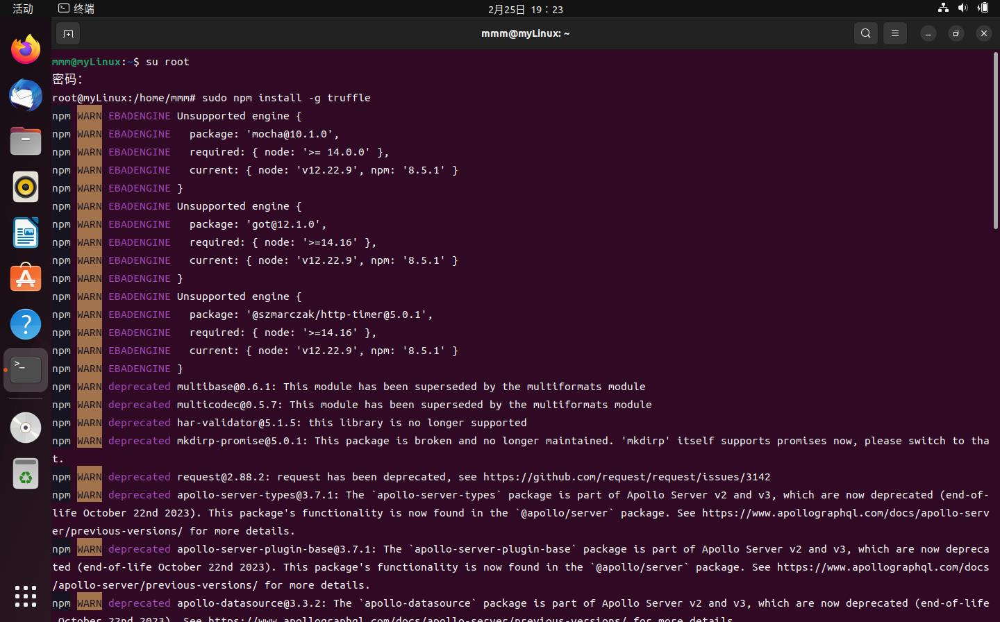
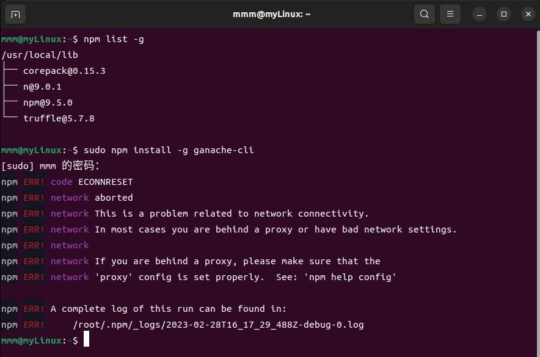
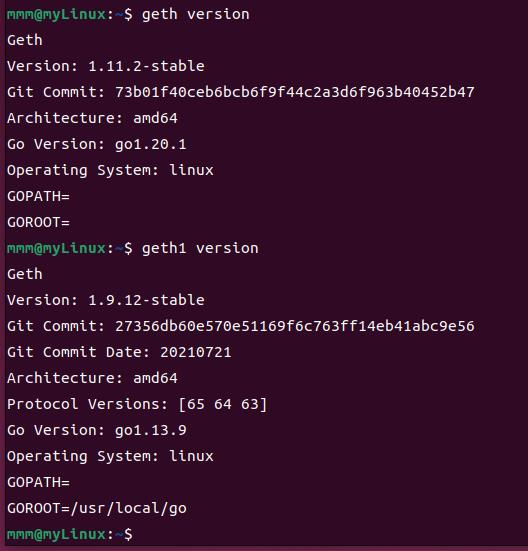

# 复现文档

## 环境配置-虚拟机part
### 版本：
* **目标**：清空了所有旧的虚拟机，要新配一个虚拟机
1. 更新了 **virtual box** 版本，现在的版本是：**7.0.6版本**
2. 在 virtual box 里配置虚拟机环境，它对应的 **ubuntu** 版本是：**22.04版本**
3. 安装环境

#### bug汇总
### 安装的库
#### gcc
* 11.3.0版本
#### vim
* 8.2.4919版本
#### npm
* 8.5.1版本
#### nodejs
* nodejs:v12.22.9版本
* node:v18.14.2版本
#### truffle
* 出现卡死情况：

* 解决方式：重新配置淘宝源，然后再次输入指令 “sudo npm install -g truffle” ，还是卡死，于是考虑以下俩可能性：
    * node和npm版本不匹配的问题
    * 缓存的问题
    * 指定版本下载？——最终选择，下载版本5.4.32
    
    * 它噶了...超时了，网络连接出问题？
    
    * 又安装了一次显示node的版本太低了
    
    * 于是升级node版本，升到v18.14.2
* 终于安完了...
    * 版本号：v5.7.8
    ```shell
    mmm@myLinux:~$ truffle version
    Truffle v5.7.8(core:5.7.8)
    Ganache v7.7.5
    Solidity v0.5.16(solc-js)
    Node v18.14.2
    Web3.js v1.8.2
    ```
#### ganache-cli
* 指令：sudo npm install -g ganache-cli 
* 报错了，好像是网络原因，超时了？
    
    * 是网络导致的超时问题，再次安装就解决了
* 安装完查询版本：v6.12.2版本
    
* 使用 ganache-cli 指令，能正常运行，模拟部署私有区块链，为运行合约打基础

#### geth
* 1.11.2-stable版本
##### geth1
* 后续的指令要借助此基础geth1完成
* 1.9.12版本的geth，二进制文件在仓库里
* [Linux和Windows之间共享文件夹设置方法](https://blog.csdn.net/weixin_46952849/article/details/124061252?ops_request_misc=&request_id=&biz_id=102&utm_term=virtualbox%E5%85%B1%E4%BA%AB%E6%96%87%E4%BB%B6%E5%A4%B9&utm_medium=distribute.pc_search_result.none-task-blog-2~all~sobaiduweb~default-4-124061252.142^v73^insert_down3,201^v4^add_ask,239^v2^insert_chatgpt)
    * 设置共享文件夹之后，首先要从共享文件夹里把geth1移动出来，我先移到了文档里，[访问共享文件夹的权限设置](https://blog.csdn.net/a772304419/article/details/123048330)
    * 然后要从文档文件夹里把geth1放进/usr/bin里，直接剪切+粘贴会报问题“无向/usr/bin写入的权限”，则说明需要[借助root权限进入/usr/bin](https://blog.csdn.net/m0_59133441/article/details/122081288?ops_request_misc=%257B%2522request%255Fid%2522%253A%2522167739817216800192264491%2522%252C%2522scm%2522%253A%252220140713.130102334..%2522%257D&request_id=167739817216800192264491&biz_id=0&utm_medium=distribute.pc_search_result.none-task-blog-2~all~sobaiduend~default-1-122081288-null-null.142^v73^insert_down3,201^v4^add_ask,239^v2^insert_chatgpt&utm_term=linux%20%E7%A7%BB%E5%8A%A8%E6%96%87%E4%BB%B6%E6%9D%83%E9%99%90%E4%B8%8D%E5%A4%9F)。采用第一条解决方法即可完成移动。
* 检查版本无误。

* [基础使用手册](https://www.cnblogs.com/ddcoder/p/7837910.html)
#### web3
#### solc
### 安装软件
#### vscode
* 1.75.1版本
* [一些使用技巧](https://blog.csdn.net/weixin_44062177/article/details/125302270?ops_request_misc=&request_id=&biz_id=102&utm_term=vscode%20truffle&utm_medium=distribute.pc_search_result.none-task-blog-2~all~sobaiduweb~default-9-125302270.nonecase&spm=1018.2226.3001.4187)

## 传统区块链初始化和启动-半完成
* 需记录的是，chainID：666，password：123456
* 常用指令：
    ```javaScript
    > miner.start(1)
    > miner.stop()
    > exit
    ```
### 测试的合约
* [使用方法](https://blog.csdn.net/Scoful/article/details/118226053?ops_request_misc=%257B%2522request%255Fid%2522%253A%2522167750446916782427466369%2522%252C%2522scm%2522%253A%252220140713.130102334.pc%255Fall.%2522%257D&request_id=167750446916782427466369&biz_id=0&utm_medium=distribute.pc_search_result.none-task-blog-2~all~first_rank_ecpm_v1~rank_v31_ecpm-26-118226053-null-null.142^v73^insert_down3,201^v4^add_ask,239^v2^insert_chatgpt&utm_term=vscode%20truffle&spm=1018.2226.3001.4187)
### 测试合约part
* 在使用 truffle init 之后，生成的对应文件的作用：

* 把合约搞好以后，编译得到这个：
    ```shell
    mmm@myLinux:~/testCode/test$ truffle compile

    Compiling your contracts...
    ===========================
    > Compiling ./contracts/InfoContract.solin. Attempt #2
    > Compilation warnings encountered:

        Warning: Visibility for constructor is ignored. If you want the contract to be non-deployable, making it "abstract" is sufficient.
    --> project:/contracts/InfoContract.sol:8:4:
    |
    8 |    constructor() public {
    |    ^ (Relevant source part starts here and spans across multiple lines).


    > Artifacts written to /home/mmm/testCode/test/build/contracts
    > Compiled successfully using:
    - solc: 0.8.18+commit.87f61d96.Emscripten.clang
    mmm@myLinux:~/testCode/test$ 
    ✓ Downloading compiler. Attempt #2.
    ```
* 修改接口：
    ```JSON
    "abi": [
    {
      "inputs": [],
      "stateMutability": "nonpayable",
      "type": "constructor"
    },
    {
      "inputs": [],
      "name": "age",
      "outputs": [
        {
          "internalType": "uint256",
          "name": "",
          "type": "uint256"
        }
      ],
      "stateMutability": "view",
      "type": "function"
    },
    {
      "inputs": [],
      "name": "fName",
      "outputs": [
        {
          "internalType": "string",
          "name": "",
          "type": "string"
        }
      ],
      "stateMutability": "view",
      "type": "function"
    },
    {
      "inputs": [
        {
          "internalType": "string",
          "name": "_fName",
          "type": "string"
        },
        {
          "internalType": "uint256",
          "name": "_age",
          "type": "uint256"
        }
      ],
      "name": "setInfo",
      "outputs": [],
      "stateMutability": "payable",
      "type": "function"
    },
    {
      "inputs": [],
      "name": "getInfo",
      "outputs": [
        {
          "internalType": "string",
          "name": "",
          "type": "string"
        },
        {
          "internalType": "uint256",
          "name": "",
          "type": "uint256"
        }
      ],
      "stateMutability": "view",
      "type": "function"
    }
  ]
    ```
* 使用 ganache-cli 完成区块链模拟，在 “truffle migration”，应该是“发布合约”的环节报错，显示的是网络连接出错了，如下图：

* 因此去 truffle-config.js 里修改连接的网络地址：
    ```json
    development: {
     host: "127.0.0.1",     // Localhost (default: none)
     port: 8545,            // Standard Ethereum port (default: none)
     network_id: "*",       // Any network (default: none)
    }
    ```
    * 把这几部分的注释消掉，之所以使用 127.0.0.1:8545 的原因是，ganache-cli 的区块链模拟情况下，其显示的监听端口为 127.0.0.1:8545
    * 修改完 truffle-config.js 以后，再次 “truffle migration”，发现在 ganache-cli 对应的终端里，有多余的三行输出，说明监听到了内容
        * truffle migration 和 truffle migrate 的效果一致
* 但实际上此时还是出问题：
    
    * 按行去查找，发现问题出在红框里：“network up to date”，像个报错，然后在网上搜到[可能的解决方法](https://blog.csdn.net/jamesdodo/article/details/108445967?ops_request_misc=&request_id=&biz_id=102&utm_term=truffle%20migrate%20Network%20up%20to%20&utm_medium=distribute.pc_search_result.none-task-blog-2~all~sobaiduweb~default-3-108445967.142^v73^insert_down3,201^v4^add_ask,239^v2^insert_chatgpt)
        * 为了强制合约再次发布，采用 “truffle migrate --reset” 指令
* 然后发现在部署后，他不按照正常的情况出结果，因此对拍源代码，发现我缺失了 “1_initial_migration.js” 和 “Migrations.sol” 文件，添加后，正常出结果
 

* 正常，按要求寻找合约地址和合约账户，在 index.html 里修改
* 改完以后，在 index.html 页面里，直接借助 “open in default browser” 打开默认浏览器，如下图：
    
    如果访问 localhost:8545/index.html 则出现下图的400号报错。
    
    * 新目标：解决无法访问动态网页的问题
    * 分析可能是因为没有正确连接 web3？不清楚，但是没有给 firebox 浏览器安装 MetaMask 扩展，可能是失败第一步...
* 在csdn上搜索，发现好像是因为没有安装MetaMask？所以在走流程以后， ganache-cli 中给出的私钥也没啥用...就按流程安装它
  * MetaMask 钱包的密码：hellometa258
  * MetaMask 账户助记词：shed fragile old leader addict appear defy solution punch uncle pioneer correct
* [配置 MetaMask 网络](https://blog.csdn.net/weixin_46353030/article/details/121494906)
* 还是不显示（test 11 year old），查看页面元素，发现是web3的调用部分出错了↓

  * 感觉它是不是想说，无法访问 web3.min.js，就去查看了一下 node_modules 文件夹的权限，发现其只允许 root 访问，感觉可能是这里的问题，修改 node_modules 文件夹的权限。
    * 把 node_modules 文件夹的权限从仅限 root 访问，变成了允许 mmm 访问，完全更改体如下图，原本的样子如红色标示。
    
    * 以及修改了 web3 文件夹、web3.min.js 文件的权限以后，测试的网页能正常出现，完成测试，接下来的目的是返回复现实验，测试在 test_truffle_geth 文件夹内部署的区块链是否正确
* 开始走：启动私有链、创建账户挖矿、测试私有链的流程
  * 启动私有链：在 personal.newAccount("123456") 步骤后，分析输出，可以看到它给出了如下内容：
    
  * 其中 address 应该指账户地址，需要 remember 的 password 应该是指私钥
  * 但由于此部分不需要 MetaMask，所以不管它
* 在此处实现 "truffle migrate --reset" 的时候出现如下报错：
    
  它导致了整个迁移脚本无法运行，究其根本，问题应该出在 terminal 的 geth1 指令部署私有区块链上，就考虑到是否为账户重复新建+使用，导致出现网络配置问题；同时也对比了第一次初次部署区块链且新建完账户后被打断，此次再次部署区块链并新建账户时，建立的账户是两个名字相同的账户，第二次 geth1 指令输入且按流程创建账户挖矿后，事实上没挖出来矿，因为它一直卡住不动，上csdn搜索了一下为什么“不挖矿”，也有人说可能是重复创建账户的原因，因此在 terminal 里查看账户数量：
    
    (不知道...)
    * 针对不挖矿的情况...它其实是一直卡在 "Commit new mining work" 的地方了...不知道怎么回事，第一次挖矿就很正常，第二次就不正常...
      * 决定按照[网上的说法](https://blog.csdn.net/bajiu8739/article/details/101907137?ops_request_misc=%257B%2522request%255Fid%2522%253A%2522167768865216800227487927%2522%252C%2522scm%2522%253A%252220140713.130102334..%2522%257D&request_id=167768865216800227487927&biz_id=0&utm_medium=distribute.pc_search_result.none-task-blog-2~all~sobaiduend~default-2-101907137-null-null.142^v73^insert_down3,201^v4^add_ask,239^v2^insert_chatgpt&utm_term=Commit%20new%20mining%20work) -> 可能需要多等一会...
        * **a时间开始挖矿，a+30min能动起来**...
      * 打算通过 eth.blockNumber 来在等候很久以后查看是否挖到东西... -> 没增长
      * 也有可能是创世块配置文件失效？[有可能的解决方案](https://blog.csdn.net/weixin_43875104/article/details/120217299)


