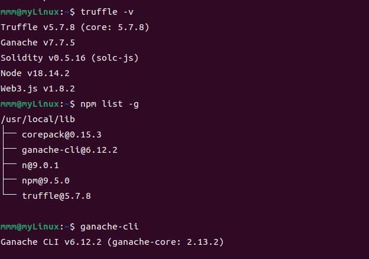
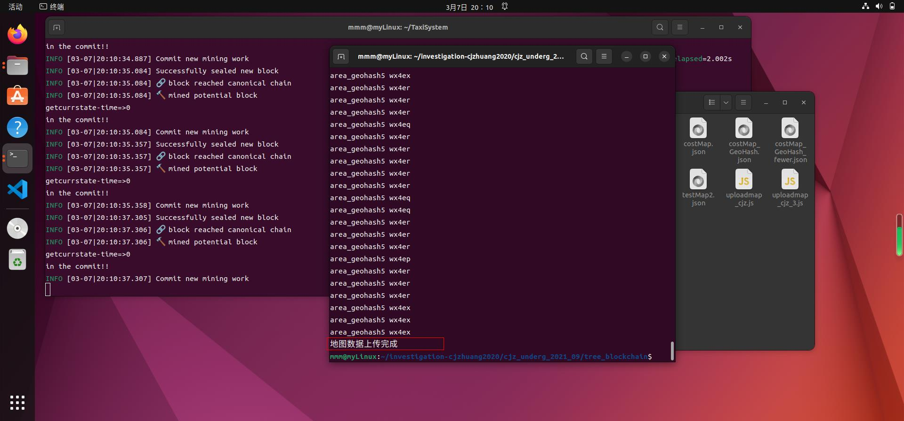
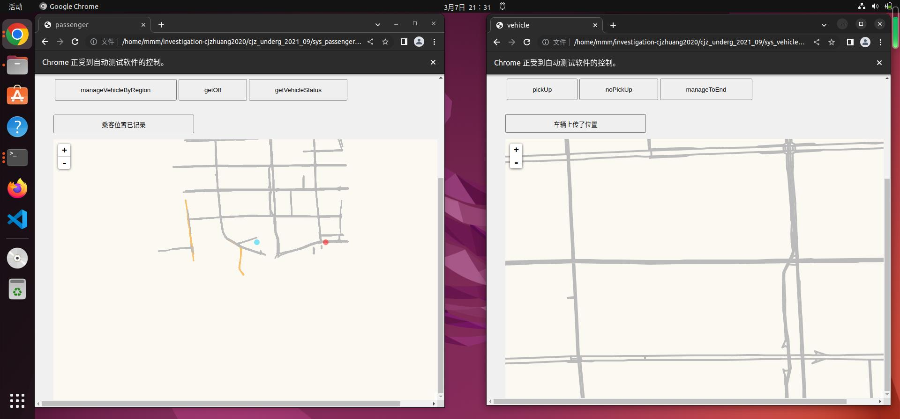
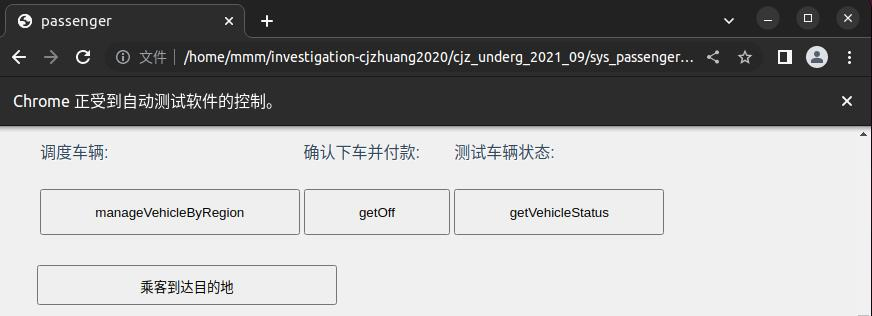

# 复现文档

> 整个流程已走完，待将本markdown文件整理到易阅读的水平

## 00 环境配置-虚拟机part
### 版本：
* **目标**：清空了所有旧的虚拟机，要新配一个虚拟机
1. 更新了 **virtual box** 版本，现在的版本是：**7.0.6版本**
2. 在 virtual box 里配置虚拟机环境，它对应的 **ubuntu** 版本是：**22.04版本**
3. 安装环境

#### bug汇总
### 安装的库
#### gcc
* 11.3.0版本
#### vim
* 8.2.4919版本
#### npm
* 8.5.1版本
#### nodejs
* nodejs:v12.22.9版本
* node:v18.14.2版本
#### truffle
* 出现卡死情况：

* 解决方式：重新配置淘宝源，然后再次输入指令 “sudo npm install -g truffle” ，还是卡死，于是考虑以下俩可能性：
    * node和npm版本不匹配的问题
    * 缓存的问题
    * 指定版本下载？——最终选择，下载版本5.4.32
    
    * 它噶了...超时了，网络连接出问题？
    
    * 又安装了一次显示node的版本太低了
    
    * 于是升级node版本，升到v18.14.2
* 终于安完了...
    * 版本号：v5.7.8
    ```shell
    mmm@myLinux:~$ truffle version
    Truffle v5.7.8(core:5.7.8)
    Ganache v7.7.5
    Solidity v0.5.16(solc-js)
    Node v18.14.2
    Web3.js v1.8.2
    ```
#### ganache-cli
* 指令：sudo npm install -g ganache-cli 
* 报错了，好像是网络原因，超时了？
    
    * 是网络导致的超时问题，再次安装就解决了
* 安装完查询版本：v6.12.2版本
    
* 使用 ganache-cli 指令，能正常运行，模拟部署私有区块链，为运行合约打基础

#### geth
* 1.11.2-stable版本
##### geth1
* 后续的指令要借助此基础geth1完成
* 1.9.12版本的geth，二进制文件在仓库里
* [Linux和Windows之间共享文件夹设置方法](https://blog.csdn.net/weixin_46952849/article/details/124061252?ops_request_misc=&request_id=&biz_id=102&utm_term=virtualbox%E5%85%B1%E4%BA%AB%E6%96%87%E4%BB%B6%E5%A4%B9&utm_medium=distribute.pc_search_result.none-task-blog-2~all~sobaiduweb~default-4-124061252.142^v73^insert_down3,201^v4^add_ask,239^v2^insert_chatgpt)
    * 设置共享文件夹之后，首先要从共享文件夹里把geth1移动出来，我先移到了文档里，[访问共享文件夹的权限设置](https://blog.csdn.net/a772304419/article/details/123048330)
    * 然后要从文档文件夹里把geth1放进/usr/bin里，直接剪切+粘贴会报问题“无向/usr/bin写入的权限”，则说明需要[借助root权限进入/usr/bin](https://blog.csdn.net/m0_59133441/article/details/122081288?ops_request_misc=%257B%2522request%255Fid%2522%253A%2522167739817216800192264491%2522%252C%2522scm%2522%253A%252220140713.130102334..%2522%257D&request_id=167739817216800192264491&biz_id=0&utm_medium=distribute.pc_search_result.none-task-blog-2~all~sobaiduend~default-1-122081288-null-null.142^v73^insert_down3,201^v4^add_ask,239^v2^insert_chatgpt&utm_term=linux%20%E7%A7%BB%E5%8A%A8%E6%96%87%E4%BB%B6%E6%9D%83%E9%99%90%E4%B8%8D%E5%A4%9F)。采用第一条解决方法即可完成移动。
* 检查版本无误。

* [基础使用手册](https://www.cnblogs.com/ddcoder/p/7837910.html)
#### web3
#### solc
### 安装软件
#### vscode
* 1.75.1版本
* [一些使用技巧](https://blog.csdn.net/weixin_44062177/article/details/125302270?ops_request_misc=&request_id=&biz_id=102&utm_term=vscode%20truffle&utm_medium=distribute.pc_search_result.none-task-blog-2~all~sobaiduweb~default-9-125302270.nonecase&spm=1018.2226.3001.4187)

#### Remix Ide
* [在线使用](https://remix.ethereum.org/#lang=en&optimize=false&runs=200&evmVersion=null&version=soljson-v0.8.18+commit.87f61d96.js)
  * 但我的虚拟机中上本网页很慢...所以使用自己本地vscode进行相关truffle配置后编译智能合约以获取abi、bytecode码


## 01 传统区块链初始化和启动(test_truffle_Geth) - 半完成
* 需记录的是，chainID：666，password：123456
* 常用指令：
    ```javaScript
    > miner.start(1)
    > miner.stop()
    > exit
    ```
### 测试的合约
* [使用方法](https://blog.csdn.net/Scoful/article/details/118226053?ops_request_misc=%257B%2522request%255Fid%2522%253A%2522167750446916782427466369%2522%252C%2522scm%2522%253A%252220140713.130102334.pc%255Fall.%2522%257D&request_id=167750446916782427466369&biz_id=0&utm_medium=distribute.pc_search_result.none-task-blog-2~all~first_rank_ecpm_v1~rank_v31_ecpm-26-118226053-null-null.142^v73^insert_down3,201^v4^add_ask,239^v2^insert_chatgpt&utm_term=vscode%20truffle&spm=1018.2226.3001.4187)
### 测试合约part
* 在使用 truffle init 之后，生成的对应文件的作用：

* 把合约搞好以后，编译得到这个：
    ```shell
    mmm@myLinux:~/testCode/test$ truffle compile

    Compiling your contracts...
    ===========================
    > Compiling ./contracts/InfoContract.solin. Attempt #2
    > Compilation warnings encountered:

        Warning: Visibility for constructor is ignored. If you want the contract to be non-deployable, making it "abstract" is sufficient.
    --> project:/contracts/InfoContract.sol:8:4:
    |
    8 |    constructor() public {
    |    ^ (Relevant source part starts here and spans across multiple lines).


    > Artifacts written to /home/mmm/testCode/test/build/contracts
    > Compiled successfully using:
    - solc: 0.8.18+commit.87f61d96.Emscripten.clang
    mmm@myLinux:~/testCode/test$ 
    ✓ Downloading compiler. Attempt #2.
    ```
* 修改接口：
    ```JSON
    "abi": [
    {
      "inputs": [],
      "stateMutability": "nonpayable",
      "type": "constructor"
    },
    {
      "inputs": [],
      "name": "age",
      "outputs": [
        {
          "internalType": "uint256",
          "name": "",
          "type": "uint256"
        }
      ],
      "stateMutability": "view",
      "type": "function"
    },
    {
      "inputs": [],
      "name": "fName",
      "outputs": [
        {
          "internalType": "string",
          "name": "",
          "type": "string"
        }
      ],
      "stateMutability": "view",
      "type": "function"
    },
    {
      "inputs": [
        {
          "internalType": "string",
          "name": "_fName",
          "type": "string"
        },
        {
          "internalType": "uint256",
          "name": "_age",
          "type": "uint256"
        }
      ],
      "name": "setInfo",
      "outputs": [],
      "stateMutability": "payable",
      "type": "function"
    },
    {
      "inputs": [],
      "name": "getInfo",
      "outputs": [
        {
          "internalType": "string",
          "name": "",
          "type": "string"
        },
        {
          "internalType": "uint256",
          "name": "",
          "type": "uint256"
        }
      ],
      "stateMutability": "view",
      "type": "function"
    }
  ]
    ```
    又一次编译。。。0304完成。。。
    ```json
    "abi": [
    {
      "inputs": [],
      "stateMutability": "nonpayable",
      "type": "constructor"
    },
    {
      "inputs": [],
      "name": "age",
      "outputs": [
        {
          "internalType": "uint256",
          "name": "",
          "type": "uint256"
        }
      ],
      "stateMutability": "view",
      "type": "function"
    },
    {
      "inputs": [],
      "name": "fName",
      "outputs": [
        {
          "internalType": "string",
          "name": "",
          "type": "string"
        }
      ],
      "stateMutability": "view",
      "type": "function"
    },
    {
      "inputs": [
        {
          "internalType": "string",
          "name": "_fName",
          "type": "string"
        },
        {
          "internalType": "uint256",
          "name": "_age",
          "type": "uint256"
        }
      ],
      "name": "setInfo",
      "outputs": [],
      "stateMutability": "payable",
      "type": "function"
    },
    {
      "inputs": [],
      "name": "getInfo",
      "outputs": [
        {
          "internalType": "string",
          "name": "",
          "type": "string"
        },
        {
          "internalType": "uint256",
          "name": "",
          "type": "uint256"
        }
      ],
      "stateMutability": "view",
      "type": "function"
    }
  ]
    ```
* 使用 ganache-cli 完成区块链模拟，在 “truffle migration”，应该是“发布合约”的环节报错，显示的是网络连接出错了，如下图：

* 因此去 truffle-config.js 里修改连接的网络地址：
    ```json
    development: {
     host: "127.0.0.1",     // Localhost (default: none)
     port: 8545,            // Standard Ethereum port (default: none)
     network_id: "*",       // Any network (default: none)
    }
    ```
    * 把这几部分的注释消掉，之所以使用 127.0.0.1:8545 的原因是，ganache-cli 的区块链模拟情况下，其显示的监听端口为 127.0.0.1:8545
    * 修改完 truffle-config.js 以后，再次 “truffle migration”，发现在 ganache-cli 对应的终端里，有多余的三行输出，说明监听到了内容
        * truffle migration 和 truffle migrate 的效果一致
* 但实际上此时还是出问题：
    
    * 按行去查找，发现问题出在红框里：“network up to date”，像个报错，然后在网上搜到[可能的解决方法](https://blog.csdn.net/jamesdodo/article/details/108445967?ops_request_misc=&request_id=&biz_id=102&utm_term=truffle%20migrate%20Network%20up%20to%20&utm_medium=distribute.pc_search_result.none-task-blog-2~all~sobaiduweb~default-3-108445967.142^v73^insert_down3,201^v4^add_ask,239^v2^insert_chatgpt)
        * 为了强制合约再次发布，采用 “truffle migrate --reset” 指令
* 然后发现在部署后，他不按照正常的情况出结果，因此对拍源代码，发现我缺失了 “1_initial_migration.js” 和 “Migrations.sol” 文件，添加后，正常出结果
 

* 正常，按要求寻找合约地址和合约账户，在 index.html 里修改
* 改完以后，在 index.html 页面里，直接借助 “open in default browser” 打开默认浏览器，如下图：
    
    如果访问 localhost:8545/index.html 则出现下图的400号报错。
    
    * 新目标：解决无法访问动态网页的问题
    * 分析可能是因为没有正确连接 web3？不清楚，但是没有给 firebox 浏览器安装 MetaMask 扩展，可能是失败第一步...
* 在csdn上搜索，发现好像是因为没有安装MetaMask？所以在走流程以后， ganache-cli 中给出的私钥也没啥用...就按流程安装它
  * MetaMask 钱包的密码：hellometa258
  * MetaMask 账户助记词：shed fragile old leader addict appear defy solution punch uncle pioneer correct
* [配置 MetaMask 网络](https://blog.csdn.net/weixin_46353030/article/details/121494906)
* 还是不显示（test 11 year old），查看页面元素，发现是web3的调用部分出错了↓

  * 感觉它是不是想说，无法访问 web3.min.js，就去查看了一下 node_modules 文件夹的权限，发现其只允许 root 访问，感觉可能是这里的问题，修改 node_modules 文件夹的权限。
    * 把 node_modules 文件夹的权限从仅限 root 访问，变成了允许 mmm 访问，完全更改体如下图，原本的样子如红色标示。
    
    * 以及修改了 web3 文件夹、web3.min.js 文件的权限以后，测试的网页能正常出现，完成测试，接下来的目的是返回复现实验，测试在 test_truffle_geth 文件夹内部署的区块链是否正确
* 开始走：启动私有链、创建账户挖矿、测试私有链的流程
  * 启动私有链：在 personal.newAccount("123456") 步骤后，分析输出，可以看到它给出了如下内容：
    
  * 其中 address 应该指账户地址，需要 remember 的 password 应该是指私钥
  * 但由于此部分不需要 MetaMask，所以不管它
* 在此处实现 "truffle migrate --reset" 的时候出现如下报错：
    
  它导致了整个迁移脚本无法运行，究其根本，问题应该出在 terminal 的 geth1 指令部署私有区块链上，就考虑到是否为账户重复新建+使用，导致出现网络配置问题；同时也对比了第一次初次部署区块链且新建完账户后被打断，此次再次部署区块链并新建账户时，建立的账户是两个名字相同的账户，第二次 geth1 指令输入且按流程创建账户挖矿后，事实上没挖出来矿，因为它一直卡住不动，上csdn搜索了一下为什么“不挖矿”，也有人说可能是重复创建账户的原因，因此在 terminal 里查看账户数量：
    
    (不知道...)
    * 针对不挖矿的情况...它其实是一直卡在 "Commit new mining work" 的地方了...不知道怎么回事，第一次挖矿就很正常，第二次就不正常...
      * 决定按照[网上的说法](https://blog.csdn.net/bajiu8739/article/details/101907137?ops_request_misc=%257B%2522request%255Fid%2522%253A%2522167768865216800227487927%2522%252C%2522scm%2522%253A%252220140713.130102334..%2522%257D&request_id=167768865216800227487927&biz_id=0&utm_medium=distribute.pc_search_result.none-task-blog-2~all~sobaiduend~default-2-101907137-null-null.142^v73^insert_down3,201^v4^add_ask,239^v2^insert_chatgpt&utm_term=Commit%20new%20mining%20work) -> 可能需要多等一会...
        * **a时间开始挖矿，a+30min能动起来**...
      * 打算通过 eth.blockNumber 来在等候很久以后查看是否挖到东西... -> 没增长
      * 也有可能是创世块配置文件失效？[有可能的解决方案](https://blog.csdn.net/weixin_43875104/article/details/120217299)
* 。。。不知道为啥。。。？挖矿的问题他自己好了？？？
* “network ID ：NAN” 的问题在于：区块链创世块配置里的chainID=666 ， 但在启动geth1的时候用的chainID=100
* 修改启动 geth1 的语句，发现依然报 “network ID：NAN”
* 怒而重部署区块链
  * 删除掉 chain 文件夹
  * 依据 genesis.json 文件重新初始化链
  * 启动区块链，在此时使用 chainID 666（和genesis.json里保持一致）
  * 在 geth1 console 中，按顺序走“建账户-解锁账户-挖矿”流程
    
    * 又报错了...
      ```shell
      Compiling your contracts...
      ===========================
      > Everything is up to date, there is nothing to compile.


      Starting migrations...
      ======================
      > Network name:    'development'
      > Network id:      NaN
      > Block gas limit: 4722986 (0x48112a)


      1_initial_migration.js
      ======================

        Deploying 'Migrations'
        ----------------------
      *** Deployment Failed ***

      "Migrations" -- Migrations has no network id set, cannot lookup artifact data. Either set the network manually using Migrations.setNetwork(), run Migrations.detectNetwork(), or use new(), at() or deployed() as a thenable which will detect the network automatically..


      Exiting: Review successful transactions manually by checking the transaction hashes above on Etherscan.


      Error:  *** Deployment Failed ***

      "Migrations" -- Migrations has no network id set, cannot lookup artifact data. Either set the network manually using Migrations.setNetwork(), run Migrations.detectNetwork(), or use new(), at() or deployed() as a thenable which will detect the network automatically..

          at /usr/local/lib/node_modules/truffle/build/webpack:/packages/deployer/src/deployment.js:330:1
          at processTicksAndRejections (node:internal/process/task_queues:95:5)
      Truffle v5.7.8 (core: 5.7.8)
      Node v18.14.2
      ```


* 新收到的官方文档投喂（
  * [truffle官方手册](https://trufflesuite.com/docs/truffle/reference/command-line-options/#init)
  * [truffle官方文档](https://platon-truffle.readthedocs.io/en/stable/getting-started/running-migrations.html)
  * [中文truffle手册](https://learnblockchain.cn/docs/truffle/getting-started/running-migrations.html)


## 02 树状区块链启动和创建节点(TreeBlockchain) - 完成
### 建立账户part
* 需记录的内容：
  ```javaScript
    > personal.newAccount("123456")

    INFO [03-05|14:02:30.487] Your new key was generated               address=0xcE6771Ec04F35c37c28db4E16c440Fce30122325

    WARN [03-05|14:02:30.493] Please backup your key file!             path=/home/mmm/TreeBlockchain/gethdata/keystore/UTC--2023-03-05T06-02-22.312696877Z--ce6771ec04f35c37c28db4e16c440fce30122325

    WARN [03-05|14:02:30.497] Please remember your password! 

    "0xce6771ec04f35c37c28db4e16c440fce30122325"

    > 
  ```
* 挖矿期出现的合约地址：
  ```
  INFO [03-05|14:22:07.143] Commit new mining work                   number=2 sealhash=45c157…3b3a6e uncles=0 txs=0 gas=0       fees=0           elapsed=66.379ms

  null [object Object]

  Contract mined! Address: 0x471a9fddb6540e40a52543c4223df97a308ba6dd

  [object Object]

  null [object Object]

  Contract mined! Address: 0xd171289d0ec854394f48c23f4e5590d6df12765f

  [object Object]
  ```
* 然后它一直在正常挖矿。实验结束。

## 03 区块链创建多个节点(MultiNodes) - 已完成
### 初始化part
* 第一个疑问点：
  * n1-p45、n1-p41、n2-p46、n2-p42都是啥？
  * reply：可能是不同终端的命名
### 配第一个节点
  * 获得的输出信息
    ```javascript
    > personal.newAccount("123456")

    INFO [03-05|15:48:24.498] Your new key was generated               address=0x1b515792342d9f468F8af857F0277b4267cD374F

    WARN [03-05|15:48:24.503] Please backup your key file!             path=/home/mmm/MultiNodes/Node1/gethdata/keystore/UTC--2023-03-05T07-48-21.100667243Z--1b515792342d9f468f8af857f0277b4267cd374f

    WARN [03-05|15:48:24.504] Please remember your password! 

    "0x1b515792342d9f468f8af857f0277b4267cd374f"
    ```
### 配第二个节点
* 获取第一个节点的信息
  ```javascript
  > admin.nodeInfo.enode

  "enode://1ce84f8237f0f87322020a1e1635f5eb25d70d4bba225a9e10ea417ac43fc474bd1efe2415eea2d254714c9e5257dd4dd2bc45e33681e5d1b519d58dd1cd8e4d@127.0.0.1:30303?discport=0"

  > 
  ```
### 同步
* 在n1-p45里挖矿时，n2-46会出现同步信息


## 04 event事件监听的实现(EventListening) - 已完成
### 创建账户part
* 4个账户地址
  ```javascript
  > for (i = 0; i < 4; i++) { personal.newAccount("123456") }

  INFO [03-06|09:43:31.528] Your new key was generated               address=0x21C746a316Db28774Aa558CadE715E296A5f394A

  WARN [03-06|09:43:31.535] Please backup your key file!             path=/home/mmm/EventListening/gethdata/keystore/UTC--2023-03-06T01-43-26.299649841Z--21c746a316db28774aa558cade715e296a5f394a

  WARN [03-06|09:43:31.536] Please remember your password! 

  INFO [03-06|09:43:43.650] Your new key was generated               address=0xb1b9381984Fa9F86Ac03eEA10a16f71FE3BE4702

  WARN [03-06|09:43:43.650] Please backup your key file!             path=/home/mmm/EventListening/gethdata/keystore/UTC--2023-03-06T01-43-31.575694296Z--b1b9381984fa9f86ac03eea10a16f71fe3be4702

  WARN [03-06|09:43:43.650] Please remember your password! 

  INFO [03-06|09:43:46.343] Your new key was generated               address=0x1350a4309721EFcb9323b502D1b337E5E0FDF267

  WARN [03-06|09:43:46.343] Please backup your key file!             path=/home/mmm/EventListening/gethdata/keystore/UTC--2023-03-06T01-43-43.661798030Z--1350a4309721efcb9323b502d1b337e5e0fdf267

  WARN [03-06|09:43:46.346] Please remember your password! 

  INFO [03-06|09:43:48.594] Your new key was generated               address=0x97528Bf63ff812d2c731fD76493A3Fab7043Becc

  WARN [03-06|09:43:48.594] Please backup your key file!             path=/home/mmm/EventListening/gethdata/keystore/UTC--2023-03-06T01-43-46.347245906Z--97528bf63ff812d2c731fd76493a3fab7043becc

  WARN [03-06|09:43:48.594] Please remember your password! 

  "0x97528bf63ff812d2c731fd76493a3fab7043becc"
  ```
* 将这四个地址补充到 genesis.json 文件中，然后重新初始化链-在终端打开链控制台，用 eth.getBalance(eth.accounts[0])~eth.getBalance(eth.accounts[3]) 依次查看余额情况，输出 5e+40，表明配置成功
* 要进行下一步的时候，发现自己环境没配全，因此中断 geth javascript 控制台，去安装 Remix-ide
* 找到了 Remix-ide 的在线编辑网址，在虚拟机里打不开，只能在 Windows 的主机下打开，所以在 Windows11-Edge 中打开 Remix-ide 的在线编辑网站，编译 TestContract.sol，得到 TestContract.json，在其中找到关心的接口，但将其拼接导入 geth javascript console 里发现其报错 “invaild address”
* 考虑到使用 Remix-ide 的本质是为了编译智能合约 TestContract.sol 从而得到 TestContract.json，在其中寻找接口内容完成部署；因为不想下载 Remix-ide，因此我选择使用 vsCode+truffle 的方式编译智能合约。
  * truffle init -> 导入TestContract.sol -> truffle compile
  * 得到 TestContract.json，从而寻找对应接口
    ```json
    "abi": [
      {
        "anonymous": false,
        "inputs": [
          {
            "indexed": false,
            "internalType": "string",
            "name": "res",
            "type": "string"
          }
        ],
        "name": "Myevent",
        "type": "event"
      },
      {
        "inputs": [
          {
            "internalType": "string",
            "name": "uuid",
            "type": "string"
          }
        ],
        "name": "setVehicleStatus",
        "outputs": [],
        "stateMutability": "nonpayable",
        "type": "function"
      }
    ],
    ```
    ```json
    "bytecode": "0x608060405234801561001057600080fd5b506103da806100206000396000f3fe608060405234801561001057600080fd5b506004361061002b5760003560e01c8063aa5d485214610030575b600080fd5b61004a60048036038101906100459190610238565b61004c565b005b6000808260405161005d91906102f2565b9081526020016040518091039020600001541461007d5761007c610309565b5b7fb58728ea1fc0389ea1078b5d1833ae97cedee74c5b53b4f6d4281af24be5867c816040516100ac9190610382565b60405180910390a160016000826040516100c691906102f2565b90815260200160405180910390206000018190555050565b6000604051905090565b600080fd5b600080fd5b600080fd5b600080fd5b6000601f19601f8301169050919050565b7f4e487b7100000000000000000000000000000000000000000000000000000000600052604160045260246000fd5b610145826100fc565b810181811067ffffffffffffffff821117156101645761016361010d565b5b80604052505050565b60006101776100de565b9050610183828261013c565b919050565b600067ffffffffffffffff8211156101a3576101a261010d565b5b6101ac826100fc565b9050602081019050919050565b82818337600083830152505050565b60006101db6101d684610188565b61016d565b9050828152602081018484840111156101f7576101f66100f7565b5b6102028482856101b9565b509392505050565b600082601f83011261021f5761021e6100f2565b5b813561022f8482602086016101c8565b91505092915050565b60006020828403121561024e5761024d6100e8565b5b600082013567ffffffffffffffff81111561026c5761026b6100ed565b5b6102788482850161020a565b91505092915050565b600081519050919050565b600081905092915050565b60005b838110156102b557808201518184015260208101905061029a565b60008484015250505050565b60006102cc82610281565b6102d6818561028c565b93506102e6818560208601610297565b80840191505092915050565b60006102fe82846102c1565b915081905092915050565b7f4e487b7100000000000000000000000000000000000000000000000000000000600052600160045260246000fd5b600082825260208201905092915050565b600061035482610281565b61035e8185610338565b935061036e818560208601610297565b610377816100fc565b840191505092915050565b6000602082019050818103600083015261039c8184610349565b90509291505056fea2646970667358221220bb5d396061ec56e063cd8629c71c490ff8e3b127a6458ddf8b53bad1d409930d64736f6c63430008120033",
    
    ```
* 将得到的接口信息，拼接如下：
  ```javascript
  abi = JSON.parse('[{\"anonymous\":false,\"inputs\":[{\"indexed\":false,\"internalType\":\"string\",\"name\":\"res\",\"type\":\"string\"}],\"name\":\"Myevent\",\"type\":\"event\"},{\"inputs\":[{\"internalType\":\"string\",\"name\":\"uuid\",\"type\":\"string\"}],\"name\":\"setVehicleStatus\",\"outputs\":[],\"stateMutability\":\"nonpayable\",\"type\":\"function\"}]')
  bytecode = "0x608060405234801561001057600080fd5b506103da806100206000396000f3fe608060405234801561001057600080fd5b506004361061002b5760003560e01c8063aa5d485214610030575b600080fd5b61004a60048036038101906100459190610238565b61004c565b005b6000808260405161005d91906102f2565b9081526020016040518091039020600001541461007d5761007c610309565b5b7fb58728ea1fc0389ea1078b5d1833ae97cedee74c5b53b4f6d4281af24be5867c816040516100ac9190610382565b60405180910390a160016000826040516100c691906102f2565b90815260200160405180910390206000018190555050565b6000604051905090565b600080fd5b600080fd5b600080fd5b600080fd5b6000601f19601f8301169050919050565b7f4e487b7100000000000000000000000000000000000000000000000000000000600052604160045260246000fd5b610145826100fc565b810181811067ffffffffffffffff821117156101645761016361010d565b5b80604052505050565b60006101776100de565b9050610183828261013c565b919050565b600067ffffffffffffffff8211156101a3576101a261010d565b5b6101ac826100fc565b9050602081019050919050565b82818337600083830152505050565b60006101db6101d684610188565b61016d565b9050828152602081018484840111156101f7576101f66100f7565b5b6102028482856101b9565b509392505050565b600082601f83011261021f5761021e6100f2565b5b813561022f8482602086016101c8565b91505092915050565b60006020828403121561024e5761024d6100e8565b5b600082013567ffffffffffffffff81111561026c5761026b6100ed565b5b6102788482850161020a565b91505092915050565b600081519050919050565b600081905092915050565b60005b838110156102b557808201518184015260208101905061029a565b60008484015250505050565b60006102cc82610281565b6102d6818561028c565b93506102e6818560208601610297565b80840191505092915050565b60006102fe82846102c1565b915081905092915050565b7f4e487b7100000000000000000000000000000000000000000000000000000000600052600160045260246000fd5b600082825260208201905092915050565b600061035482610281565b61035e8185610338565b935061036e818560208601610297565b610377816100fc565b840191505092915050565b6000602082019050818103600083015261039c8184610349565b90509291505056fea2646970667358221220bb5d396061ec56e063cd8629c71c490ff8e3b127a6458ddf8b53bad1d409930d64736f6c63430008120033"
  QualContract = web3.eth.contract(abi);
  web3.eth.estimateGas({data: bytecode})
  Qual = QualContract.new({
          from: web3.eth.accounts[0], 
          data: bytecode, 
          gas: '1400000',
          position:"w2511111111111",
          txtime:277001
    }, function (e, contract){
      console.log(e, contract);
      if (!e) {
          if(!contract.address) {
              console.log("Contract transaction send: TransactionHash: " + contract.transactionHash + " waiting to be mined...");
          } else {
              console.log("Contract mined! Address: " + contract.address);
              console.log(contract);
          }
      }
  });
  ```
* 部署完后发现未报错，认为代码无误，部署完成。

## 05 启动多节点树状区块链(LaunchMultiNodes) - 已完成
* 初始化区块链，创建账户，记录其信息如下：
  ```javascript
  > for (i = 0; i < 4; i++) { personal.newAccount("123456")  }

  INFO [03-06|15:09:59.085] Your new key was generated               address=0x3fd5c055DA60591A56F7289D9741ad0FFEa92685

  WARN [03-06|15:09:59.086] Please backup your key file!             path=/home/mmm/LaunchMultiNodes/Node1/gethdata/keystore/UTC--2023-03-06T07-09-51.363850747Z--3fd5c055da60591a56f7289d9741ad0ffea92685

  WARN [03-06|15:09:59.086] Please remember your password! 

  INFO [03-06|15:10:03.880] Your new key was generated               address=0x7e11b9B7988696e20375A67A645CEED381aBc2d3

  WARN [03-06|15:10:03.882] Please backup your key file!             path=/home/mmm/LaunchMultiNodes/Node1/gethdata/keystore/UTC--2023-03-06T07-09-59.110440178Z--7e11b9b7988696e20375a67a645ceed381abc2d3

  WARN [03-06|15:10:03.882] Please remember your password! 

  INFO [03-06|15:10:05.944] Your new key was generated               address=0xbE9bEFdA7b9130c3F680Ca082559532D9e95023A

  WARN [03-06|15:10:05.945] Please backup your key file!             path=/home/mmm/LaunchMultiNodes/Node1/gethdata/keystore/UTC--2023-03-06T07-10-03.882924977Z--be9befda7b9130c3f680ca082559532d9e95023a

  WARN [03-06|15:10:05.945] Please remember your password! 

  INFO [03-06|15:10:10.028] Your new key was generated               address=0x3411183D0270E04b81Fb02e1FD36Ed8D57D6313d

  WARN [03-06|15:10:10.028] Please backup your key file!             path=/home/mmm/LaunchMultiNodes/Node1/gethdata/keystore/UTC--2023-03-06T07-10-05.947117048Z--3411183d0270e04b81fb02e1fd36ed8d57d6313d

  WARN [03-06|15:10:10.028] Please remember your password! 

  "0x3411183d0270e04b81fb02e1fd36ed8d57d6313d"

  > 
  ```
* 再按要求依次解锁账户，记录第一个节点的信息：
  ```javascript
  > admin.nodeInfo.enode

  "enode://49de70aedbce7b608d1481e8203e52892c5617916545b30cd2ae9a65f3df85ed3c56e9c0bf821b046b28e1444d1eb3e7c4745647c090e91218983d3b7c68cee6@127.0.0.1:30303?discport=0"
  ```
* 把节点信息在 Node2 中进行匹配修改，在 Node2 的控制台中有同样的，然后在 Node1 中开始挖矿，看到 Node2 的 geth JavaScript console 中有同步输出，实验成功

## 06 多节点树状区块链的部署(DeplyMultiNodes) - 已完成
* 记录 N1 中反馈的 enode 信息
  ```javascript
  > admin.nodeInfo.enode

  "enode://49de70aedbce7b608d1481e8203e52892c5617916545b30cd2ae9a65f3df85ed3c56e9c0bf821b046b28e1444d1eb3e7c4745647c090e91218983d3b7c68cee6@127.0.0.1:30303?discport=0"
  ```
* 将 N1 中反馈的 enode 信息配置到 N2 中，N2 terminal 中显示“net.peerCount” 的输出是 1，此步配置成功。
### 建立新的账户
* 记录 N1 中的 4 个新账户的地址：
  ```javascript
  > for (i = 4; i < 8; i++) { personal.newAccount("123456") }

  INFO [03-06|15:37:56.568] Your new key was generated               address=0x02592A164cF5A94c44F231bb5437dEC6714C3Fd8

  WARN [03-06|15:37:56.570] Please backup your key file!             path=/home/mmm/DeplyMultiNodes/Node1/gethdata/keystore/UTC--2023-03-06T07-37-53.780775366Z--02592a164cf5a94c44f231bb5437dec6714c3fd8

  WARN [03-06|15:37:56.570] Please remember your password! 

  INFO [03-06|15:37:59.851] Your new key was generated               address=0x35feE50fDe08A50C3241472D9B8286d22d7AD55A

  WARN [03-06|15:37:59.851] Please backup your key file!             path=/home/mmm/DeplyMultiNodes/Node1/gethdata/keystore/UTC--2023-03-06T07-37-56.571605710Z--35fee50fde08a50c3241472d9b8286d22d7ad55a

  WARN [03-06|15:37:59.851] Please remember your password! 

  INFO [03-06|15:38:01.598] Your new key was generated               address=0x35E5e9ABB089E47e3132Cc9d9c91DC9216d2Ea01

  WARN [03-06|15:38:01.598] Please backup your key file!             path=/home/mmm/DeplyMultiNodes/Node1/gethdata/keystore/UTC--2023-03-06T07-37-59.856015283Z--35e5e9abb089e47e3132cc9d9c91dc9216d2ea01

  WARN [03-06|15:38:01.598] Please remember your password! 

  INFO [03-06|15:38:08.266] Your new key was generated               address=0x909a320b79537b0208eA4A23257c05400B0fd219

  WARN [03-06|15:38:08.266] Please backup your key file!             path=/home/mmm/DeplyMultiNodes/Node1/gethdata/keystore/UTC--2023-03-06T07-38-01.599004287Z--909a320b79537b0208ea4a23257c05400b0fd219

  WARN [03-06|15:38:08.266] Please remember your password! 

  "0x909a320b79537b0208ea4a23257c05400b0fd219"
  ```
* 测试账户数目确实为8，配置成功，解锁四个新的账户
### 部署合约
* 首先需要先找到这俩合约 StoreMap.sol 和 StoreTraffic.sol ...
* 现将这俩合约粘贴如下：
  * StoreMap.sol
    ```Solidity
    pragma solidity ^0.5.16;

    contract StoreMap{
      // 存储地图信息
      struct one_type
      {	
        int32 minzoom;
        int32 cost;
        bool  oneway;
        bool  building;
        bytes32 highway;
        bytes32 name;   //名称 
        int32 source;
        int32 target;
        bytes32 gtype;
        uint256 path_num;
        mapping(uint256 => bytes32) path;
      }
      //gid->one_type,store real types
      mapping(uint256 => one_type) types;
      // 区域道路结构体,用于存储区域内的道路信息
      struct  area_types{
        uint256 num;
        // num->gid,store gids of roads in the area
        mapping(uint256 => uint256) types_list;
      }
      // 对称
      mapping(bytes32 => area_types) public geo_maps;

      //-----------------cjz--------------------------------------------------
      //每个邻居节点的结构
      struct adj
      {	
        bytes32 sourceGeohash;
        bytes32 targetGeohash;
        int32 target;
        int32 cost;
        int32 gid;
      }
      //遍历邻居列表能够找到所有邻居
      struct adj_types{
        uint256 adjnum;
        mapping (uint256 => adj) adjs;
      }
      //通过路口geohash找到其邻居列表
      mapping(bytes32 => adj_types) public adjacencyList;

      //参数P
      uint256 P = 1;

      struct pathType{
        uint256 num;
        mapping(uint256 => bytes32) index;
        mapping(bytes32 => bytes32) map;
      }
      struct costSofarType{
        uint256 num;
        mapping(uint256 => bytes32) index;
        mapping(bytes32 => uint256) map;
      }
      //记录每个节点的父节点
      pathType paths;
      //记录起点到当前节点的实际费用
      costSofarType costSofar;
      //-----------------cjz--------------------------------------------------
      


      // 获取对应geohash区域内所有道路信息
      function get_types(bytes32 hash) view public returns (int32[] memory feature, bytes32[] memory names, bytes32[] memory highways, bytes32[] memory gtypes, bytes32[] memory path) {
        uint256 num = geo_maps[hash].num;
        uint256 path_num = 0;
        //different parm in different domain may cause duplicate declare error when compile, maybe a bug
        uint256 i;

        if(num > 0){
          feature = new int32[](7 * num);
          names = new bytes32[]( num );
          highways = new bytes32[]( num );
          gtypes = new bytes32[]( num );
          uint256 gid;
          for(i=0; i < num; i++){
            gid = geo_maps[hash].types_list[i]; 
            one_type storage single_type = types[gid];
            uint256 base = i * 7;
            feature[base] = int32(gid);
            feature[base + 1] = single_type.minzoom;
            feature[base + 2] = single_type.cost;
            feature[base + 3] = single_type.source;
            feature[base + 4] = single_type.target;
            if(single_type.oneway){
              feature[base + 5] = 1;
            }
            else{
              feature[base + 5] = 0;
            }
            if(single_type.building){
              feature[base + 6] = 1;
            }
            else{
              feature[base + 6] = 0;
            }
            path_num = path_num + 1 + single_type.path_num;
            names[i] = single_type.name;
            highways[i] = single_type.highway;
            gtypes[i] = single_type.gtype;
          }
          path = new bytes32[](path_num);
          uint256 pos = 0;
          for(i=0; i< num; i++){
            gid = geo_maps[hash].types_list[i];
            //may cause duplicate declare, don't know why
            one_type storage single_type2 = types[gid];
            path[pos++] = bytes32(single_type2.path_num);
            for(uint256 j=0; j< single_type2.path_num; j++){
              path[pos++] = single_type2.path[j];
            }
          }
        }
      }

      // 添加一条
      function add_onetype(uint256 gid, int32 minzoom, int32 cost, int32 source, int32 target, bool oneway, bool building, bytes32 highway, bytes32 name, bytes32 gtype, bytes32[] memory path) public {
        types[gid].minzoom = minzoom;
        types[gid].cost = cost;
        types[gid].source = source;
        types[gid].target = target;
        types[gid].oneway = oneway;
        types[gid].building = building;
        types[gid].highway = highway;
        types[gid].name = name;
        types[gid].gtype = gtype;

        adjacencyList[path[0]].adjs[adjacencyList[path[0]].adjnum].sourceGeohash = path[0];
        adjacencyList[path[0]].adjs[adjacencyList[path[0]].adjnum].targetGeohash = path[path.length - 1];
        adjacencyList[path[0]].adjs[adjacencyList[path[0]].adjnum].target = target;
        adjacencyList[path[0]].adjs[adjacencyList[path[0]].adjnum].cost = cost;
        adjacencyList[path[0]].adjs[adjacencyList[path[0]].adjnum++].gid = int32(gid);

        uint256 num = types[gid].path_num;
        for(uint256 i=0; i< path.length; i++){
          types[gid].path[num++] = path[i];
        }
        types[gid].path_num = num;
      }

      //bind a line to an area 
      function add_area_line(bytes32 hash, uint256 gid) public {
        uint256 num = geo_maps[hash].num++;
        geo_maps[hash].types_list[num] = gid;
      }
      //astar算法主流程逻辑
      function astar(bytes32 startGeohash, bytes32 endGeohash) public returns(bytes32[] memory backwards, uint256 costAll){
        enqueue(startGeohash, 0);
        costSofar.map[startGeohash] = 0;
        costSofar.index[costSofar.num] = startGeohash;
        costSofar.num++;
        bytes32 currentGeohash;
        uint256 priority;
        while (frontier.geohashs.length > 1) {
          currentGeohash = top(); 
          //remove smallest item
          dequeue();
          adj_types storage adjNodes = adjacencyList[currentGeohash];
          if (currentGeohash == endGeohash) {
            costAll = costSofar.map[currentGeohash];
            //处理paths获得最短路径
            bytes32 current = endGeohash;
            backwards = new bytes32[](paths.num);
            uint256 i = 0;
            while(current != startGeohash){
              backwards[i] = current;
              current = paths.map[current];
              i++;
            }
            backwards[i] = startGeohash;
            //将结构体清空
            for(uint256 j = 0; j < paths.num; j++){
              delete paths.map[paths.index[j]];
              delete paths.index[j];
            }
            paths.num = 0;
            for(uint256 j = 0; j < costSofar.num; j++){
              delete costSofar.map[costSofar.index[j]];
              delete costSofar.index[j];
            }
            costSofar.num = 0;
            while (frontier.geohashs.length > 1){
              dequeue();
            }
            break;
          }

          for (uint256 i = 0; i < adjNodes.adjnum; i++) {
            uint256 newCost = costSofar.map[currentGeohash] + uint256(adjacencyList[currentGeohash].adjs[i].cost);
            if (costSofar.map[adjNodes.adjs[i].targetGeohash] == 0 || newCost < costSofar.map[adjNodes.adjs[i].targetGeohash]) {
              if(costSofar.map[adjNodes.adjs[i].targetGeohash] == 0){
                costSofar.index[costSofar.num] = adjNodes.adjs[i].targetGeohash;
                costSofar.num++;
              }
              costSofar.map[adjNodes.adjs[i].targetGeohash] = newCost;
              priority = newCost * P + manhattan(adjNodes.adjs[i].targetGeohash, endGeohash);
              enqueue(adjNodes.adjs[i].targetGeohash, priority);
              if(paths.map[adjNodes.adjs[i].targetGeohash] == 0x0000000000000000000000000000000000000000000000000000000000000000){
                paths.index[paths.num] = adjNodes.adjs[i].targetGeohash;
                paths.num++;
              }
              paths.map[adjNodes.adjs[i].targetGeohash] = currentGeohash;
            }
          }
        }
      }
      
      
      function manhattan(bytes32 nextGeohash, bytes32 endGeohash) public view returns (uint256){
        if(nextGeohash == endGeohash){
          return 0;
        }
        //数该长度下的geohash对应的格子数
        
        //前缀匹配优化速度
        string memory shortNext;
        string memory shortEnd;
        
        (shortNext, shortEnd) = sliceGeoHash(nextGeohash, endGeohash);

        uint256 dislat1 = getLatBlock(shortNext);
        uint256 dislat2 = getLatBlock(shortEnd);
        uint256 dislon1 = getLonBlock(shortNext);
        uint256 dislon2 = getLonBlock(shortEnd);
        
        uint256 dislat;
        uint256 dislon;
        if(dislat2 > dislat1){
          dislat = dislat2 - dislat1;
        }else{
          dislat = dislat1 - dislat2;
        }
        if(dislon2 > dislon1){
          dislon = dislon2 - dislon1;
        }else{
          dislon = dislon1 - dislon2;
        }
        return (dislat + dislon);
      }
      
      //前缀匹配，geohash精度调整为8
      uint256 PRECISION = 8;
      function changePrecision(uint256 newPrecision) public returns (uint256){
        PRECISION = newPrecision;
        return PRECISION;
      }
      function changeP(uint256 newP) public returns (uint256){
        P = newP;
        return P;
      }
      function sliceGeoHash(bytes32 geohash1, bytes32 geohash2) public view returns (string memory, string memory){
        bytes32 geo1 = geohash1;
        bytes32 geo2 = geohash2;
        uint256 len = geo1.length;
        //geohash different start index
        uint256 index;
        //geohash different length
        uint256 dif = 0;
        for (index = 0; index < len; index++) {
          if (geo1[index] != geo2[index]) {
            break;
          }
        }
        dif = PRECISION - index;
        uint256 index2 = 0;
        bytes memory shortGeo1 = new bytes(dif);
        bytes memory shortGeo2 = new bytes(dif);
        for (uint256 j = index; j < PRECISION; j++) {
          shortGeo1[index2] = geo1[j];
          shortGeo2[index2] = geo2[j];
          index2++;
        }
        return (string(shortGeo1), string(shortGeo2));
      }
      
      uint256[] Bits = [16, 8, 4, 2, 1];
      string Base32 = "0123456789bcdefghjkmnpqrstuvwxyz";
      //geohash在纬度上的块数
      function getLatBlock(string memory geohash) public view returns (uint256) {
        //geohash纬度
        bool even = true;
        uint256 lat = 0;
        for (uint256 i = 0; i < bytes(geohash).length; i++) {
          byte c = bytes(geohash)[i];
          uint256 cd;
          for (uint256 j = 0; j < bytes(Base32).length; j++) {
            if (bytes(Base32)[j] == c) {
              cd = j;
              break;
            }
          }
          for (uint256 j = 0; j < 5; j++) {
            uint256 mask = Bits[j];
            if (even) {
              lat = lat * 2;
              if ((cd & mask) != 0) {
                lat = lat + 1;
              }
            }
            even = !even;
          }
        }
        return lat;
      }
      //geohash在经度上的块数
      function getLonBlock(string memory geohash) public view returns (uint256) {
        //geohash经度
        bool even = true;
        uint256 lon = 0;
        for (uint256 i = 0; i < bytes(geohash).length; i++) {
          byte c = bytes(geohash)[i];
          uint256 cd;
          for (uint256 j = 0; j < bytes(Base32).length; j++) {
            if (bytes(Base32)[j] == c) {
              cd = j;
              break;
            }
          }
          for (uint256 j = 0; j < 5; j++) {
            uint256 mask = Bits[j];
            if (!even) {
              lon = lon * 2;
              if ((cd & mask) != 0) {
                lon = lon + 1;
              }
            }
            even = !even;
          }
        }
        return lon;
      }
      
      //实现优先队列
      struct Heap {
        bytes32[] geohashs;
        mapping(bytes32 => uint256) map;
      }
      //唯一实例
      Heap frontier;
      //判断是否为空
      modifier notEmpty() {
        require(frontier.geohashs.length > 1);
        _;
      }
      //获得头元素
      function top() public view notEmpty() returns(bytes32) {
        return frontier.geohashs[1];
      }
      //出队（直接删除无返回值）
      function dequeue() public notEmpty(){
        require(frontier.geohashs.length > 1);
        
        bytes32 toReturn = top();
        frontier.geohashs[1] = frontier.geohashs[frontier.geohashs.length - 1];
        frontier.geohashs.pop();

        uint256 i = 1;

        while (i * 2 < frontier.geohashs.length) {
          uint256 j = i * 2;

          if (j + 1 < frontier.geohashs.length)
            if (frontier.map[frontier.geohashs[j]] > frontier.map[frontier.geohashs[j + 1]]) 
              j++;
          
          if (frontier.map[frontier.geohashs[i]] < frontier.map[frontier.geohashs[j]])
            break;
          
          (frontier.geohashs[i], frontier.geohashs[j]) = (frontier.geohashs[j], frontier.geohashs[i]);
          i = j;
        }
        delete frontier.map[toReturn];
      }
      //入队
      function enqueue(bytes32 geohash, uint256 cost) public {
        if (frontier.geohashs.length == 0) 
          // initialize
          frontier.geohashs.push(0x0000000000000000000000000000000000000000000000000000000000000000); 
        
        frontier.geohashs.push(geohash);
        frontier.map[geohash] = cost;
        uint256 i = frontier.geohashs.length - 1;
        while (i > 1 && frontier.map[frontier.geohashs[i / 2]] > frontier.map[frontier.geohashs[i]]) {
          (frontier.geohashs[i / 2], frontier.geohashs[i]) = (geohash, frontier.geohashs[i / 2]);
          i /= 2;
        }
      }
    }

    ```
  * StoreTraffic.sol：没找到源码x
    ```Solidity
    //not found
    ```
* 直接拿 wql 的 notion 文档中的拼接好的代码放在控制台里
* 没有报错输出，认为部署成功，开始在 N1 里挖矿，然后等待合约地址的输出，输出如下：
  ```javascript
  Contract mined! Address: 0x81c2a5c2474c772946baf013c4754cf31bd66d4f

  [object Object]

  null [object Object]

  Contract mined! Address: 0x00f775b239d17f34089f4865db96b212d1c48684

  [object Object]

  ```
* 在 miner.start(1) 的情况下，查看合约地址：(经过测试，发现在miner.stop()的情况下也可以查看，指令同下)
  ```javascript
  > StoreMap.address

  "0x81c2a5c2474c772946baf013c4754cf31bd66d4f"

  > traffic.address

  "0x00f775b239d17f34089f4865db96b212d1c48684"

  ```
## 07 调度系统复现实验(TaxiSystem) - 已完成
### 初始化区块链
* 创建8个账户，他们的信息如下：
  ```javascript
  > for (i = 0; i < 8; i++) { personal.newAccount("123456") }

  INFO [03-06|16:46:21.741] Your new key was generated               address=0x71bE879C4abB1cBc468bf1906D7ECc662C7e334D

  WARN [03-06|16:46:21.741] Please backup your key file!             path=/home/mmm/TaxiSystem/gethdata/keystore/UTC--2023-03-06T08-46-19.420417854Z--71be879c4abb1cbc468bf1906d7ecc662c7e334d

  WARN [03-06|16:46:21.741] Please remember your password! 

  INFO [03-06|16:46:23.567] Your new key was generated               address=0x3A7dA0979535a6213C883bE7e4670f0d0663fFF1

  WARN [03-06|16:46:23.567] Please backup your key file!             path=/home/mmm/TaxiSystem/gethdata/keystore/UTC--2023-03-06T08-46-21.742848966Z--3a7da0979535a6213c883be7e4670f0d0663fff1

  WARN [03-06|16:46:23.567] Please remember your password! 

  INFO [03-06|16:46:26.724] Your new key was generated               address=0xF69949979F7dDcB1aaa19cEC8A6E0140aD2793A3

  WARN [03-06|16:46:26.724] Please backup your key file!             path=/home/mmm/TaxiSystem/gethdata/keystore/UTC--2023-03-06T08-46-23.568494445Z--f69949979f7ddcb1aaa19cec8a6e0140ad2793a3

  WARN [03-06|16:46:26.724] Please remember your password! 

  INFO [03-06|16:46:28.708] Your new key was generated               address=0xf0AD756b382D48AFe35B805C569eaa7405dAd9b7

  WARN [03-06|16:46:28.708] Please backup your key file!             path=/home/mmm/TaxiSystem/gethdata/keystore/UTC--2023-03-06T08-46-26.726072419Z--f0ad756b382d48afe35b805c569eaa7405dad9b7

  WARN [03-06|16:46:28.708] Please remember your password! 

  INFO [03-06|16:46:31.565] Your new key was generated               address=0x5DF57ad0deF6fdD17337F6B28bFAEdB956F1B06b

  WARN [03-06|16:46:31.565] Please backup your key file!             path=/home/mmm/TaxiSystem/gethdata/keystore/UTC--2023-03-06T08-46-28.709087288Z--5df57ad0def6fdd17337f6b28bfaedb956f1b06b

  WARN [03-06|16:46:31.565] Please remember your password! 

  INFO [03-06|16:46:36.393] Your new key was generated               address=0x51340448aA97E06135aC110f56fD0610c71F3d37

  WARN [03-06|16:46:36.393] Please backup your key file!             path=/home/mmm/TaxiSystem/gethdata/keystore/UTC--2023-03-06T08-46-31.570643523Z--51340448aa97e06135ac110f56fd0610c71f3d37

  WARN [03-06|16:46:36.393] Please remember your password! 

  INFO [03-06|16:46:40.787] Your new key was generated               address=0xD5E748A45545C43C9F95A9358d3c5acF28b8084F

  WARN [03-06|16:46:40.788] Please backup your key file!             path=/home/mmm/TaxiSystem/gethdata/keystore/UTC--2023-03-06T08-46-36.394913939Z--d5e748a45545c43c9f95a9358d3c5acf28b8084f

  WARN [03-06|16:46:40.788] Please remember your password! 

  INFO [03-06|16:46:44.837] Your new key was generated               address=0xecC441cCCd26044de4D799bba9Af90a598114B73

  WARN [03-06|16:46:44.837] Please backup your key file!             path=/home/mmm/TaxiSystem/gethdata/keystore/UTC--2023-03-06T08-46-40.789196713Z--ecc441cccd26044de4d799bba9af90a598114b73

  WARN [03-06|16:46:44.837] Please remember your password! 

  "0xecc441cccd26044de4d799bba9af90a598114b73"

  > 
  ```
* 接下来依次解锁账户，返回 true，说明成功
* 也可以通过如下指令获得8个账户的地址
  ```javascript
  > eth.accounts

  ["0x71be879c4abb1cbc468bf1906d7ecc662c7e334d", "0x3a7da0979535a6213c883be7e4670f0d0663fff1", "0xf69949979f7ddcb1aaa19cec8a6e0140ad2793a3", "0xf0ad756b382d48afe35b805c569eaa7405dad9b7", "0x5df57ad0def6fdd17337f6b28bfaedb956f1b06b", "0x51340448aa97e06135ac110f56fd0610c71f3d37", "0xd5e748a45545c43c9f95a9358d3c5acf28b8084f", "0xecc441cccd26044de4d799bba9af90a598114b73"]

  ```
* 将这些地址放在创世块中的 alloc{} 部分，重新初始化 and 启动，然后用 eth.getBalance(eth.accounts[i]) 查看余额，均已初始化为 5e+40.
* **每次打开 geth 控制台都要重新解锁一次账户**

### 部署合约
* [用于压缩且转义 abi 接口的网站](https://www.bejson.com/zhuanyi/)
* 在 vscode 里编译 storeMap.sol 文件，获取storeMap.json，获取 json 文件里的 abi 和 bytecode 如下：
  * abi 接口
    ```json
    "abi": [
        {
          "constant": true,
          "inputs": [
            {
              "internalType": "bytes32",
              "name": "",
              "type": "bytes32"
            }
          ],
          "name": "adjacencyList",
          "outputs": [
            {
              "internalType": "uint256",
              "name": "adjnum",
              "type": "uint256"
            }
          ],
          "payable": false,
          "stateMutability": "view",
          "type": "function"
        },
        {
          "constant": true,
          "inputs": [
            {
              "internalType": "bytes32",
              "name": "",
              "type": "bytes32"
            }
          ],
          "name": "geo_maps",
          "outputs": [
            {
              "internalType": "uint256",
              "name": "num",
              "type": "uint256"
            }
          ],
          "payable": false,
          "stateMutability": "view",
          "type": "function"
        },
        {
          "constant": true,
          "inputs": [
            {
              "internalType": "bytes32",
              "name": "hash",
              "type": "bytes32"
            }
          ],
          "name": "get_types",
          "outputs": [
            {
              "internalType": "int32[]",
              "name": "feature",
              "type": "int32[]"
            },
            {
              "internalType": "bytes32[]",
              "name": "names",
              "type": "bytes32[]"
            },
            {
              "internalType": "bytes32[]",
              "name": "highways",
              "type": "bytes32[]"
            },
            {
              "internalType": "bytes32[]",
              "name": "gtypes",
              "type": "bytes32[]"
            },
            {
              "internalType": "bytes32[]",
              "name": "path",
              "type": "bytes32[]"
            }
          ],
          "payable": false,
          "stateMutability": "view",
          "type": "function"
        },
        {
          "constant": false,
          "inputs": [
            {
              "internalType": "uint256",
              "name": "gid",
              "type": "uint256"
            },
            {
              "internalType": "int32",
              "name": "minzoom",
              "type": "int32"
            },
            {
              "internalType": "int32",
              "name": "cost",
              "type": "int32"
            },
            {
              "internalType": "int32",
              "name": "source",
              "type": "int32"
            },
            {
              "internalType": "int32",
              "name": "target",
              "type": "int32"
            },
            {
              "internalType": "bool",
              "name": "oneway",
              "type": "bool"
            },
            {
              "internalType": "bool",
              "name": "building",
              "type": "bool"
            },
            {
              "internalType": "bytes32",
              "name": "highway",
              "type": "bytes32"
            },
            {
              "internalType": "bytes32",
              "name": "name",
              "type": "bytes32"
            },
            {
              "internalType": "bytes32",
              "name": "gtype",
              "type": "bytes32"
            },
            {
              "internalType": "bytes32[]",
              "name": "path",
              "type": "bytes32[]"
            }
          ],
          "name": "add_onetype",
          "outputs": [],
          "payable": false,
          "stateMutability": "nonpayable",
          "type": "function"
        },
        {
          "constant": false,
          "inputs": [
            {
              "internalType": "bytes32",
              "name": "hash",
              "type": "bytes32"
            },
            {
              "internalType": "uint256",
              "name": "gid",
              "type": "uint256"
            }
          ],
          "name": "add_area_line",
          "outputs": [],
          "payable": false,
          "stateMutability": "nonpayable",
          "type": "function"
        },
        {
          "constant": false,
          "inputs": [
            {
              "internalType": "bytes32",
              "name": "startGeohash",
              "type": "bytes32"
            },
            {
              "internalType": "bytes32",
              "name": "endGeohash",
              "type": "bytes32"
            }
          ],
          "name": "astar",
          "outputs": [
            {
              "internalType": "bytes32[]",
              "name": "backwards",
              "type": "bytes32[]"
            },
            {
              "internalType": "uint256",
              "name": "costAll",
              "type": "uint256"
            }
          ],
          "payable": false,
          "stateMutability": "nonpayable",
          "type": "function"
        },
        {
          "constant": true,
          "inputs": [
            {
              "internalType": "bytes32",
              "name": "nextGeohash",
              "type": "bytes32"
            },
            {
              "internalType": "bytes32",
              "name": "endGeohash",
              "type": "bytes32"
            }
          ],
          "name": "manhattan",
          "outputs": [
            {
              "internalType": "uint256",
              "name": "",
              "type": "uint256"
            }
          ],
          "payable": false,
          "stateMutability": "view",
          "type": "function"
        },
        {
          "constant": false,
          "inputs": [
            {
              "internalType": "uint256",
              "name": "newPrecision",
              "type": "uint256"
            }
          ],
          "name": "changePrecision",
          "outputs": [
            {
              "internalType": "uint256",
              "name": "",
              "type": "uint256"
            }
          ],
          "payable": false,
          "stateMutability": "nonpayable",
          "type": "function"
        },
        {
          "constant": false,
          "inputs": [
            {
              "internalType": "uint256",
              "name": "newP",
              "type": "uint256"
            }
          ],
          "name": "changeP",
          "outputs": [
            {
              "internalType": "uint256",
              "name": "",
              "type": "uint256"
            }
          ],
          "payable": false,
          "stateMutability": "nonpayable",
          "type": "function"
        },
        {
          "constant": true,
          "inputs": [
            {
              "internalType": "bytes32",
              "name": "geohash1",
              "type": "bytes32"
            },
            {
              "internalType": "bytes32",
              "name": "geohash2",
              "type": "bytes32"
            }
          ],
          "name": "sliceGeoHash",
          "outputs": [
            {
              "internalType": "string",
              "name": "",
              "type": "string"
            },
            {
              "internalType": "string",
              "name": "",
              "type": "string"
            }
          ],
          "payable": false,
          "stateMutability": "view",
          "type": "function"
        },
        {
          "constant": true,
          "inputs": [
            {
              "internalType": "string",
              "name": "geohash",
              "type": "string"
            }
          ],
          "name": "getLatBlock",
          "outputs": [
            {
              "internalType": "uint256",
              "name": "",
              "type": "uint256"
            }
          ],
          "payable": false,
          "stateMutability": "view",
          "type": "function"
        },
        {
          "constant": true,
          "inputs": [
            {
              "internalType": "string",
              "name": "geohash",
              "type": "string"
            }
          ],
          "name": "getLonBlock",
          "outputs": [
            {
              "internalType": "uint256",
              "name": "",
              "type": "uint256"
            }
          ],
          "payable": false,
          "stateMutability": "view",
          "type": "function"
        },
        {
          "constant": true,
          "inputs": [],
          "name": "top",
          "outputs": [
            {
              "internalType": "bytes32",
              "name": "",
              "type": "bytes32"
            }
          ],
          "payable": false,
          "stateMutability": "view",
          "type": "function"
        },
        {
          "constant": false,
          "inputs": [],
          "name": "dequeue",
          "outputs": [],
          "payable": false,
          "stateMutability": "nonpayable",
          "type": "function"
        },
        {
          "constant": false,
          "inputs": [
            {
              "internalType": "bytes32",
              "name": "geohash",
              "type": "bytes32"
            },
            {
              "internalType": "uint256",
              "name": "cost",
              "type": "uint256"
            }
          ],
          "name": "enqueue",
          "outputs": [],
          "payable": false,
          "stateMutability": "nonpayable",
          "type": "function"
        }
      ],
    ```
  * bytecode：
    ```json
    "bytecode": "0x608060405260016003556008600a556040518060a00160405280601060ff168152602001600860ff168152602001600460ff168152602001600260ff168152602001600160ff16815250600b9060056200005b929190620000be565b506040518060400160405280602081526020017f30313233343536373839626364656667686a6b6d6e707172737475767778797a815250600c9080519060200190620000a992919062000115565b50348015620000b757600080fd5b50620001c4565b82805482825590600052602060002090810192821562000102579160200282015b8281111562000101578251829060ff16905591602001919060010190620000df565b5b5090506200011191906200019c565b5090565b828054600181600116156101000203166002900490600052602060002090601f016020900481019282601f106200015857805160ff191683800117855562000189565b8280016001018555821562000189579182015b82811115620001885782518255916020019190600101906200016b565b5b5090506200019891906200019c565b5090565b620001c191905b80821115620001bd576000816000905550600101620001a3565b5090565b90565b61229280620001d46000396000f3fe608060405234801561001057600080fd5b50600436106100f55760003560e01c8063bc6331da11610097578063d35a1d0d11610066578063d35a1d0d14610750578063f90e5ca914610792578063fdcd80aa146107ca578063fe6dcdba146108e7576100f5565b8063bc6331da146105f6578063cbf3b01e14610638578063cd3d71961461067a578063d1cf2408146106bc576100f5565b806353f065fd116100d357806353f065fd146103a457806368ba6df9146103f05780637f6d50c9146104bf578063957908d1146105ec576100f5565b806313372041146100fa5780633fb805821461013257806344cf2cd7146102d5575b600080fd5b6101306004803603604081101561011057600080fd5b810190808035906020019092919080359060200190929190505050610905565b005b61015e6004803603602081101561014857600080fd5b8101908080359060200190929190505050610aae565b60405180806020018060200180602001806020018060200186810386528b818151815260200191508051906020019060200280838360005b838110156101b1578082015181840152602081019050610196565b5050505090500186810385528a818151815260200191508051906020019060200280838360005b838110156101f35780820151818401526020810190506101d8565b50505050905001868103845289818151815260200191508051906020019060200280838360005b8381101561023557808201518184015260208101905061021a565b50505050905001868103835288818151815260200191508051906020019060200280838360005b8381101561027757808201518184015260208101905061025c565b50505050905001868103825287818151815260200191508051906020019060200280838360005b838110156102b957808201518184015260208101905061029e565b505050509050019a505050505050505050505060405180910390f35b61038e600480360360208110156102eb57600080fd5b810190808035906020019064010000000081111561030857600080fd5b82018360208201111561031a57600080fd5b8035906020019184600183028401116401000000008311171561033c57600080fd5b91908080601f016020809104026020016040519081016040528093929190818152602001838380828437600081840152601f19601f820116905080830192505050505050509192919290505050610f51565b6040518082815260200191505060405180910390f35b6103da600480360360408110156103ba57600080fd5b8101908080359060200190929190803590602001909291905050506110e6565b6040518082815260200191505060405180910390f35b6104a96004803603602081101561040657600080fd5b810190808035906020019064010000000081111561042357600080fd5b82018360208201111561043557600080fd5b8035906020019184600183028401116401000000008311171561045757600080fd5b91908080601f016020809104026020016040519081016040528093929190818152602001838380828437600081840152601f19601f820116905080830192505050505050509192919290505050611189565b6040518082815260200191505060405180910390f35b6105ea60048036036101608110156104d657600080fd5b8101908080359060200190929190803560030b9060200190929190803560030b9060200190929190803560030b9060200190929190803560030b90602001909291908035151590602001909291908035151590602001909291908035906020019092919080359060200190929190803590602001909291908035906020019064010000000081111561056757600080fd5b82018360208201111561057957600080fd5b8035906020019184602083028401116401000000008311171561059b57600080fd5b919080806020026020016040519081016040528093929190818152602001838360200280828437600081840152601f19601f82011690508083019250505050505050919291929050505061131f565b005b6105f46117f7565b005b6106226004803603602081101561060c57600080fd5b8101908080359060200190929190505050611a4f565b6040518082815260200191505060405180910390f35b6106646004803603602081101561064e57600080fd5b8101908080359060200190929190505050611a6d565b6040518082815260200191505060405180910390f35b6106a66004803603602081101561069057600080fd5b8101908080359060200190929190505050611a8b565b6040518082815260200191505060405180910390f35b6106f2600480360360408110156106d257600080fd5b810190808035906020019092919080359060200190929190505050611a9e565b6040518080602001838152602001828103825284818151815260200191508051906020019060200280838360005b8381101561073b578082015181840152602081019050610720565b50505050905001935050505060405180910390f35b61077c6004803603602081101561076657600080fd5b8101908080359060200190929190505050611fc6565b6040518082815260200191505060405180910390f35b6107c8600480360360408110156107a857600080fd5b810190808035906020019092919080359060200190929190505050611fd9565b005b610800600480360360408110156107e057600080fd5b810190808035906020019092919080359060200190929190505050612033565b604051808060200180602001838103835285818151815260200191508051906020019080838360005b83811015610844578082015181840152602081019050610829565b50505050905090810190601f1680156108715780820380516001836020036101000a031916815260200191505b50838103825284818151815260200191508051906020019080838360005b838110156108aa57808201518184015260208101905061088f565b50505050905090810190601f1680156108d75780820380516001836020036101000a031916815260200191505b5094505050505060405180910390f35b6108ef612225565b6040518082815260200191505060405180910390f35b6000600d60000180549050141561094a57600d60000160009080600181540180825580915050906001820390600052602060002001600090919260001b909190915055505b600d60000182908060018154018082558091505090600182039060005260206000200160009091929091909150555080600d60010160008481526020019081526020016000208190555060006001600d600001805490500390505b600181118015610a1e5750600d6001016000600d60000183815481106109c757fe5b9060005260206000200154815260200190815260200160002054600d6001016000600d600001600285816109f757fe5b0481548110610a0257fe5b9060005260206000200154815260200190815260200160002054115b15610aa95782600d60000160028381610a3357fe5b0481548110610a3e57fe5b9060005260206000200154600d60000160028481610a5857fe5b0481548110610a6357fe5b906000526020600020016000600d6000018581548110610a7f57fe5b90600052602060002001600084919050558391905055505060028181610aa157fe5b0490506109a5565b505050565b60608060608060606000600160008881526020019081526020016000206000015490506000809050600080831115610f455782600702604051908082528060200260200182016040528015610b125781602001602082028038833980820191505090505b50975082604051908082528060200260200182016040528015610b445781602001602082028038833980820191505090505b50965082604051908082528060200260200182016040528015610b765781602001602082028038833980820191505090505b50955082604051908082528060200260200182016040528015610ba85781602001602082028038833980820191505090505b50945060008091505b83821015610e3657600160008b81526020019081526020016000206001016000838152602001908152602001600020549050600080600083815260200190815260200160002090506000600784029050828b8281518110610c0e57fe5b602002602001019060030b908160030b815250508160000160009054906101000a900460030b8b6001830181518110610c4357fe5b602002602001019060030b908160030b815250508160000160049054906101000a900460030b8b6002830181518110610c7857fe5b602002602001019060030b908160030b815250508160030160009054906101000a900460030b8b6003830181518110610cad57fe5b602002602001019060030b908160030b815250508160030160049054906101000a900460030b8b6004830181518110610ce257fe5b602002602001019060030b908160030b815250508160000160089054906101000a900460ff1615610d375760018b6005830181518110610d1e57fe5b602002602001019060030b908160030b81525050610d5d565b60008b6005830181518110610d4857fe5b602002602001019060030b908160030b815250505b8160000160099054906101000a900460ff1615610d9e5760018b6006830181518110610d8557fe5b602002602001019060030b908160030b81525050610dc4565b60008b6006830181518110610daf57fe5b602002602001019060030b908160030b815250505b81600501546001860101945081600201548a8581518110610de157fe5b6020026020010181815250508160010154898581518110610dfe57fe5b6020026020010181815250508160040154888581518110610e1b57fe5b60200260200101818152505050508180600101925050610bb1565b82604051908082528060200260200182016040528015610e655781602001602082028038833980820191505090505b5094506000809050600092505b84831015610f4257600160008c8152602001908152602001600020600101600084815260200190815260200160002054915060008060008481526020019081526020016000209050806005015460001b878380600101945081518110610ed457fe5b60200260200101818152505060008090505b8160050154811015610f335781600601600082815260200190815260200160002054888480600101955081518110610f1a57fe5b6020026020010181815250508080600101915050610ee6565b50508280600101935050610e72565b50505b50505091939590929450565b60008060019050600080905060008090505b84518110156110db576000858281518110610f7a57fe5b602001015160f81c60f81b9050600080600090505b600c80546001816001161561010002031660029004905081101561107057827effffffffffffffffffffffffffffffffffffffffffffffffffffffffffffff1916600c82815460018160011615610100020316600290048110610fee57fe5b81546001161561100d5790600052602060002090602091828204019190065b9054901a7f0100000000000000000000000000000000000000000000000000000000000000027effffffffffffffffffffffffffffffffffffffffffffffffffffffffffffff1916141561106357809150611070565b8080600101915050610f8f565b5060008090505b60058110156110cb576000600b828154811061108f57fe5b90600052602060002001549050866110b9576002860295506000818416146110b8576001860195505b5b86159650508080600101915050611077565b5050508080600101915050610f63565b508092505050919050565b6000818314156110f95760009050611183565b6060806111068585612033565b8092508193505050600061111983611189565b9050600061112683611189565b9050600061113385610f51565b9050600061114085610f51565b90506000808585111561115757858503915061115d565b84860391505b8383111561116f578383039050611175565b82840390505b808201985050505050505050505b92915050565b60008060019050600080905060008090505b84518110156113145760008582815181106111b257fe5b602001015160f81c60f81b9050600080600090505b600c8054600181600116156101000203166002900490508110156112a857827effffffffffffffffffffffffffffffffffffffffffffffffffffffffffffff1916600c8281546001816001161561010002031660029004811061122657fe5b8154600116156112455790600052602060002090602091828204019190065b9054901a7f0100000000000000000000000000000000000000000000000000000000000000027effffffffffffffffffffffffffffffffffffffffffffffffffffffffffffff1916141561129b578091506112a8565b80806001019150506111c7565b5060008090505b6005811015611304576000600b82815481106112c757fe5b9060005260206000200154905086156112f2576002860295506000818416146112f1576001860195505b5b861596505080806001019150506112af565b505050808060010191505061119b565b508092505050919050565b896000808d815260200190815260200160002060000160006101000a81548163ffffffff021916908360030b63ffffffff160217905550886000808d815260200190815260200160002060000160046101000a81548163ffffffff021916908360030b63ffffffff160217905550876000808d815260200190815260200160002060030160006101000a81548163ffffffff021916908360030b63ffffffff160217905550866000808d815260200190815260200160002060030160046101000a81548163ffffffff021916908360030b63ffffffff160217905550856000808d815260200190815260200160002060000160086101000a81548160ff021916908315150217905550846000808d815260200190815260200160002060000160096101000a81548160ff021916908315150217905550836000808d815260200190815260200160002060010181905550826000808d815260200190815260200160002060020181905550816000808d815260200190815260200160002060040181905550806000815181106114b057fe5b602002602001015160026000836000815181106114c957fe5b60200260200101518152602001908152602001600020600101600060026000856000815181106114f557fe5b60200260200101518152602001908152602001600020600001548152602001908152602001600020600001819055508060018251038151811061153457fe5b6020026020010151600260008360008151811061154d57fe5b602002602001015181526020019081526020016000206001016000600260008560008151811061157957fe5b60200260200101518152602001908152602001600020600001548152602001908152602001600020600101819055508660026000836000815181106115ba57fe5b60200260200101518152602001908152602001600020600101600060026000856000815181106115e657fe5b6020026020010151815260200190815260200160002060000154815260200190815260200160002060020160006101000a81548163ffffffff021916908360030b63ffffffff16021790555088600260008360008151811061164457fe5b602002602001015181526020019081526020016000206001016000600260008560008151811061167057fe5b6020026020010151815260200190815260200160002060000154815260200190815260200160002060020160046101000a81548163ffffffff021916908360030b63ffffffff1602179055508a60026000836000815181106116ce57fe5b60200260200101518152602001908152602001600020600101600060026000856000815181106116fa57fe5b60200260200101518152602001908152602001600020600001600081548092919060010191905055815260200190815260200160002060020160086101000a81548163ffffffff021916908360030b63ffffffff16021790555060008060008d815260200190815260200160002060050154905060008090505b82518110156117ce5782818151811061178957fe5b60200260200101516000808f81526020019081526020016000206006016000848060010195508152602001908152602001600020819055508080600101915050611774565b50806000808e815260200190815260200160002060050181905550505050505050505050505050565b6001600d600001805490501161180c57600080fd5b6001600d600001805490501161182157600080fd5b600061182b612225565b9050600d6000016001600d60000180549050038154811061184857fe5b9060005260206000200154600d60000160018154811061186457fe5b9060005260206000200181905550600d60000180548061188057fe5b600190038181906000526020600020016000905590556000600190505b600d60000180549050600282021015611a31576000600282029050600d6000018054905060018201101561194057600d6001016000600d60000160018401815481106118e557fe5b9060005260206000200154815260200190815260200160002054600d6001016000600d600001848154811061191657fe5b9060005260206000200154815260200190815260200160002054111561193f5780806001019150505b5b600d6001016000600d600001838154811061195757fe5b9060005260206000200154815260200190815260200160002054600d6001016000600d600001858154811061198857fe5b906000526020600020015481526020019081526020016000205410156119ae5750611a31565b600d60000181815481106119be57fe5b9060005260206000200154600d60000183815481106119d957fe5b9060005260206000200154600d60000184815481106119f457fe5b906000526020600020016000600d6000018581548110611a1057fe5b9060005260206000200160008491905055839190505550508091505061189d565b600d6001016000838152602001908152602001600020600090555050565b60026020528060005260406000206000915090508060000154905081565b60016020528060005260406000206000915090508060000154905081565b6000816003819055506003549050919050565b60606000611aad846000610905565b6000600760020160008681526020019081526020016000208190555083600760010160006007600001548152602001908152602001600020819055506007600001600081548092919060010191905055506000805b6001600d600001805490501115611fbd57611b1b612225565b9150611b256117f7565b600060026000848152602001908152602001600020905085831415611d1157600760020160008481526020019081526020016000205493506000869050600460000154604051908082528060200260200182016040528015611b965781602001602082028038833980820191505090505b50955060008090505b888214611be55781878281518110611bb357fe5b602002602001018181525050600460020160008381526020019081526020016000205491508080600101915050611b9f565b88878281518110611bf257fe5b60200260200101818152505060008090505b600460000154811015611c685760046002016000600460010160008481526020019081526020016000205481526020019081526020016000206000905560046001016000828152602001908152602001600020600090558080600101915050611c04565b50600060046000018190555060008090505b600760000154811015611cde5760076002016000600760010160008481526020019081526020016000205481526020019081526020016000206000905560076001016000828152602001908152602001600020600090558080600101915050611c7a565b5060006007600001819055505b6001600d600001805490501115611d0957611d046117f7565b611ceb565b505050611fbd565b60008090505b8160000154811015611fb657600060026000868152602001908152602001600020600101600083815260200190815260200160002060020160049054906101000a900460030b60030b6007600201600087815260200190815260200160002054019050600060076002016000856001016000868152602001908152602001600020600101548152602001908152602001600020541480611de45750600760020160008460010160008581526020019081526020016000206001015481526020019081526020016000205481105b15611fa857600060076002016000856001016000868152602001908152602001600020600101548152602001908152602001600020541415611e6e5782600101600083815260200190815260200160002060010154600760010160006007600001548152602001908152602001600020819055506007600001600081548092919060010191905055505b806007600201600085600101600086815260200190815260200160002060010154815260200190815260200160002081905550611ec383600101600084815260200190815260200160002060010154896110e6565b6003548202019350611eed8360010160008481526020019081526020016000206001015485610905565b6000801b60046002016000856001016000868152602001908152602001600020600101548152602001908152602001600020541415611f745782600101600083815260200190815260200160002060010154600460010160006004600001548152602001908152602001600020819055506004600001600081548092919060010191905055505b8460046002016000856001016000868152602001908152602001600020600101548152602001908152602001600020819055505b508080600101915050611d17565b5050611b02565b50509250929050565b600081600a81905550600a549050919050565b60006001600084815260200190815260200160002060000160008154809291906001019190505590508160016000858152602001908152602001600020600101600083815260200190815260200160002081905550505050565b606080600084905060008490506000602060ff16905060008060009050600091505b828210156120d85783826020811061206957fe5b1a60f81b7effffffffffffffffffffffffffffffffffffffffffffffffffffffffffffff191685836020811061209b57fe5b1a60f81b7effffffffffffffffffffffffffffffffffffffffffffffffffffffffffffff1916146120cb576120d8565b8180600101925050612055565b81600a5403905060008090506060826040519080825280601f01601f1916602001820160405280156121195781602001600182028038833980820191505090505b5090506060836040519080825280601f01601f1916602001820160405280156121515781602001600182028038833980820191505090505b50905060008590505b600a5481101561220f5788816020811061217057fe5b1a60f81b83858151811061218057fe5b60200101907effffffffffffffffffffffffffffffffffffffffffffffffffffffffffffff1916908160001a9053508781602081106121bb57fe5b1a60f81b8285815181106121cb57fe5b60200101907effffffffffffffffffffffffffffffffffffffffffffffffffffffffffffff1916908160001a9053508380600101945050808060010191505061215a565b5081819950995050505050505050509250929050565b60006001600d600001805490501161223c57600080fd5b600d60000160018154811061224d57fe5b906000526020600020015490509056fea265627a7a7231582014462944c81c04cdb10ec48b19562629869fe77394949baef18fba27f8c8803c64736f6c63430005100032",
    ```
  * 拼接好的内容：
    ```javascript
    abi = JSON.parse('[{\"constant\":true,\"inputs\":[{\"internalType\":\"bytes32\",\"name\":\"\",\"type\":\"bytes32\"}],\"name\":\"adjacencyList\",\"outputs\":[{\"internalType\":\"uint256\",\"name\":\"adjnum\",\"type\":\"uint256\"}],\"payable\":false,\"stateMutability\":\"view\",\"type\":\"function\"},{\"constant\":true,\"inputs\":[{\"internalType\":\"bytes32\",\"name\":\"\",\"type\":\"bytes32\"}],\"name\":\"geo_maps\",\"outputs\":[{\"internalType\":\"uint256\",\"name\":\"num\",\"type\":\"uint256\"}],\"payable\":false,\"stateMutability\":\"view\",\"type\":\"function\"},{\"constant\":true,\"inputs\":[{\"internalType\":\"bytes32\",\"name\":\"hash\",\"type\":\"bytes32\"}],\"name\":\"get_types\",\"outputs\":[{\"internalType\":\"int32[]\",\"name\":\"feature\",\"type\":\"int32[]\"},{\"internalType\":\"bytes32[]\",\"name\":\"names\",\"type\":\"bytes32[]\"},{\"internalType\":\"bytes32[]\",\"name\":\"highways\",\"type\":\"bytes32[]\"},{\"internalType\":\"bytes32[]\",\"name\":\"gtypes\",\"type\":\"bytes32[]\"},{\"internalType\":\"bytes32[]\",\"name\":\"path\",\"type\":\"bytes32[]\"}],\"payable\":false,\"stateMutability\":\"view\",\"type\":\"function\"},{\"constant\":false,\"inputs\":[{\"internalType\":\"uint256\",\"name\":\"gid\",\"type\":\"uint256\"},{\"internalType\":\"int32\",\"name\":\"minzoom\",\"type\":\"int32\"},{\"internalType\":\"int32\",\"name\":\"cost\",\"type\":\"int32\"},{\"internalType\":\"int32\",\"name\":\"source\",\"type\":\"int32\"},{\"internalType\":\"int32\",\"name\":\"target\",\"type\":\"int32\"},{\"internalType\":\"bool\",\"name\":\"oneway\",\"type\":\"bool\"},{\"internalType\":\"bool\",\"name\":\"building\",\"type\":\"bool\"},{\"internalType\":\"bytes32\",\"name\":\"highway\",\"type\":\"bytes32\"},{\"internalType\":\"bytes32\",\"name\":\"name\",\"type\":\"bytes32\"},{\"internalType\":\"bytes32\",\"name\":\"gtype\",\"type\":\"bytes32\"},{\"internalType\":\"bytes32[]\",\"name\":\"path\",\"type\":\"bytes32[]\"}],\"name\":\"add_onetype\",\"outputs\":[],\"payable\":false,\"stateMutability\":\"nonpayable\",\"type\":\"function\"},{\"constant\":false,\"inputs\":[{\"internalType\":\"bytes32\",\"name\":\"hash\",\"type\":\"bytes32\"},{\"internalType\":\"uint256\",\"name\":\"gid\",\"type\":\"uint256\"}],\"name\":\"add_area_line\",\"outputs\":[],\"payable\":false,\"stateMutability\":\"nonpayable\",\"type\":\"function\"},{\"constant\":false,\"inputs\":[{\"internalType\":\"bytes32\",\"name\":\"startGeohash\",\"type\":\"bytes32\"},{\"internalType\":\"bytes32\",\"name\":\"endGeohash\",\"type\":\"bytes32\"}],\"name\":\"astar\",\"outputs\":[{\"internalType\":\"bytes32[]\",\"name\":\"backwards\",\"type\":\"bytes32[]\"},{\"internalType\":\"uint256\",\"name\":\"costAll\",\"type\":\"uint256\"}],\"payable\":false,\"stateMutability\":\"nonpayable\",\"type\":\"function\"},{\"constant\":true,\"inputs\":[{\"internalType\":\"bytes32\",\"name\":\"nextGeohash\",\"type\":\"bytes32\"},{\"internalType\":\"bytes32\",\"name\":\"endGeohash\",\"type\":\"bytes32\"}],\"name\":\"manhattan\",\"outputs\":[{\"internalType\":\"uint256\",\"name\":\"\",\"type\":\"uint256\"}],\"payable\":false,\"stateMutability\":\"view\",\"type\":\"function\"},{\"constant\":false,\"inputs\":[{\"internalType\":\"uint256\",\"name\":\"newPrecision\",\"type\":\"uint256\"}],\"name\":\"changePrecision\",\"outputs\":[{\"internalType\":\"uint256\",\"name\":\"\",\"type\":\"uint256\"}],\"payable\":false,\"stateMutability\":\"nonpayable\",\"type\":\"function\"},{\"constant\":false,\"inputs\":[{\"internalType\":\"uint256\",\"name\":\"newP\",\"type\":\"uint256\"}],\"name\":\"changeP\",\"outputs\":[{\"internalType\":\"uint256\",\"name\":\"\",\"type\":\"uint256\"}],\"payable\":false,\"stateMutability\":\"nonpayable\",\"type\":\"function\"},{\"constant\":true,\"inputs\":[{\"internalType\":\"bytes32\",\"name\":\"geohash1\",\"type\":\"bytes32\"},{\"internalType\":\"bytes32\",\"name\":\"geohash2\",\"type\":\"bytes32\"}],\"name\":\"sliceGeoHash\",\"outputs\":[{\"internalType\":\"string\",\"name\":\"\",\"type\":\"string\"},{\"internalType\":\"string\",\"name\":\"\",\"type\":\"string\"}],\"payable\":false,\"stateMutability\":\"view\",\"type\":\"function\"},{\"constant\":true,\"inputs\":[{\"internalType\":\"string\",\"name\":\"geohash\",\"type\":\"string\"}],\"name\":\"getLatBlock\",\"outputs\":[{\"internalType\":\"uint256\",\"name\":\"\",\"type\":\"uint256\"}],\"payable\":false,\"stateMutability\":\"view\",\"type\":\"function\"},{\"constant\":true,\"inputs\":[{\"internalType\":\"string\",\"name\":\"geohash\",\"type\":\"string\"}],\"name\":\"getLonBlock\",\"outputs\":[{\"internalType\":\"uint256\",\"name\":\"\",\"type\":\"uint256\"}],\"payable\":false,\"stateMutability\":\"view\",\"type\":\"function\"},{\"constant\":true,\"inputs\":[],\"name\":\"top\",\"outputs\":[{\"internalType\":\"bytes32\",\"name\":\"\",\"type\":\"bytes32\"}],\"payable\":false,\"stateMutability\":\"view\",\"type\":\"function\"},{\"constant\":false,\"inputs\":[],\"name\":\"dequeue\",\"outputs\":[],\"payable\":false,\"stateMutability\":\"nonpayable\",\"type\":\"function\"},{\"constant\":false,\"inputs\":[{\"internalType\":\"bytes32\",\"name\":\"geohash\",\"type\":\"bytes32\"},{\"internalType\":\"uint256\",\"name\":\"cost\",\"type\":\"uint256\"}],\"name\":\"enqueue\",\"outputs\":[],\"payable\":false,\"stateMutability\":\"nonpayable\",\"type\":\"function\"}]')
    bytecode = "0x608060405260016003556008600a556040518060a00160405280601060ff168152602001600860ff168152602001600460ff168152602001600260ff168152602001600160ff16815250600b9060056200005b929190620000be565b506040518060400160405280602081526020017f30313233343536373839626364656667686a6b6d6e707172737475767778797a815250600c9080519060200190620000a992919062000115565b50348015620000b757600080fd5b50620001c4565b82805482825590600052602060002090810192821562000102579160200282015b8281111562000101578251829060ff16905591602001919060010190620000df565b5b5090506200011191906200019c565b5090565b828054600181600116156101000203166002900490600052602060002090601f016020900481019282601f106200015857805160ff191683800117855562000189565b8280016001018555821562000189579182015b82811115620001885782518255916020019190600101906200016b565b5b5090506200019891906200019c565b5090565b620001c191905b80821115620001bd576000816000905550600101620001a3565b5090565b90565b61229280620001d46000396000f3fe608060405234801561001057600080fd5b50600436106100f55760003560e01c8063bc6331da11610097578063d35a1d0d11610066578063d35a1d0d14610750578063f90e5ca914610792578063fdcd80aa146107ca578063fe6dcdba146108e7576100f5565b8063bc6331da146105f6578063cbf3b01e14610638578063cd3d71961461067a578063d1cf2408146106bc576100f5565b806353f065fd116100d357806353f065fd146103a457806368ba6df9146103f05780637f6d50c9146104bf578063957908d1146105ec576100f5565b806313372041146100fa5780633fb805821461013257806344cf2cd7146102d5575b600080fd5b6101306004803603604081101561011057600080fd5b810190808035906020019092919080359060200190929190505050610905565b005b61015e6004803603602081101561014857600080fd5b8101908080359060200190929190505050610aae565b60405180806020018060200180602001806020018060200186810386528b818151815260200191508051906020019060200280838360005b838110156101b1578082015181840152602081019050610196565b5050505090500186810385528a818151815260200191508051906020019060200280838360005b838110156101f35780820151818401526020810190506101d8565b50505050905001868103845289818151815260200191508051906020019060200280838360005b8381101561023557808201518184015260208101905061021a565b50505050905001868103835288818151815260200191508051906020019060200280838360005b8381101561027757808201518184015260208101905061025c565b50505050905001868103825287818151815260200191508051906020019060200280838360005b838110156102b957808201518184015260208101905061029e565b505050509050019a505050505050505050505060405180910390f35b61038e600480360360208110156102eb57600080fd5b810190808035906020019064010000000081111561030857600080fd5b82018360208201111561031a57600080fd5b8035906020019184600183028401116401000000008311171561033c57600080fd5b91908080601f016020809104026020016040519081016040528093929190818152602001838380828437600081840152601f19601f820116905080830192505050505050509192919290505050610f51565b6040518082815260200191505060405180910390f35b6103da600480360360408110156103ba57600080fd5b8101908080359060200190929190803590602001909291905050506110e6565b6040518082815260200191505060405180910390f35b6104a96004803603602081101561040657600080fd5b810190808035906020019064010000000081111561042357600080fd5b82018360208201111561043557600080fd5b8035906020019184600183028401116401000000008311171561045757600080fd5b91908080601f016020809104026020016040519081016040528093929190818152602001838380828437600081840152601f19601f820116905080830192505050505050509192919290505050611189565b6040518082815260200191505060405180910390f35b6105ea60048036036101608110156104d657600080fd5b8101908080359060200190929190803560030b9060200190929190803560030b9060200190929190803560030b9060200190929190803560030b90602001909291908035151590602001909291908035151590602001909291908035906020019092919080359060200190929190803590602001909291908035906020019064010000000081111561056757600080fd5b82018360208201111561057957600080fd5b8035906020019184602083028401116401000000008311171561059b57600080fd5b919080806020026020016040519081016040528093929190818152602001838360200280828437600081840152601f19601f82011690508083019250505050505050919291929050505061131f565b005b6105f46117f7565b005b6106226004803603602081101561060c57600080fd5b8101908080359060200190929190505050611a4f565b6040518082815260200191505060405180910390f35b6106646004803603602081101561064e57600080fd5b8101908080359060200190929190505050611a6d565b6040518082815260200191505060405180910390f35b6106a66004803603602081101561069057600080fd5b8101908080359060200190929190505050611a8b565b6040518082815260200191505060405180910390f35b6106f2600480360360408110156106d257600080fd5b810190808035906020019092919080359060200190929190505050611a9e565b6040518080602001838152602001828103825284818151815260200191508051906020019060200280838360005b8381101561073b578082015181840152602081019050610720565b50505050905001935050505060405180910390f35b61077c6004803603602081101561076657600080fd5b8101908080359060200190929190505050611fc6565b6040518082815260200191505060405180910390f35b6107c8600480360360408110156107a857600080fd5b810190808035906020019092919080359060200190929190505050611fd9565b005b610800600480360360408110156107e057600080fd5b810190808035906020019092919080359060200190929190505050612033565b604051808060200180602001838103835285818151815260200191508051906020019080838360005b83811015610844578082015181840152602081019050610829565b50505050905090810190601f1680156108715780820380516001836020036101000a031916815260200191505b50838103825284818151815260200191508051906020019080838360005b838110156108aa57808201518184015260208101905061088f565b50505050905090810190601f1680156108d75780820380516001836020036101000a031916815260200191505b5094505050505060405180910390f35b6108ef612225565b6040518082815260200191505060405180910390f35b6000600d60000180549050141561094a57600d60000160009080600181540180825580915050906001820390600052602060002001600090919260001b909190915055505b600d60000182908060018154018082558091505090600182039060005260206000200160009091929091909150555080600d60010160008481526020019081526020016000208190555060006001600d600001805490500390505b600181118015610a1e5750600d6001016000600d60000183815481106109c757fe5b9060005260206000200154815260200190815260200160002054600d6001016000600d600001600285816109f757fe5b0481548110610a0257fe5b9060005260206000200154815260200190815260200160002054115b15610aa95782600d60000160028381610a3357fe5b0481548110610a3e57fe5b9060005260206000200154600d60000160028481610a5857fe5b0481548110610a6357fe5b906000526020600020016000600d6000018581548110610a7f57fe5b90600052602060002001600084919050558391905055505060028181610aa157fe5b0490506109a5565b505050565b60608060608060606000600160008881526020019081526020016000206000015490506000809050600080831115610f455782600702604051908082528060200260200182016040528015610b125781602001602082028038833980820191505090505b50975082604051908082528060200260200182016040528015610b445781602001602082028038833980820191505090505b50965082604051908082528060200260200182016040528015610b765781602001602082028038833980820191505090505b50955082604051908082528060200260200182016040528015610ba85781602001602082028038833980820191505090505b50945060008091505b83821015610e3657600160008b81526020019081526020016000206001016000838152602001908152602001600020549050600080600083815260200190815260200160002090506000600784029050828b8281518110610c0e57fe5b602002602001019060030b908160030b815250508160000160009054906101000a900460030b8b6001830181518110610c4357fe5b602002602001019060030b908160030b815250508160000160049054906101000a900460030b8b6002830181518110610c7857fe5b602002602001019060030b908160030b815250508160030160009054906101000a900460030b8b6003830181518110610cad57fe5b602002602001019060030b908160030b815250508160030160049054906101000a900460030b8b6004830181518110610ce257fe5b602002602001019060030b908160030b815250508160000160089054906101000a900460ff1615610d375760018b6005830181518110610d1e57fe5b602002602001019060030b908160030b81525050610d5d565b60008b6005830181518110610d4857fe5b602002602001019060030b908160030b815250505b8160000160099054906101000a900460ff1615610d9e5760018b6006830181518110610d8557fe5b602002602001019060030b908160030b81525050610dc4565b60008b6006830181518110610daf57fe5b602002602001019060030b908160030b815250505b81600501546001860101945081600201548a8581518110610de157fe5b6020026020010181815250508160010154898581518110610dfe57fe5b6020026020010181815250508160040154888581518110610e1b57fe5b60200260200101818152505050508180600101925050610bb1565b82604051908082528060200260200182016040528015610e655781602001602082028038833980820191505090505b5094506000809050600092505b84831015610f4257600160008c8152602001908152602001600020600101600084815260200190815260200160002054915060008060008481526020019081526020016000209050806005015460001b878380600101945081518110610ed457fe5b60200260200101818152505060008090505b8160050154811015610f335781600601600082815260200190815260200160002054888480600101955081518110610f1a57fe5b6020026020010181815250508080600101915050610ee6565b50508280600101935050610e72565b50505b50505091939590929450565b60008060019050600080905060008090505b84518110156110db576000858281518110610f7a57fe5b602001015160f81c60f81b9050600080600090505b600c80546001816001161561010002031660029004905081101561107057827effffffffffffffffffffffffffffffffffffffffffffffffffffffffffffff1916600c82815460018160011615610100020316600290048110610fee57fe5b81546001161561100d5790600052602060002090602091828204019190065b9054901a7f0100000000000000000000000000000000000000000000000000000000000000027effffffffffffffffffffffffffffffffffffffffffffffffffffffffffffff1916141561106357809150611070565b8080600101915050610f8f565b5060008090505b60058110156110cb576000600b828154811061108f57fe5b90600052602060002001549050866110b9576002860295506000818416146110b8576001860195505b5b86159650508080600101915050611077565b5050508080600101915050610f63565b508092505050919050565b6000818314156110f95760009050611183565b6060806111068585612033565b8092508193505050600061111983611189565b9050600061112683611189565b9050600061113385610f51565b9050600061114085610f51565b90506000808585111561115757858503915061115d565b84860391505b8383111561116f578383039050611175565b82840390505b808201985050505050505050505b92915050565b60008060019050600080905060008090505b84518110156113145760008582815181106111b257fe5b602001015160f81c60f81b9050600080600090505b600c8054600181600116156101000203166002900490508110156112a857827effffffffffffffffffffffffffffffffffffffffffffffffffffffffffffff1916600c8281546001816001161561010002031660029004811061122657fe5b8154600116156112455790600052602060002090602091828204019190065b9054901a7f0100000000000000000000000000000000000000000000000000000000000000027effffffffffffffffffffffffffffffffffffffffffffffffffffffffffffff1916141561129b578091506112a8565b80806001019150506111c7565b5060008090505b6005811015611304576000600b82815481106112c757fe5b9060005260206000200154905086156112f2576002860295506000818416146112f1576001860195505b5b861596505080806001019150506112af565b505050808060010191505061119b565b508092505050919050565b896000808d815260200190815260200160002060000160006101000a81548163ffffffff021916908360030b63ffffffff160217905550886000808d815260200190815260200160002060000160046101000a81548163ffffffff021916908360030b63ffffffff160217905550876000808d815260200190815260200160002060030160006101000a81548163ffffffff021916908360030b63ffffffff160217905550866000808d815260200190815260200160002060030160046101000a81548163ffffffff021916908360030b63ffffffff160217905550856000808d815260200190815260200160002060000160086101000a81548160ff021916908315150217905550846000808d815260200190815260200160002060000160096101000a81548160ff021916908315150217905550836000808d815260200190815260200160002060010181905550826000808d815260200190815260200160002060020181905550816000808d815260200190815260200160002060040181905550806000815181106114b057fe5b602002602001015160026000836000815181106114c957fe5b60200260200101518152602001908152602001600020600101600060026000856000815181106114f557fe5b60200260200101518152602001908152602001600020600001548152602001908152602001600020600001819055508060018251038151811061153457fe5b6020026020010151600260008360008151811061154d57fe5b602002602001015181526020019081526020016000206001016000600260008560008151811061157957fe5b60200260200101518152602001908152602001600020600001548152602001908152602001600020600101819055508660026000836000815181106115ba57fe5b60200260200101518152602001908152602001600020600101600060026000856000815181106115e657fe5b6020026020010151815260200190815260200160002060000154815260200190815260200160002060020160006101000a81548163ffffffff021916908360030b63ffffffff16021790555088600260008360008151811061164457fe5b602002602001015181526020019081526020016000206001016000600260008560008151811061167057fe5b6020026020010151815260200190815260200160002060000154815260200190815260200160002060020160046101000a81548163ffffffff021916908360030b63ffffffff1602179055508a60026000836000815181106116ce57fe5b60200260200101518152602001908152602001600020600101600060026000856000815181106116fa57fe5b60200260200101518152602001908152602001600020600001600081548092919060010191905055815260200190815260200160002060020160086101000a81548163ffffffff021916908360030b63ffffffff16021790555060008060008d815260200190815260200160002060050154905060008090505b82518110156117ce5782818151811061178957fe5b60200260200101516000808f81526020019081526020016000206006016000848060010195508152602001908152602001600020819055508080600101915050611774565b50806000808e815260200190815260200160002060050181905550505050505050505050505050565b6001600d600001805490501161180c57600080fd5b6001600d600001805490501161182157600080fd5b600061182b612225565b9050600d6000016001600d60000180549050038154811061184857fe5b9060005260206000200154600d60000160018154811061186457fe5b9060005260206000200181905550600d60000180548061188057fe5b600190038181906000526020600020016000905590556000600190505b600d60000180549050600282021015611a31576000600282029050600d6000018054905060018201101561194057600d6001016000600d60000160018401815481106118e557fe5b9060005260206000200154815260200190815260200160002054600d6001016000600d600001848154811061191657fe5b9060005260206000200154815260200190815260200160002054111561193f5780806001019150505b5b600d6001016000600d600001838154811061195757fe5b9060005260206000200154815260200190815260200160002054600d6001016000600d600001858154811061198857fe5b906000526020600020015481526020019081526020016000205410156119ae5750611a31565b600d60000181815481106119be57fe5b9060005260206000200154600d60000183815481106119d957fe5b9060005260206000200154600d60000184815481106119f457fe5b906000526020600020016000600d6000018581548110611a1057fe5b9060005260206000200160008491905055839190505550508091505061189d565b600d6001016000838152602001908152602001600020600090555050565b60026020528060005260406000206000915090508060000154905081565b60016020528060005260406000206000915090508060000154905081565b6000816003819055506003549050919050565b60606000611aad846000610905565b6000600760020160008681526020019081526020016000208190555083600760010160006007600001548152602001908152602001600020819055506007600001600081548092919060010191905055506000805b6001600d600001805490501115611fbd57611b1b612225565b9150611b256117f7565b600060026000848152602001908152602001600020905085831415611d1157600760020160008481526020019081526020016000205493506000869050600460000154604051908082528060200260200182016040528015611b965781602001602082028038833980820191505090505b50955060008090505b888214611be55781878281518110611bb357fe5b602002602001018181525050600460020160008381526020019081526020016000205491508080600101915050611b9f565b88878281518110611bf257fe5b60200260200101818152505060008090505b600460000154811015611c685760046002016000600460010160008481526020019081526020016000205481526020019081526020016000206000905560046001016000828152602001908152602001600020600090558080600101915050611c04565b50600060046000018190555060008090505b600760000154811015611cde5760076002016000600760010160008481526020019081526020016000205481526020019081526020016000206000905560076001016000828152602001908152602001600020600090558080600101915050611c7a565b5060006007600001819055505b6001600d600001805490501115611d0957611d046117f7565b611ceb565b505050611fbd565b60008090505b8160000154811015611fb657600060026000868152602001908152602001600020600101600083815260200190815260200160002060020160049054906101000a900460030b60030b6007600201600087815260200190815260200160002054019050600060076002016000856001016000868152602001908152602001600020600101548152602001908152602001600020541480611de45750600760020160008460010160008581526020019081526020016000206001015481526020019081526020016000205481105b15611fa857600060076002016000856001016000868152602001908152602001600020600101548152602001908152602001600020541415611e6e5782600101600083815260200190815260200160002060010154600760010160006007600001548152602001908152602001600020819055506007600001600081548092919060010191905055505b806007600201600085600101600086815260200190815260200160002060010154815260200190815260200160002081905550611ec383600101600084815260200190815260200160002060010154896110e6565b6003548202019350611eed8360010160008481526020019081526020016000206001015485610905565b6000801b60046002016000856001016000868152602001908152602001600020600101548152602001908152602001600020541415611f745782600101600083815260200190815260200160002060010154600460010160006004600001548152602001908152602001600020819055506004600001600081548092919060010191905055505b8460046002016000856001016000868152602001908152602001600020600101548152602001908152602001600020819055505b508080600101915050611d17565b5050611b02565b50509250929050565b600081600a81905550600a549050919050565b60006001600084815260200190815260200160002060000160008154809291906001019190505590508160016000858152602001908152602001600020600101600083815260200190815260200160002081905550505050565b606080600084905060008490506000602060ff16905060008060009050600091505b828210156120d85783826020811061206957fe5b1a60f81b7effffffffffffffffffffffffffffffffffffffffffffffffffffffffffffff191685836020811061209b57fe5b1a60f81b7effffffffffffffffffffffffffffffffffffffffffffffffffffffffffffff1916146120cb576120d8565b8180600101925050612055565b81600a5403905060008090506060826040519080825280601f01601f1916602001820160405280156121195781602001600182028038833980820191505090505b5090506060836040519080825280601f01601f1916602001820160405280156121515781602001600182028038833980820191505090505b50905060008590505b600a5481101561220f5788816020811061217057fe5b1a60f81b83858151811061218057fe5b60200101907effffffffffffffffffffffffffffffffffffffffffffffffffffffffffffff1916908160001a9053508781602081106121bb57fe5b1a60f81b8285815181106121cb57fe5b60200101907effffffffffffffffffffffffffffffffffffffffffffffffffffffffffffff1916908160001a9053508380600101945050808060010191505061215a565b5081819950995050505050505050509250929050565b60006001600d600001805490501161223c57600080fd5b600d60000160018154811061224d57fe5b906000526020600020015490509056fea265627a7a7231582014462944c81c04cdb10ec48b19562629869fe77394949baef18fba27f8c8803c64736f6c63430005100032"

    StoreMapContract = web3.eth.contract(abi);
    web3.eth.estimateGas({data: bytecode})
    StoreMap = StoreMapContract.new({
        from: web3.eth.accounts[0], 
        data: bytecode, 
        gas: '3000000',
        position:"w2511111111111",
        txtime:277001
      },function (e, contract){
        console.log(e, contract);
        if(!e){
            if(!contract.address) {
                console.log("Contract transaction send: TransactionHash: " + contract.transactionHash + " waiting to be mined...");
            } else {
                console.log("Contract mined! Address: " + contract.address);
                console.log(contract);
            }
        }
    });
    ```
* 回到控制台，启动区块链 -> 解锁账户 -> 部署 storeMap.sol 合约 -> 开始挖矿，等待合约地址反馈 ：
  * 此处出现问题：在输入 miner.start() 后，它没有挖矿，直接返回 "null"，输入 StoreMap.sol 也显示 "undefined"，哦，然后等了一会就好了...
  * 观察到反馈，记录 StoreMap.sol 地址：
    ```javascript
    null [object Object]

    Contract mined! Address: 0x2766a10dd3f4fcc093f0a636230903b9258c577d

    [object Object]
    ```
  * 在停止挖矿后又确认了一遍 StoreMap.sol 的合约地址，发现无误。
    ```javascript
    > StoreMap.address
    "0x2766a10dd3f4fcc093f0a636230903b9258c577d"
    ```
* 继续，部署 StoreTraffic.sol 合约 -> 开始挖矿，等待合约地址反馈：
  * 观察到反馈，记录 StoreTraffic.sol 地址：
    ```javascript
    null [object Object]

    Contract mined! Address: 0xe08a4ba8832aacba9451f1e1878aabf878acce77

    [object Object]
    ```
  * 停止挖矿，确认 StoreTraffic.sol 地址：
    ```javascript
    > traffic.address
    "0xe08a4ba8832aacba9451f1e1878aabf878acce77"
    ```
### 上传地图
* 下载了 investigation-cjzhuang2020/cjz_underg_2021_09 文件夹，并把 investigation-cjzhuang2020 文件夹放置在了与 TaxiSystem 文件夹同级的地方，按照手册要求修改文件内容。
  * 修改 uploadmap_cjz_3.json 文件
  * 用 truffle compile 生成的新 StoreMap.json 替换旧 StoreMap.json
  * 在本地树状区块链中开始挖矿，挖起来以后，用 node 运行 uploadmap_cjz_3.js 脚本文件
    ```shell
    node uploadmap_cjz_3.js
    ```
    * 发现控制台里在疯狂输出，等待（它真的上传好久啊...）...
    * 它有一些奇奇怪怪的输出...
      ```shell
      Transaction xxx wasn’t processed in 240 seconds!
      ```
    * 感觉好像是交易超时了...就硬等吧...已经传了1个小时了...
      
    * 又出现了什么 “Invaild JSON RPC response:"" ”的报错，但是继续运行了...就硬等吧...
      
    * 它的经历：疯狂的报“交易在 240 second 内未完成”的 error，然后突然之间卡住了，在我想要移动一下这两个 terminal 视图的时候，移不动，然后对我的点击没有反应，后来再有反应的时候，就是 geth 控制台报 “已杀死”，然后运行脚本的窗口自动退出运行...宣告失败了☠️
      * 说杀死谁被杀死😓
    * 重开了...重新启动区块链，重新开始挖矿，重新开始拿 node 运行脚本
      * 依然在报上面的错，但是一直在动弹，就先等等看吧（又半个小时了...）...晚上找别人讨论一下过程，看看是不是我流程走错了...
      * 虚拟机卡死了...试图通过 virtual box 直接硬关机
    * 直到出现“地图数据上传完成”的输出，再暂停挖矿
      * 正常的开始输出
      
      * 正常的结束输出

* 重开了.
  * 记录一下8个账户的地址，解锁账户，完成账户初始化余额的步骤：
    ```javascript
    > eth.accounts
    ["0xabda6c51a9cd9f724377fdbcc27e1d5d98a33072", "0xb7a500a91521c642bd7e6a8a9ec3d9d933411101", "0x7531feed6ff960edc76d89161b3de217b04383a5", "0x5b90e36195021736b77b6773cc6af9d9a11f2e75", "0x9ef07ee88dd7c252a1ff4b855503a7f725aed0da", "0xb3b836658e5237d209497da9deac940c6b81686c", "0x98703c1c792f2646a199b1b9b937bf89ce1eb520", "0xd9246cc9fa29887f389fe15fb1c3e1187f936bc4"]
    ```
  * 记录合约地址
    * ohhhh，这里突然想起来一个问题，如果部署了合约但很久都挖不到合约地址的话，有可能是因为没解锁账户...我应该是没解锁账户然后就挖不到地址...
    ```javascript
    > StoreMap.address
    "0xc7941e7d6da833bc5634d5184bf417042560b9fa"
    > traffic.adress
    "0xb82eeb6a954b19c1e0815dc300f3ced872458849"
    ```
  * 重新上传地图
  
  * 上传成功
  * 前面的报错大概是因为最刚开始导入的一版部署合约的控制台代码里，用的是 abi = JSON.parse("复制来的内容")，但实际上应该用abi = JSON.parse('复制来的内容')，改用单引号
    * 考虑到可能就是这里的双引号，导致最初上传时报错 “Invaild JSON RPC response:"" ”，然后导致它一直无意义的报错，无休止地输出 error

### 更改文件以加入账户信息
* 单纯修改，没什么问题
### 启动测试
* 在运行 vehicle_test.py 的时候报错如下：

  * 是需要安装 selenium 模块，并且查阅手册得知还需要下载 google chorme
* selenium 下载：

* google chorme 下载：[参考](https://blog.csdn.net/Leexin_love_Ling/article/details/123186876?ops_request_misc=&request_id=&biz_id=102&utm_term=python%20%E5%AE%89%E8%A3%85selenium%20linux&utm_medium=distribute.pc_search_result.none-task-blog-2~all~sobaiduweb~default-2-123186876.142^v73^insert_down3,201^v4^add_ask,239^v2^insert_chatgpt&spm=1018.2226.3001.4187)

  ```shell
  mmm@myLinux:~/桌面$ wget https://dl.google.com/linux/direct/google-chrome-stable_current_amd64.deb
  mmm@myLinux:~/桌面$ su root
  root@myLinux:/home/mmm/桌面# dpkg -i google-chrome-stable_current_amd64.deb
  root@myLinux:/home/mmm/桌面# su mmm
  mmm@myLinux:~/桌面$ /usr/bin/google-chrome-stable -v
  mmm@myLinux:~/桌面$ google-chrome --version
  Google Chrome 110.0.5481.177 

  ```
  * 安装对应版本的chormedriver
    * [查看最佳对应版本的驱动](https://blog.csdn.net/qq_41405394/article/details/128121577?ops_request_misc=%257B%2522request%255Fid%2522%253A%2522167819464316800213015253%2522%252C%2522scm%2522%253A%252220140713.130102334.pc%255Fall.%2522%257D&request_id=167819464316800213015253&biz_id=0&utm_medium=distribute.pc_search_result.none-task-blog-2~all~first_rank_ecpm_v1~times_rank-1-128121577-null-null.142^v73^insert_down3,201^v4^add_ask,239^v2^insert_chatgpt&utm_term=chromedriver110.0.5481.177)
      * 查询可知，110.0.5481.177对应的最佳驱动版本为110.0.5481.77
    ```shell
    mmm@myLinux:~/桌面$ wget https://npm.taobao.org/mirrors/chromedriver/110.0.5481.77/chromedriver_linux64.zip
    mmm@myLinux:~/桌面$ unzip chromedriver_linux64.zip
    mmm@myLinux:~/桌面$ su root
    密码：
    root@myLinux:/home/mmm/桌面# mv chromedriver /usr/bin/
    root@myLinux:/home/mmm/桌面# chmod +x /usr/bin/chromedriver
    root@myLinux:/home/mmm/桌面# su mmm
    ```
* 完成下载后，按手册指导去修改 vehicle_test.py 中的对应代码（事实上我从仓库下载下来的是已经改好的代码，所以这一步修改在检查后可以直接跳过）
* 然后开两个终端，依次分别运行：
    ```shell
    python3 vehicle_test.py
    ```
    和
    ```shell
    python3 passenger_test.py
    ```
  * 看到以下页面（但它真的好卡...卡爆了...）
    
    
    
    
* 完成复现

